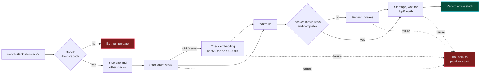
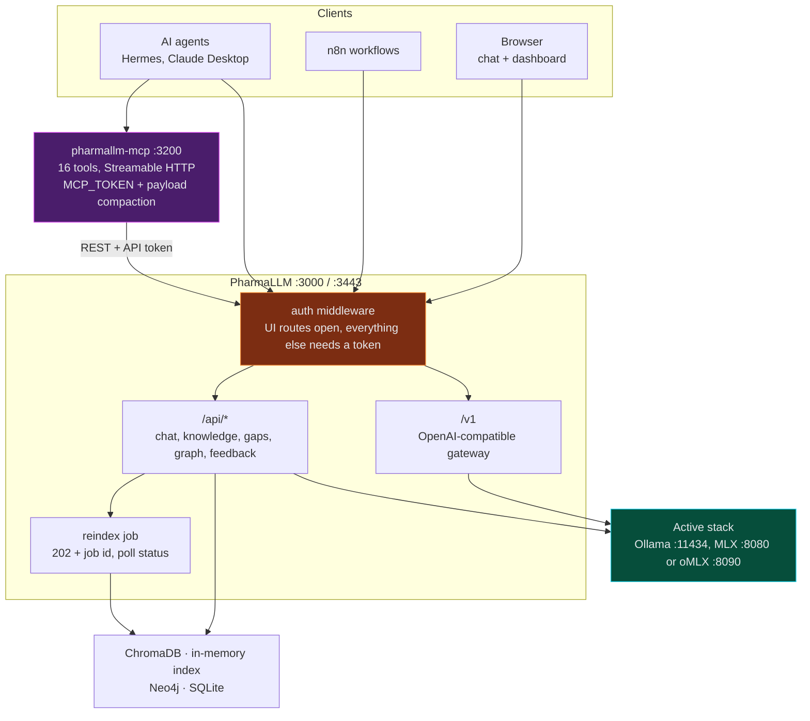
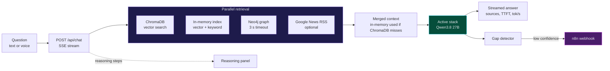

<div align="center">

# PharmaCyberLLM

### Local-first cyber threat intelligence for the pharmaceutical industry

A RAG chatbot that runs a 27B Qwen model on your own Mac, on **Ollama, MLX or oMLX**, grounds every answer in a hybrid vector + graph knowledge base, detects and fills its own knowledge gaps, and serves the same knowledge to AI agents over MCP.

**It also answers on Telegram.** [Hermes Agent](https://hermes-agent.nousresearch.com/) runs on the same local model, searches the knowledge base with 16 MCP tools, and replies in about 90 seconds. Four scheduled jobs pull the news, close knowledge gaps, watch health and report on feedback, without sending a token to anyone's cloud.

[](https://nodejs.org)
[](https://www.typescriptlang.org)
[](https://expressjs.com)
<br/>
[](https://ollama.com)
[](https://github.com/ml-explore/mlx-lm)
[](https://github.com/jundot/omlx)
[](#benchmarks)
<br/>
[](https://www.trychroma.com)
[](https://neo4j.com)
[](https://n8n.io)
<br/>
[](#hermes-agent-on-telegram)
[](#hermes-agent-on-telegram)
[](#agents-mcp-and-the-model-gateway)

[](#testing)
[](#choose-your-stack)
[](#switching-from-the-web-ui)
[](#choose-your-stack)
[](#why-pharmacyberllm)

[Quick Start](#quick-start) · [Choose Your Stack](#choose-your-stack) · [Benchmarks](#benchmarks) · [How It Works](#how-it-works) · [Telegram agent](#hermes-agent-on-telegram) · [API](#api-reference)

</div>

---

## In your pocket

A real exchange with the Telegram bot, answered by the 27B model on the Mac mini in **1 min 15 s**, start to delivery:

> **You** · Any known threat actors targeting pharmaceutical manufacturing?
>
> **PharmaCyberLLM** · Nation-state actors targeting pharma manufacturing:
> • **China** — APT10, APT41, Winnti; APT10 "Cloud Hopper" via MSPs
> • **North Korea** — Lazarus, Kimsuky (vaccine IP)
> • **Russia** — APT28, APT29 (vaccine/therapeutic research)
> • **Iran** — APT33, APT35 (sanctions IP theft)
> • Ransomware groups: LockBit, ALPHV, Black Basta, Snake/EKANS (ICS)
>
> Sources: `cyber-attack-types-pharma.md`, `vendor-dell-cyber-recovery.md`

Behind that reply: two knowledge-base searches over MCP, a 64K-context prompt on the local model, and nothing leaving the machine except the Telegram message itself. The same assistant runs four unattended jobs a day and cannot add knowledge or rebuild indexes while it does, because scheduled runs get a write-limited copy of the tool set.

---

## Why PharmaCyberLLM

Security teams in pharma need fast answers about attack histories, threat actors, vendor capabilities and regulations, but the questions themselves are sensitive: they reveal what a company runs, what it fears and where it is exposed. Pasting them into a cloud chatbot is often not an option.

> PharmaCyberLLM keeps the model, the embeddings and the knowledge base on your machine. No API keys, no cloud LLM, no `.env` file required.

At runtime, network access is limited to live news lookups (Google News RSS for web search and the news agent), URLs you explicitly add to the knowledge base, your own SearXNG instance if you enable the n8n research loop, and, if you run the optional Telegram assistant, the messages it exchanges with Telegram. Web search can be switched off in the chat UI.

---

## Highlights

| | Feature | What it does |
|---|---|---|
| 🧠 | **Local 27B LLM** | Qwen3.8 27B (4-bit) for chat and Qwen3-Embedding 0.6B (8-bit), on Ollama, MLX or oMLX, with a 64K context |
| 🔀 | **Three interchangeable stacks** | One script switches Ollama ⇄ MLX ⇄ oMLX, with per-stack indexes and automatic rollback — or drive the switch from the web UI, Telegram-confirmed |
| 🔎 | **Hybrid retrieval** | ChromaDB, an in-memory vector + keyword index, Neo4j Graph RAG and live news, in parallel |
| 💭 | **Visible reasoning** | Each retrieval step streams to the UI over SSE, with sources, TTFT and tok/s per answer |
| 🧰 | **MCP service** | `pharmallm-mcp` exposes 16 tools over Streamable HTTP, token-protected, run by launchd |
| 🔌 | **Model gateway** | OpenAI-compatible `/v1` on whichever stack is active, so any agent can use the local model |
| 🤖 | **Telegram assistant** | Optional Hermes Agent with four scheduled jobs, a network-less Docker sandbox and read-only tools when unattended |
| 🩹 | **Self-healing knowledge** | Low-confidence answers trigger an n8n workflow that researches, ingests and re-checks the gap |
| 🎙️ | **Voice input** | Local speech-to-text with whisper.cpp; HTTPS mode for iPad and mobile microphones |
| 📰 | **News agent** | 188 search topics pulled from Google News every 24 hours into the knowledge base |
| 📊 | **Monitoring dashboard** | Chart.js dashboard for questions, confidence, ratings, gaps, KB health and service status |
| ⏱️ | **Built-in benchmark** | Reproducible Ollama vs MLX vs oMLX comparison with retrieval overlap and a blind A/B review page |

---

## Quick Start

**Prerequisites:** a Mac with Apple Silicon (MLX requires it), [Homebrew](https://brew.sh), Node.js 22, Python 3, about 33 GB of free disk for the models, and `ffmpeg` if you want voice input.

```bash
# 1. Install Ollama and the Node dependencies
brew install ollama && brew services start ollama
git clone https://github.com/sebdallais-git/PharmaCyberLLM.git
cd PharmaCyberLLM
npm install

# 2. One-time setup: download the Ollama and MLX models (~33 GB), create the MLX
#    and oMLX venvs (oMLX reuses the same Hugging Face snapshots, so it adds no
#    extra download), then start ChromaDB, build the active stack's indexes and
#    launch PharmaLLM
scripts/switch-stack.sh prepare          # also installs the oMLX venv
```

When `prepare` finishes, PharmaLLM is running on the Ollama stack (the default):

| | URL |
|---|---|
| 💬 Chat | http://localhost:3000 |
| 📊 Dashboard | http://localhost:3000/dashboard |
| ❤️ Health | http://localhost:3000/api/health |

Later sessions start everything (ChromaDB, the last active stack and a hot-reload dev server) with:

```bash
npm run dev          # runs scripts/start-services.sh
```

> [!NOTE]
> The first index build re-embeds the whole knowledge base (about 7,000 raw documents) and took 12–16 minutes on an M4 Pro. Ollama 0.17.6 could not pull Qwen3.8; the setup was verified with Ollama 0.34.0.

> [!IMPORTANT]
> Nothing starts the app or the model stack after a reboot. Run `scripts/start-services.sh` (or `scripts/switch-stack.sh ollama`) before you expect answers. Only the MCP service and the Hermes gateway come back on their own, and until the app is up they report PharmaLLM as unreachable.

<details>
<summary><b>Optional: self-healing loop (n8n + SearXNG)</b></summary>

<br/>

1. Run [SearXNG](https://github.com/searxng/searxng) on `http://localhost:8888` and [n8n](https://n8n.io) on `http://localhost:5678`.
2. In n8n, import `n8n/knowledge_gap_workflow_v2.json` and `n8n/knowledge_qa_workflow.json` (**Workflows → Import from File**) and activate them.
3. Point the gap detector at the webhook and restart:

```bash
export N8N_WEBHOOK_URL="http://localhost:5678/webhook/knowledge-gap"
npm run dev
```

The workflows call protected routes, so once an API token is set they need `Authorization: Bearer {{ $env.PHARMALLM_API_TOKEN }}`. See [`n8n/README.md`](n8n/README.md).

</details>

<details>
<summary><b>Optional: Graph RAG (Neo4j)</b></summary>

<br/>

```bash
# Neo4j Community in Docker (the app's default password is pharma2024)
docker run -d --name neo4j-pharma \
  -p 7474:7474 -p 7687:7687 \
  -e NEO4J_AUTH=neo4j/pharma2024 \
  neo4j:community

# Bulk-extract entities from knowledge/*.md (requires the Ollama stack to be running)
pip install -r python/requirements.txt
python python/graph_builder.py
```

`graph_builder.py` calls Ollama's `/api/generate` directly with `OLLAMA_MODEL` (default `mistral-small:24b`), so pull that model or set `OLLAMA_MODEL` to one you have. Browse the graph at http://localhost:7474. New content from the news agent and uploads is added to the graph automatically.

</details>

<details>
<summary><b>Optional: agents (MCP service and Telegram assistant)</b></summary>

<br/>

```bash
scripts/switch-stack.sh token          # create data/run/api-token
scripts/switch-stack.sh mcp-token      # create data/run/mcp-token
npm --prefix mcp install
scripts/switch-stack.sh mcp start      # pharmallm-mcp under launchd (com.pharmallm.mcp)
scripts/switch-stack.sh mcp status
```

Creating the API token does not enable it: restart the app (`scripts/switch-stack.sh ollama`, `mlx` or `omlx`) so it is exported. The Telegram assistant is a separate install, see [Agents, MCP and the model gateway](#agents-mcp-and-the-model-gateway).

</details>

---

## Choose Your Stack

Every local model call, chat and embeddings alike, runs on **exactly one** stack. All three stacks run the same models at matching quantization levels (4-bit chat, 8-bit embeddings), so they can be compared fairly. There is no silent fallback: if the active stack is down, requests fail with a clear error.

| | 🦙 Ollama stack | 🍎 MLX stack | 🧬 oMLX stack |
|---|---|---|---|
| **Chat model** | `qwen3.8-pharma` (Qwen3.8 27B Q4_K_M, 64K context) | `mlx-community/Qwen3.8-27B-4bit` via `mlx_lm.server` | `mlx-community--Qwen3.8-27B-4bit` (oMLX's discovery ids use double dashes) |
| **Embedding model** | `qwen3-embedding:0.6b-q8_0` | `mlx-community/Qwen3-Embedding-0.6B-8bit` via `python/mlx-embed-server.py` | `mlx-community--Qwen3-Embedding-0.6B-8bit` |
| **Ports** | `:11434` | `:8080` chat, `:8081` embeddings | `:8090` — one server for chat and embeddings |
| **ChromaDB collection** | `knowledge_base_ollama` | `knowledge_base_mlx` | `knowledge_base_mlx` (shared with the MLX stack) |
| **In-memory index** | `knowledge/.index.ollama.json` | `knowledge/.index.mlx.json` | `knowledge/.index.mlx.json` (shared with the MLX stack) |
| **Prompt cache** | one shared cache, evicted by the next caller | several caches, capped by `--prompt-cache-bytes` (8 GB) | one paged SSD cache, capped by `--paged-ssd-cache-max-size` (20 GB default); survives an app restart |
| **Graph rebuild** | ✅ supported | ❌ switch to Ollama first (`409`) | ❌ switch to Ollama first (`409`) — `python/graph_builder.py` calls Ollama directly |

```bash
scripts/switch-stack.sh mlx        # stop the other stacks, start MLX, restart PharmaLLM (rolls back on failure)
scripts/switch-stack.sh omlx       # third stack, port 8090 — one server for chat and embeddings,
                                    # shares the MLX index, restores long prompts from SSD after a restart
scripts/switch-stack.sh ollama     # and back
scripts/switch-stack.sh status     # active stack, ports, OLLAMA_NUM_PARALLEL and index counts
scripts/switch-stack.sh prepare    # one-time model downloads; also installs the oMLX venv
scripts/switch-stack.sh telegram   # store the Telegram credentials used to confirm UI-driven switches
scripts/switch-stack.sh ollama-ctx # recreate qwen3.8-pharma if its context differs from the Modelfile
```

### Switching from the web UI

The header has a stack selector next to the model selector. Choosing a different stack does not switch immediately: PharmaLLM sends a Telegram message with a one-time confirmation link, valid for 5 minutes. Tapping it starts the switch; ignoring it reverts the selector. The UI then follows the switch (stopping, starting, warming up, checking indexes) and shows the new stack with how long it took — the header line next to the selector reads `OMLX stack ready (96 s)` — and Telegram gets a completion message with the same line.

The route itself needs no token, because approval comes from the Telegram link. Store the credentials once:

```bash
scripts/switch-stack.sh telegram         # prompts for the bot token and your chat id, stores them at mode 600
```

Without them the selector is disabled and says so. A switch is refused while another switch is pending confirmation or already in progress, while a benchmark or a reindex is running, or when the requested stack is already active.

**Embedding parity.** The oMLX stack shares the MLX index and ChromaDB collection because their embeddings are identical (cosine 1.000000). Every oMLX start re-checks that against `__tests__/fixtures/embedding-reference.json` and refuses to serve below a cosine of 0.9999, so a future oMLX upgrade that quietly changed the embedding cannot poison retrieval: without the check, it would write vectors into `knowledge_base_mlx` that no longer match the ones already there, and searches would return the wrong documents with no error. The probe turns that failure mode into a refused switch instead.

**64K context.** `ollama/qwen3.8-pharma.Modelfile` sets `num_ctx 65536` and MLX is started with `--prompt-cache-bytes`. The model is a hybrid architecture: only 16 of its 64 layers keep a KV cache, so 64K costs about 4 GB instead of the 1 GB a 16K context used. Ollama's OpenAI API cannot set the context per request, so one shared size keeps a single copy of the model loaded. Keep `OLLAMA_NUM_PARALLEL` at 1, because each parallel slot allocates its own 64K context.



**How the switch stays safe**

- **One client:** `src/services/llm-client.ts` talks to all three stacks through the OpenAI-compatible `/v1/chat/completions` and `/v1/embeddings` APIs; `src/config/llm-stacks.ts` only swaps base URLs and model names. Thinking mode is disabled on all three.
- **Guarded indexes:** each index records its stack, embedding model and dimension (1024), plus a completeness marker written only when a rebuild ran to the end. Search on a mismatched, incomplete or rebuilding index is refused instead of returning meaningless matches.
- **Rebuildable from source:** indexes are rebuilt from `knowledge/` and `data/raw_documents/`, where uploads, ingested text and news articles are saved first. Rebuild with `LLM_PROVIDER=<stack> npx tsx scripts/reindex-stack.ts` (app stopped) or `POST /api/knowledge/reindex` (app running, asynchronous).
- **Everything follows the stack:** n8n calls `POST /api/llm/complete`, agents call `/v1/chat/completions`, and both run on whichever stack is active.

---

## Benchmarks

oMLX figures land in a follow-up task that measures all three stacks live; the tables below are the Ollama vs MLX baseline.

### RAG answers (the web chat workload)

First head-to-head run on a **Mac mini M4 Pro, 48 GB** (macOS 26.4), 2026-09-16. Full pipeline through `POST /api/chat`: 23 questions from `bench/questions.json`, one cold run each after a warm-up question outside the set, temperature 0, no web search, `max_tokens` 1024 on both stacks, background LLM jobs paused.

| Metric (median) | 🦙 Ollama | 🍎 MLX | MLX vs Ollama |
|---|---:|---:|---:|
| Time to first token | 19.1 s | 18.5 s | **−2.8%** |
| Decode speed | 12.4 tok/s | 13.0 tok/s | **+4.9%** |
| Total time per answer | 99.6 s | 93.8 s | **−5.8%** |
| Query embedding | 30 ms | 18 ms | −40.0% |
| Retrieval | 80 ms | 42 ms | −47.5% |
| Peak system memory used | 39,958 MB | 37,338 MB | **−6.6%** |
| Loaded model memory (chat + embeddings) | ~20.4 GB | 16.0 GB | ≈ −22% |
| Index build (~7k raw documents) | 15.6 min | 11.6 min | −25% |
| Failed runs | 0 / 23 | 0 / 23 | |

**Quality checks:** cross-stack embedding parity has a mean cosine of **0.9986** (min 0.9875 over 20 texts, threshold 0.98), and retrieved chunks overlap at **0.91** (mean Jaccard), so both stacks answered from nearly the same evidence.

### Long prompts (the agent workload)

Measured 2026-09-17 on the same machine, through `/v1` with a 16.7K-token prompt, streamed, sent cold and then again with the same prefix.

| Metric | 🦙 Ollama | 🍎 MLX |
|---|---:|---:|
| Cold time to first token | 156.3 s | 141.2 s |
| Warm time to first token, same prefix | 5.8 s | 0.8 s |
| Decode | 11.3–11.6 tok/s | 11.5–12.4 tok/s |
| Memory pressure | normal, 41% free | normal, 40% free |

Prefill is the cost, at roughly 104–118 tok/s. Caching works on both stacks: appending a tool result to a conversation keeps the cached prefix, and a 14.6K-token prompt that cost 140.6 s cold came back in 10.9 s once about 1K tokens were appended. On Ollama the cache is shared, so a web chat between two agent steps evicts it.

**Reading it honestly**

- 🟰 MLX is modestly faster end to end on RAG answers (~6%). Generation dominates: embedding and retrieval gains are milliseconds against ~95 s answers.
- ✂️ Most answers hit the 1024-token cap (15/23 on Ollama, 13/23 on MLX). The cap is identical, so the comparison is fair, but totals reflect truncated answers and the blind review compares truncated text.
- 🧮 The benchmark's own Ollama *process* memory reading (59 MB) was invalid: Ollama 0.34 runs models in `llama-server` child processes the sampler missed. The ~20.4 GB figure was measured directly afterwards (17,576 MB chat + 2,780 MB embeddings), and the sampler has since been fixed.
- 🔁 These are single cold runs on one machine, so treat the percentages as a first signal rather than a verdict.

<details>
<summary><b>Reproduce the benchmark</b></summary>

<br/>

```bash
scripts/switch-stack.sh ollama && npx tsx scripts/benchmark-stack.ts
scripts/switch-stack.sh mlx    && npx tsx scripts/benchmark-stack.ts
npx tsx scripts/compare-benchmarks.ts data/benchmarks/ollama-<time>.json data/benchmarks/mlx-<time>.json
```

`benchmark-stack.ts` accepts `--runs`, `--app` and `--questions`. Benchmark mode (`/api/bench/start`, a 15-minute lease) pauses the news agent and other background LLM jobs; chat requests with `benchmark: true` use temperature 0, skip web search and cap answers at 1024 tokens. `/v1` and `/api/llm/complete` return `503` while it runs. The comparison reports TTFT, decode speed, embedding and retrieval time, peak memory, retrieval overlap, and writes a blind A/B review page with stack labels hidden.

Embedding parity check (stacks run one after the other):

```bash
LLM_PROVIDER=ollama npx tsx scripts/embedding-parity.ts save data/benchmarks/parity-ollama.json
LLM_PROVIDER=mlx    npx tsx scripts/embedding-parity.ts save data/benchmarks/parity-mlx.json
npx tsx scripts/embedding-parity.ts compare data/benchmarks/parity-ollama.json data/benchmarks/parity-mlx.json
```

The question set has 23 questions: 11 vendor, 5 threat, 2 regulation, 2 pharma, and 3 deliberately not covered by the knowledge base.

</details>

---

## How It Works

### System map



Static files and the browser routes listed in `src/api/auth.ts` are always open. Everything else (`/v1/*` and the rest of `/api/*`) needs `Authorization: Bearer <token>` once `PHARMALLM_API_TOKEN` is set. Without a token, those routes accept only same-machine requests that also carry a `localhost`, `127.0.0.1` or `[::1]` Host header, which blocks DNS rebinding.

### Request pipeline



The reasoning panel shows each step live ("Searching knowledge graph...", "Searching the web for: ...") and collapses when the first answer token arrives. Each answer carries a `response_id` for feedback. Typing `/names` toggles whether answers name specific companies in incident discussions.

### Self-healing knowledge loop


A second workflow runs every 6 hours as a KB health check: it sends test queries through the full RAG pipeline, has the active stack score each answer and flag hallucinations, and posts the report to `/api/dashboard/kb-health` (168 reports kept, 7 days).

### Knowledge graph

Neo4j stores **14 entity types** (Company, Subsidiary, Drug, TherapeuticArea, ManufacturingSite, Country, RegulatoryBody, Regulation, ThreatActor, Attack, AttackVector, Vendor, Product, Technology) and **20 relationship types** such as `ACQUIRED`, `MANUFACTURES`, `TARGETED`, `ATTRIBUTED_TO`, `USED_VECTOR` and `PROTECTS_AGAINST`. Chat extracts likely entity names from the question and queries the graph alongside vector search; graph writes from the news agent and uploads run asynchronously so they never block a response.

---

## Agents, MCP and the Model Gateway

PharmaLLM serves AI agents in two ways: as a set of tools, and as a model provider.

| | Endpoint | Purpose |
|---|---|---|
| 🧰 **MCP tools** | `pharmallm-mcp` at `http://<host>:3200/mcp` | 16 tools over Streamable HTTP: search, full RAG answers, add knowledge, graph, gaps, health, metrics, news agent, background reindex, feedback |
| 🧠 **Model gateway** | `http://<host>:3000/v1` or `https://<host>:3443/v1` | OpenAI-compatible chat completions on the active stack, tools and streaming supported |

### The MCP service

`mcp/` is a separate package and process with no RAG logic: every tool maps to one or two PharmaLLM REST calls. It speaks stateless Streamable HTTP at `POST /mcp` and answers `GET /healthz` without auth.

```bash
scripts/switch-stack.sh mcp-token       # create data/run/mcp-token
npm --prefix mcp install
scripts/switch-stack.sh mcp start       # launchd service com.pharmallm.mcp, logs in data/logs/mcp.log
scripts/switch-stack.sh mcp status
scripts/switch-stack.sh mcp stop
```

Without `MCP_TOKEN` the service accepts only same-machine requests with a local Host header. With a token it requires `Authorization: Bearer` and accepts any Host. `scripts/run-mcp.sh` refuses to listen on a non-loopback host without a token. See [`mcp/README.md`](mcp/README.md) for the full tool list and configuration.

**Tool payloads are compacted** before they reach an agent (`mcp/src/tools/compact.ts`): embeddings are dropped, long lists become `{count, sample, truncated}`, stored answers are cut to 300 characters, and `list_knowledge_gaps` returns 20 rows by default (`limit` up to 50). The REST API and the web UI are unchanged.

| Tool result | Before | After |
|---|---:|---:|
| `search_knowledge` (5 chunks) | ≈48,600 tokens | ≈1,100 tokens |
| `list_knowledge_gaps` | ≈31,000 tokens | ≈2,700 tokens |
| `knowledge_status` | ≈10,000 tokens | ≈530 tokens |
| `news_agent_status` | ≈2,200 tokens | ≈260 tokens |

Each search chunk used to carry a ~30 KB embedding object next to ~440 characters of text, so 98% of the payload was a vector no agent can use. That size, re-read on every step, was the real cost of agent runs, not cache misses.

### The model gateway

`/v1/chat/completions` forwards to the active stack and pipes the response through byte for byte, so streaming and tool calls work unchanged. It forces the stack's own chat model (the `model` field is ignored), forwards only `messages`, `tools`, `tool_choice`, `stream`, `stream_options`, `temperature` and `max_tokens` (capped at 4096), and drops the rest. It returns `503` during a benchmark or when the stack is down, with no fallback.

### Hermes Agent on Telegram

[`hermes/`](hermes/README.md) runs [Hermes Agent](https://hermes-agent.nousresearch.com/) as a Telegram assistant on the local 27B model. Everything needed to rebuild it lives in the repo; secrets stay in `~/.hermes/.env` and `data/run/*-token` at mode 600.

```bash
scripts/switch-stack.sh token           # PharmaLLM API token
scripts/switch-stack.sh mcp-token       # token Hermes uses for pharmallm-mcp
scripts/hermes-setup.sh all             # config, .env, launchd services, cron jobs
scripts/hermes-setup.sh check           # read-only status; prints variable names, never values
```

| Job | Schedule | What it does |
|---|---|---|
| `pharmallm-news-digest` | 06:00 daily | Runs the news agent, then reports what was added in at most 10 lines |
| `pharmallm-gap-resolution` | 07:00 daily | Re-checks at most 3 triggered gaps, oldest first |
| `pharmallm-health-watch` | 09:00 and 19:00 | Reports failing checks; replies `[SILENT]` and delivers nothing while healthy |
| `pharmallm-feedback-digest` | Monday 08:00 | Weekly rating trends and the worst-rated answers |

- **Tool scope:** Telegram and CLI runs get 15 of the 16 MCP tools (no `start_reindex`). Scheduled runs connect to a separate, write-limited `pharmallm_cron` server with 14 tools: no `start_reindex` and no `add_knowledge`. MCP calls are never approval-gated, so the tool list is the control. Scheduled runs also get no web, memory, terminal or file toolsets.
- **Sandbox:** shell commands run in a Docker container with `--network=none`, 512 MB and 1 CPU, no host project or home directory mounted. Verified live: `/Users` is not visible, `host.docker.internal` does not resolve and the app is unreachable from inside.
- **Web search:** the local SearXNG instance, with the keyless cloud fallbacks turned off. Private and loopback URLs stay blocked for Hermes' web tools, so ChromaDB and Neo4j cannot be reached that way.
- **Speed:** a warm Telegram round trip takes about 1 min 47 s end to end (Hermes' own timer reports 107.7 s). The first step of a cold session pays the full prefill, about 140–156 s.
- **Restarting the MCP service** costs the next Hermes message about 3 minutes, because the model has to prefill the tool list again.
- **After a reboot:** `com.pharmallm.mcp` and the Hermes gateway come back on their own, the app and the model stack do not. Run `scripts/start-services.sh` before the first job fires.

<details>
<summary><b>Running Hermes on a second Mac</b></summary>

<br/>

Point the agent at the model Mac's LAN or VPN address. On the PharmaLLM Mac, bake the bind address into the launch agent so it survives a reboot:

```bash
MCP_HOST=0.0.0.0 scripts/hermes-setup.sh install-services
```

An MCP token is then required. On the Hermes Mac, set `PHARMALLM_URL`, `PHARMALLM_MCP_URL` and `SEARXNG_URL` to the model Mac and copy the two token values into `~/.hermes/.env` by hand. Full instructions in [`hermes/README.md`](hermes/README.md).

</details>

---

## API Reference

The **Auth** column shows which routes need `Authorization: Bearer <PHARMALLM_API_TOKEN>` once a token is set. Without a token, `token` routes accept only same-machine requests addressed as localhost. `open` routes are the browser UI routes listed in `src/api/auth.ts` and never need the token.

<details>
<summary><b>Model gateway (OpenAI-compatible)</b></summary>

<br/>

| Endpoint | Method | Auth | Description |
|---|---|---|---|
| `/v1/models` | GET | token | The active stack's chat model (`503` when the stack is down) |
| `/v1/chat/completions` | POST | token | Forwarded to the active stack, tools and streaming supported (`503` during a benchmark or when the stack is down) |

</details>

<details>
<summary><b>Chat, stack and benchmark</b></summary>

<br/>

| Endpoint | Method | Auth | Description |
|---|---|---|---|
| `/api/chat` | POST | open | SSE stream with reasoning steps, token stats and `response_id` |
| `/api/chat/transcribe` | POST | open | Multipart `audio` file (max 25 MB) → `{ "text": "..." }` |
| `/api/chat/models` | GET | open | Active stack and its chat and embedding models |
| `/api/llm/complete` | POST | token | `{ prompt }` → `{ response }` on the active stack (used by n8n) |
| `/api/bench/start` | POST | token | Pause background LLM jobs (15-minute lease, refreshed by calling again) |
| `/api/bench/stop` | POST | token | Resume background LLM jobs |
| `/api/bench/status` | GET | token | Benchmark flag and running background jobs |
| `/api/stack/switch` | POST | open | `{ stack }` → request a switch to `ollama`, `mlx` or `omlx`; sends a Telegram confirmation link (`202` pending confirmation, `400` unknown stack, `409` refused — already active, another switch pending, a switch already in progress, a benchmark or a reindex running, or Telegram not configured, `502` if the Telegram send fails) |
| `/api/stack/confirm` | GET | open | `?token=` from the Telegram link; starts `scripts/switch-stack.sh <target>` (`200` html page, `410` if the token expired or was already used) |
| `/api/stack/status` | GET | open | Active stack, whether Telegram is configured, any pending switch, and switch progress |

These three routes are `open` because approval comes from the one-time Telegram link, not from the bearer token — the link itself is the credential.

</details>

<details>
<summary><b>Knowledge, reindex and gaps</b></summary>

<br/>

| Endpoint | Method | Auth | Description |
|---|---|---|---|
| `/api/knowledge/stats` | GET | open | Knowledge base stats |
| `/api/knowledge/search` | POST | open | Search the knowledge base |
| `/api/knowledge/ingest-text` | POST | open | Ingest raw text (saved to `data/raw_documents/` first) |
| `/api/knowledge/upload` | POST | open | Upload and ingest a file (saved as a raw document first) |
| `/api/knowledge/add` | POST | token | Add a URL or text to ChromaDB |
| `/api/knowledge/status` | GET | token | ChromaDB status |
| `/api/knowledge/reindex` | POST | token | Start rebuilding the active stack's indexes in the background: `202 { job_id, status: "running" }`, `409` while a reindex or benchmark runs |
| `/api/knowledge/reindex/status` | GET | token | Most recent reindex job: `status` (`idle`, `running`, `succeeded`, `failed`), progress, result or error |
| `/api/knowledge/gaps` | GET | token | Recent gap detections |
| `/api/knowledge/gaps/stats` | GET | token | Gap analytics |
| `/api/knowledge/gaps/check-resolution` | POST | token | Re-ask a gap through the full RAG pipeline |

Job state lives in memory, so a server restart forgets it. The index completeness markers remain the source of truth.

</details>

<details>
<summary><b>Feedback, dashboard, graph and agent</b></summary>

<br/>

| Endpoint | Method | Auth | Description |
|---|---|---|---|
| `/api/feedback` | POST | token | `{ response_id, rating (1-5), comment? }` |
| `/api/feedback/stats` | GET | token | Rating analytics (7d, 30d, RAG vs non-RAG) |
| `/api/feedback/low-rated` | GET | token | Answers rated 2 or lower, with chunk IDs |
| `/api/feedback/weekly-digest` | GET | token | 7-day summary with improvement priorities |
| `/api/health` | GET | open | Active stack (`llm_chat`, `llm_embed`, `search_index`), ChromaDB, SearXNG, Neo4j, SQLite |
| `/api/dashboard/metrics` | GET | open | All dashboard metrics (30 s cache) |
| `/api/dashboard/chromadb-misses` | GET | open | Recent ChromaDB misses and top missed queries |
| `/api/dashboard/kb-health` | GET / POST | token | KB health history, or receive a report from n8n |
| `/api/graph/health` | GET | token | Neo4j connection check with latency |
| `/api/graph/stats` | GET | open | Node and relationship counts by type |
| `/api/graph/search` | POST | token | Search by entity name, returns neighbors |
| `/api/graph/rebuild` | POST | token | Clear and rebuild the graph (Ollama stack only, `409` on MLX) |
| `/api/agent/status` | GET | open | News agent last run and topics |
| `/api/agent/run` | POST | open | Trigger the news agent now |

</details>

---

## Voice Input and HTTPS

The mic button records audio in the browser (MediaRecorder), uploads it to `POST /api/chat/transcribe` (max 25 MB), converts it to 16 kHz WAV with `ffmpeg`, and transcribes it locally with whisper.cpp (`ggml-base.en`, bundled with `whisper-node`).

Browsers only allow microphone access on secure origins, so an **iPad or phone needs HTTPS**. Put a key and certificate in `certs/`:

```
certs/key.pem
certs/cert.pem
```

When both files exist, the server also listens on **https://&lt;your-mac&gt;:3443** (`HTTPS_PORT`). The device must trust the certificate. A token, once set, is required on both ports.

---

## Monitoring and Feedback

**Dashboard** (`/dashboard`, refreshes every 60 s, metrics cached 30 s):

| Panel | Shows |
|---|---|
| Metric cards | Questions today, confidence rate, average rating, knowledge base size |
| Time series | 30-day questions and confidence, user ratings |
| Gap intelligence | Recent gaps with status, top gap topics |
| System health | Knowledge sources, active stack, ChromaDB, SearXNG, Neo4j and SQLite checks with latency |

**Health** (`/api/health`) is `healthy`, `degraded` when only ChromaDB, SearXNG or Neo4j is down, or `unhealthy` when the active stack's chat or embedding endpoint or the search index is unusable. The inactive stack is never probed.

**Feedback:** ratings (1–5) are linked to the chunks used, compared across RAG and non-RAG answers, and answers rated 2 or lower are surfaced as improvement candidates. ChromaDB misses are logged to show coverage gaps.

---

## n8n Workflows

| File | Nodes | Purpose |
|---|---:|---|
| `n8n/knowledge_gap_workflow_v2.json` | 15 | Gap auto-fill with resolution check (recommended) |
| `n8n/knowledge_gap_workflow.json` | 13 | Gap auto-fill, v1 |
| `n8n/knowledge_qa_workflow.json` | 12 | KB health monitor, every 6 hours |

All LLM steps call `POST /api/llm/complete`, so they run on the active stack. The endpoint accepts an Ollama `/api/generate`-shaped body; the `model` field is ignored, and `temperature` or `options.temperature` is honored. It returns `503` while a benchmark runs. Protected routes need the API token header. See [`n8n/README.md`](n8n/README.md) for setup details.

---

## Knowledge Base

`knowledge/` ships **40 curated documents** (36 Markdown, 2 DOCX, 2 PDF), grown by the news agent, uploads and the n8n loop. At the last verified rebuild, the Ollama index held **7,779 chunks** and the MLX index **7,623**.

| Area | Examples |
|---|---|
| 🛡️ Cyber threats | Major pharma attacks, attacks by year, attack types, systems compromised, costs and remediation, IT/OT threats 2025 |
| 💊 Pharma industry | Business and science basics, regulation, Phase 3 pipeline 2025–26, top 20 by revenue / market cap / reputation, manufacturing plants, Basel biotech hub |
| 🏢 Vendor intelligence | Dell, Pure Storage, NetApp, HPE, VAST Data, WEKA, NVIDIA, SAP, ServiceNow, Snowflake, Databricks, Splunk / Sentinel / CrowdStrike, endpoint and identity security, Bug Bounty Switzerland |

Uploads accept `.txt`, `.md`, `.pdf`, `.csv`, `.json`, `.docx`, `.pptx` and `.ppt`.

---

## Configuration

Everything works with defaults. `scripts/switch-stack.sh` and `npm run dev` set `LLM_PROVIDER` and export `PHARMALLM_API_TOKEN` from `data/run/api-token` when it exists.

<details>
<summary><b>Environment variables</b></summary>

<br/>

| Variable | Default | Description |
|---|---|---|
| `LLM_PROVIDER` | `ollama` | Active stack: `ollama`, `mlx` or `omlx` |
| `PORT` | `3000` | HTTP port |
| `HTTPS_PORT` | `3443` | HTTPS port (used when `certs/key.pem` and `certs/cert.pem` exist) |
| `HOST` | `0.0.0.0` | Bind address |
| `OLLAMA_URL` | `http://localhost:11434` | Ollama stack endpoint |
| `MLX_CHAT_URL` | `http://localhost:8080` | MLX chat server |
| `MLX_EMBED_URL` | `http://localhost:8081` | MLX embedding server |
| `OMLX_URL` | `http://localhost:8090` | oMLX server (chat and embeddings) |
| `MLX_PYTHON` | `python3` | Python used to create `python/mlx-venv` and `python/omlx-venv` |
| `CHROMADB_URL` | `http://localhost:8100` | ChromaDB server |
| `N8N_WEBHOOK_URL` | *(none)* | n8n webhook for gap auto-fill |
| `NEO4J_URI` | `bolt://localhost:7687` | Neo4j Bolt URI |
| `NEO4J_USER` | `neo4j` | Neo4j user |
| `NEO4J_PASSWORD` | `pharma2024` | Neo4j password |
| `APP_URL` | `http://localhost:3000` | App URL used by `scripts/reindex-stack.ts` |
| `PHARMALLM_API_TOKEN` | *(none)* | Token for `/v1` and operations routes; without it they accept only same-machine requests addressed as localhost |
| `MLX_PROMPT_CACHE_BYTES` | `8589934592` | Memory cap for `mlx_lm.server`'s prompt cache (set by `switch-stack.sh`) |
| `MCP_HOST` / `MCP_PORT` | `127.0.0.1` / `3200` | Where `pharmallm-mcp` listens (`scripts/run-mcp.sh`); a non-loopback host requires `data/run/mcp-token` |
| `MCP_TOKEN` | *(none)* | Bearer token agents send to `pharmallm-mcp`; read from `data/run/mcp-token` by `run-mcp.sh` |

Tokens live in `data/run/` at mode 600 and are passed through the environment only, never as command arguments. No `.env` file is used.

</details>

---

## Project Structure

<details>
<summary><b>Show the tree</b></summary>

<br/>

```
PharmaCyberLLM/
├── src/
│   ├── server.ts               # Express + HTTPS, auth middleware, index checks, news agent schedule
│   ├── config/llm-stacks.ts    # Ollama, MLX and oMLX stack definitions
│   ├── api/                    # auth, chat, knowledge, agent, feedback, dashboard, graph, bench, llm, v1, stack
│   ├── services/
│   │   ├── llm-client.ts       # One OpenAI-compatible client for all three stacks
│   │   ├── model-gateway.ts    # /v1 body building and forwarding
│   │   ├── index-guard.ts      # Refuses search on mismatched indexes
│   │   ├── reindex.ts          # Rebuilds the active stack's indexes
│   │   ├── reindex-jobs.ts     # Background reindex job state
│   │   ├── raw-documents.ts    # Source documents that indexes are rebuilt from
│   │   ├── bench-mode.ts       # Benchmark lease and background job tracking
│   │   ├── health.ts           # Health probes and aggregation
│   │   ├── knowledge-store.ts  # In-memory hybrid index
│   │   ├── chromadb-store.ts   # ChromaDB client
│   │   ├── graph-store.ts      # Neo4j queries and entity writes
│   │   ├── gap-detector.ts     # Confidence check, cooldown, n8n webhook
│   │   ├── news-agent.ts       # 188-topic Google News agent
│   │   ├── stack-switch.ts     # Pending-switch state machine (confirm tokens, refusal reasons)
│   │   ├── telegram-notify.ts  # Sends the confirmation link and the completion message
│   │   ├── switch-labels.ts    # Switch-status text ("OMLX stack ready (96 s)"), synced with public/app.js
│   │   └── ...                 # feedback, request log, response cache, web search, file parser
│   └── utils/
├── mcp/                        # pharmallm-mcp: 16 MCP tools over Streamable HTTP
│   ├── src/tools/              # knowledge, graph, gaps, operations, feedback, compact.ts
│   ├── src/http.ts             # auth middleware, /mcp, /healthz
│   └── __tests__/              # against a fake PharmaLLM server
├── hermes/                     # Telegram assistant: config template, SOUL.md, cron jobs, plist template
├── scripts/
│   ├── switch-stack.sh         # prepare | ollama | mlx | omlx | status | token | telegram | mcp-token | mcp | ollama-ctx
│   ├── start-services.sh       # npm run dev: ChromaDB + active stack + dev server
│   ├── run-mcp.sh              # launchd entry point for pharmallm-mcp
│   ├── hermes-setup.sh         # check | install-config | install-services | install-cron | all
│   ├── reindex-stack.ts        # Rebuild, --check or --status for the active stack
│   ├── benchmark-stack.ts      # Benchmark the active stack through the app
│   ├── compare-benchmarks.ts   # Comparison report + blind A/B page
│   ├── embedding-parity.ts     # Cross-stack embedding parity
│   └── lib/                    # Shared shell and TypeScript helpers
├── python/
│   ├── mlx-embed-server.py     # OpenAI-compatible embedding server for MLX
│   ├── graph_builder.py        # Bulk entity extraction into Neo4j (calls Ollama)
│   └── utils/, tests/          # Standalone Python RAG utilities (chunking, LLM re-ranking)
├── ollama/qwen3.8-pharma.Modelfile   # Qwen3.8 27B Q4_K_M with a 64K context
├── bench/questions.json        # 23 benchmark questions
├── knowledge/                  # Curated documents + per-stack index files
├── n8n/                        # Importable workflows + setup guide
├── docs/superpowers/           # Specs, plans and verification records
├── public/                     # Chat UI (voice, reasoning panel)
├── dashboard/                  # Monitoring dashboard
├── __tests__/                  # Jest suites (+ fake OpenAI-compatible server)
└── data/                       # Raw documents, benchmarks, logs, tokens, SQLite (gitignored)
```

</details>

---

## Testing

Tests run against fakes. None of them reaches a real model server, ChromaDB, the live app, Docker, launchd or Telegram.

```bash
npm run test                 # Jest: 28 suites, 286 tests
npm --prefix mcp test        # Jest: 7 suites, 64 tests
npm run typecheck            # tsc --noEmit (strict mode)
npm run typecheck:tests      # type-check the test suites
npm --prefix mcp run typecheck
```

---

## Troubleshooting

<details>
<summary><b>App, stacks and indexes</b></summary>

<br/>

| Symptom | Fix |
|---|---|
| Nothing answers after a reboot | The app and the model stack have no launch agent. Run `scripts/start-services.sh` or `scripts/switch-stack.sh ollama` |
| `Models for mlx are missing` | Run `scripts/switch-stack.sh prepare` once |
| Search refused / `search_index` error in `/api/health` | The index belongs to another stack, is incomplete or is rebuilding. Wait for the rebuild, or `POST /api/knowledge/reindex` and poll `/api/knowledge/reindex/status` |
| `Port 8080 is used by another program` | Free the MLX ports (`:8080`, `:8081`); the switch leaves foreign processes alone and rolls back |
| `/api/graph/rebuild` returns `409` | Graph rebuild only works on the Ollama stack: `scripts/switch-stack.sh ollama` |
| Reindex, `/v1` or `/api/llm/complete` rejected during a benchmark | Wait for it to finish, or `POST /api/bench/stop` |
| Health is `degraded` | A supporting service (ChromaDB, SearXNG or Neo4j) is down; chat still works |
| `401 Unauthorized` on `/api/*` or `/v1/*` | Send `Authorization: Bearer <token>`, or reach the app as `localhost` from the same machine |
| Mic button missing or blocked on iPad | Use HTTPS on port 3443 with certificates in `certs/` that the device trusts |
| `npm run dev` fails on port 3000 | `prepare` and `switch-stack.sh ollama\|mlx` already start PharmaLLM in the background (log in `data/logs/app.log`) |
| Switch or rebuild failed | Check `data/logs/` (`mlx-chat.log`, `mlx-embed.log`, `reindex-<stack>.log`, `app.log`) |

</details>

<details>
<summary><b>Agents and the sandbox</b></summary>

<br/>

| Symptom | Fix |
|---|---|
| Hermes says the context length is below the minimum | The Ollama model still has the old context. Run `scripts/switch-stack.sh ollama-ctx`, which recreates `qwen3.8-pharma` from the Modelfile without downloading |
| MCP tool calls fail after 5 minutes | Restart `pharmallm-mcp` so the version with keepalive notifications runs: `scripts/switch-stack.sh mcp stop && scripts/switch-stack.sh mcp start`. Expect the next Hermes message to take about 3 minutes longer |
| `docker pull` hangs with no output | `~/.docker/config.json` sets `credsStore: desktop` while Docker Desktop is not running, so the pull blocks in the credential helper before it reaches the daemon. Start Docker Desktop, remove `credsStore`, or pull with an empty `DOCKER_CONFIG` against the colima socket. See [`hermes/README.md`](hermes/README.md) |
| Hermes shell tool fails to start | The sandbox image is missing. Pull `nikolaik/python-nodejs:python3.11-nodejs20` once before first use |
| `hermes-setup.sh check` reports the gateway as not loaded | It probes the `gui` launchd domain; the gateway loads in `user`. Confirm with `hermes gateway status` |

</details>

---

<div align="center">

**Local model. Grounded answers. A knowledge base that repairs itself, and agents that can use it.**

Built by [@sebdallais-git](https://github.com/sebdallais-git) for pharma security teams who take data sovereignty seriously.

</div>
