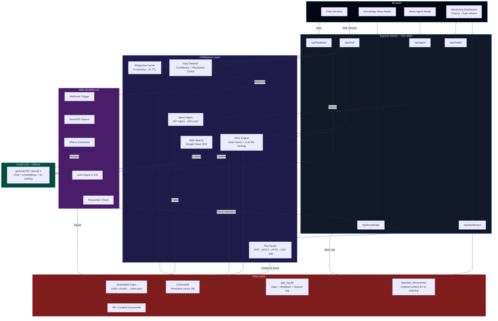
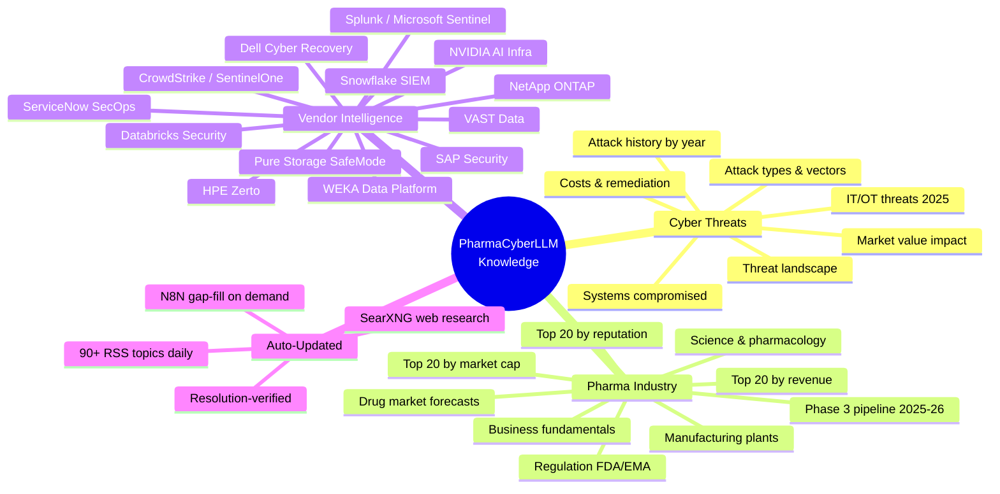

<div align="center">

# PharmaCyberLLM

### AI-Powered Cyber Threat Intelligence for the Pharmaceutical Industry

**Local LLM** | **Self-Healing RAG** | **Monitoring Dashboard** | **User Feedback** | **N8N Orchestration** | **Zero Cloud**

[](https://typescriptlang.org)
[](https://ollama.com)
[](https://www.trychroma.com)
[](https://n8n.io)
[](https://www.chartjs.org)
[](https://expressjs.com)
[](https://nodejs.org)

---

*A fully offline, self-healing RAG chatbot with a real-time monitoring dashboard, user feedback loop, and automated knowledge gap resolution — all orchestrated by N8N. Built for cybersecurity professionals who can't send sensitive queries to the cloud.*

</div>

---

## Why This Exists

> The pharmaceutical industry loses **$50M+ per cyber incident**. SOC analysts need instant access to threat intelligence — attack histories, vendor capabilities, regulatory impacts, pipeline exposure — but can't send proprietary questions to ChatGPT.

PharmaCyberLLM runs **entirely on your machine**. No API keys. No cloud. No data leaves your laptop.

It combines:
- A **local LLM** (via Ollama) for conversational intelligence
- A **dual vector store** (embedded index + ChromaDB) with 36+ curated pharma/cyber documents
- **LLM-powered re-ranking** for higher precision RAG retrieval
- An **automated news agent** that scrubs 90+ topics from Google News every 24 hours
- **Real-time web search** augmentation on every query
- A **self-healing knowledge gap detector** with closed-loop resolution verification
- A **real-time monitoring dashboard** with Chart.js visualizations
- A **user feedback system** that tracks response quality and identifies weak areas
- Full **N8N workflow orchestration** for automated gap research and ingestion

The result: an always-current, always-private, self-improving pharma cyber threat expert — with full observability.

---

## How It Works

```
User asks: "What ransomware attacks hit pharma in 2024?"
                    |
                    v
+-------------------------------------------------------------+
|                   PharmaCyberLLM Pipeline                    |
|                                                             |
|   +----------+   +----------+   +----------+               |
|   | Knowledge |   |   Web    |   |  Ollama  |               |
|   |  Search   |   |  Search  |   |   LLM    |               |
|   | (Hybrid)  |   | (Google) |   | (Local)  |               |
|   +-----+----+   +-----+----+   +-----+----+               |
|         |              |              |                      |
|         +------+-------+------+------+                      |
|                |              |                              |
|         Merged context   Gap Detector                       |
|                |              |                              |
|                v              v                              |
|         Streamed         Low confidence?                     |
|         response       +---> N8N Webhook                    |
|      with sources      |     --> SearXNG search             |
|      + response_id     |     --> Ollama extraction           |
|                        +---> Auto-ingest to KB              |
|                        +---> Resolution verification        |
+-------------------------------------------------------------+
                    |                           |
                    v                           v
"In 2024, Change Healthcare             Dashboard tracks:
 suffered a $2.87B breach..."          - Confidence rate
(citing: cyber-pharma-attacks.md)      - Response latency
                                       - User ratings
User can rate response (1-5)           - Gap resolution
```

---

## Monitoring Dashboard

A real-time dark-themed dashboard at `/dashboard` with auto-refresh every 60 seconds.

**Top row** — 4 key metric cards with trend arrows:
- Questions Today / Confidence Rate / Avg User Rating / Knowledge Base Size

**Charts** — 30-day time series:
- Questions & Confidence (dual-axis bar + line)
- User Ratings (with 3.0 baseline reference)

**Gap Intelligence**:
- Recent knowledge gaps table with color-coded status badges
- Top gap topics horizontal bar chart

**System Health**:
- Knowledge sources donut chart
- Service health checks (Ollama, ChromaDB, SearXNG, SQLite) with latency

All metrics are cached for 30 seconds and backed by indexed SQL queries.

---

## Self-Healing Knowledge Loop

The killer feature. PharmaCyberLLM **knows when it doesn't know** — fixes itself — and **verifies the fix worked**.

```
+------------------+     +-------------------+     +------------------+
|   User Question  | --> |  Ollama Response   | --> |  Gap Detector    |
|                  |     |  + response_id     |     |  (Confidence?)   |
+------------------+     +-------------------+     +--------+---------+
                                                            |
                                              Confident?    |    Not confident?
                                              (done)        |    (trigger)
                                                            v
                                                   +--------+---------+
                                                   |   N8N Webhook    |
                                                   |   (with gap_id)  |
                                                   +--------+---------+
                                                            |
                              +-----------------------------+----------------------------+
                              |                             |                            |
                              v                             v                            v
                    +---------+--------+      +-------------+---------+    +-------------+---------+
                    | Ollama: Generate |      | SearXNG: Search Web   |    | Ollama: Extract       |
                    | 3 search queries |      | (3 queries x 3 results)|    | relevant knowledge    |
                    +---------+--------+      +-------------+---------+    +-------------+---------+
                              |                             |                            |
                              +-----------------------------+----------------------------+
                                                            |
                                                            v
                                                   +--------+---------+
                                                   |  Store in KB     |
                                                   |  (ingest-text)   |
                                                   +--------+---------+
                                                            |
                                                            v
                                                   +--------+---------+
                                                   | Resolution Check |
                                                   | Re-ask question  |
                                                   | via full RAG     |
                                                   +--------+---------+
                                                            |
                                              +-------------+-------------+
                                              |                           |
                                              v                           v
                                        Confident now?              Still not?
                                        status=resolved           status=unresolved
                                        log new response          retry_count++
```

The gap detector uses a 2-hour cooldown per topic, logs every detection in SQLite, and the v2 N8N workflow verifies resolution automatically.

---

## User Feedback System

Every chat response includes a `response_id`. Users can rate responses 1-5 with optional comments.

The feedback system tracks:
- Which RAG chunks were used for each response
- Whether the response had RAG context or was pure LLM
- Ratings breakdown by topic, time period, and RAG vs non-RAG
- Low-rated responses (<=2) flagged for knowledge base improvement

```
POST /api/feedback
  { "response_id": "uuid", "rating": 4, "comment": "helpful" }

GET /api/feedback/stats
  -> avg ratings (7d, 30d, RAG vs non-RAG), best/worst topics

GET /api/feedback/low-rated
  -> all responses rated <=2 with chunk IDs used

GET /api/feedback/weekly-digest
  -> 7-day summary: questions, gaps, resolution rate, improvement priorities
```

---

## Architecture



---

## LLM Re-Ranking

The Python RAG pipeline uses **Ollama as a relevance judge** to re-rank retrieved chunks:

```
Query: "Dell cyber recovery ransomware"
         |
         v
  Retrieve top 15 from ChromaDB
         |
         v
  Send all 15 to Ollama (temp=0.1):
  "Score each chunk 0-10 for relevance..."
         |
         v
  Parse JSON scores, filter score >= 5
         |
         v
  Take top 5 (or fallback top 3)
         |
         v
  Prefix with section context:
  "From section 'Ransomware Defense' of vendor-dell.md: ..."
         |
         v
  Final RAG prompt to LLM
```

Re-ranking results are logged to `data/logs/reranking.log` for analysis.

---

## Knowledge Base

PharmaCyberLLM ships with **36+ curated intelligence documents** and **1000+ embedded chunks**:



### Curated Documents

| Category | Documents | Coverage |
|----------|-----------|----------|
| **Cyber Attacks** | 8 files | Every major pharma breach 2017-2025, attack vectors, systems compromised, financial impact, costs & remediation |
| **Pharma Business** | 9 files | Drug market forecasts, Phase 3 pipeline, top 20 rankings (revenue, market cap, reputation), manufacturing plants, regulation |
| **Vendor Intel** | 13 files | Dell, Snowflake, Databricks, ServiceNow, Pure Storage, NetApp, HPE, VAST, SAP, NVIDIA, WEKA, CrowdStrike, Splunk |
| **PDF Reports** | 2 files | Everpure AI Pharma Challenge executive briefings |
| **Auto-News** | Daily | 90+ search topics across business, science, cyber, and vendor categories |
| **Gap-Filled** | On-demand | Automatically researched via N8N, resolution-verified before marking complete |

---

## N8N Workflow v2 — Closed-Loop Gap Resolution

An importable N8N workflow that fills knowledge gaps **and verifies the fix worked**.

```
Webhook POST --> Ollama (3 queries) --> SearXNG (web search)
  --> Fetch pages --> Ollama (extraction) --> Filter relevance
  --> Store in KB --> Summary --> Resolution Check --> Log result
```

### Workflow Nodes (15 total)

| # | Node | Description |
|---|------|-------------|
| 1 | Knowledge Gap Webhook | Receives POST with `gap_id` from gap-detector |
| 2 | Generate Search Queries | Ollama generates 3 search queries |
| 3 | Parse Search Queries | Extracts queries into separate items |
| 4 | Search SearXNG | Web search per query |
| 5 | Deduplicate Results | Deduplicates by URL, max 9 results |
| 6 | Fetch Page Content | Fetches pages (skip on error) |
| 7 | Truncate & Clean | Strips HTML, limits to 8000 chars |
| 8 | Extract Knowledge | Ollama extracts relevant facts |
| 9 | Filter Relevant Only | Removes NOT_RELEVANT responses |
| 10 | Store in Knowledge Base | POSTs to `/api/knowledge/ingest-text` |
| 11 | Summary & Log | Aggregates stats |
| 12 | **Check Gap Resolution** | Calls `/api/knowledge/gaps/check-resolution` |
| 13 | **Resolution Result Log** | Logs resolved/unresolved status |
| 14 | SearXNG Error Handler | Graceful error handling |
| 15 | Ollama Query Error Handler | Fallback to search_topic |

Import: **N8N > Workflows > Import** > `n8n/knowledge_gap_workflow_v2.json`

---

## Smart Chunking

The Python vectordb uses intelligent document chunking:

| Feature | Detail |
|---------|--------|
| Split strategy | Paragraph boundaries first, then sentences |
| Split threshold | Paragraphs > 600 tokens get sentence-split |
| Merge threshold | Paragraphs < 100 tokens merged with next |
| Target size | 300-500 tokens per chunk |
| Section detection | Markdown headings, ALL CAPS titles, numbered sections |
| Metadata | `section_header`, `chunk_index`, `source_url`, `ingested_at`, `document_title` |
| Re-indexing | `POST /api/knowledge/reindex` rebuilds from `data/raw_documents/` |

---

## Quick Start

```bash
# 1. Install Ollama
brew install ollama
ollama pull gemma2:9b

# 2. Clone and install
git clone https://github.com/sebdallais-git/PharmaCyberLLM.git
cd PharmaCyberLLM
npm install

# 3. Start Ollama
ollama serve &

# 4. Launch
npm run dev

# --> Chat:      http://localhost:3000
# --> Dashboard: http://localhost:3000/dashboard
# --> Health:    http://localhost:3000/api/health
```

No API keys. No `.env` file. No cloud accounts.

### Optional: Enable Self-Healing + Full Stack

```bash
# 5. Set the N8N webhook URL
export N8N_WEBHOOK_URL="http://localhost:5678/webhook/knowledge-gap"

# 6. Import the v2 workflow into N8N
#    N8N > Workflows > Import > n8n/knowledge_gap_workflow_v2.json

# 7. Ensure SearXNG (port 8888) and ChromaDB (port 8100) are running

# 8. Restart
npm run dev
```

---

## Tech Stack

| Layer | Technology | Purpose |
|-------|-----------|---------|
| **Runtime** | Node.js 22 + TypeScript 5.6 | Type-safe server |
| **Server** | Express 4.21 | REST API + static file serving |
| **LLM** | Ollama (gemma2:9b) | Inference + embeddings + re-ranking |
| **Vector DB** | ChromaDB | Persistent vector store |
| **Dashboard** | Chart.js + vanilla HTML/CSS/JS | Real-time monitoring |
| **Orchestration** | N8N | Workflow automation with resolution check |
| **Web Search** | SearXNG + Google News RSS | Privacy-first web search |
| **Gap Detection** | Custom + SQLite | Confidence + cooldown + resolution verification |
| **Feedback** | SQLite + in-memory cache | User ratings + response tracking |
| **Re-ranking** | Ollama (Python) | LLM relevance scoring (0-10) |
| **Search** | Hybrid vector + keyword | Dual-store RAG retrieval |
| **Parsing** | pdf-parse, mammoth, JSZip | Multi-format document ingestion |
| **Streaming** | Server-Sent Events | Token-by-token chat output |
| **Python** | Utilities | Smart chunking, re-ranking, vector DB |

---

## Project Structure

```
PharmaCyberLLM/
+-- src/
|   +-- server.ts                  # Express entry + news agent + DB init
|   +-- api/
|   |   +-- chat.ts                # SSE streaming chat + timing + response_id
|   |   +-- knowledge.ts           # KB CRUD + gaps + resolution check + reindex
|   |   +-- agent.ts               # News agent status + manual trigger
|   |   +-- feedback.ts            # User feedback + stats + weekly digest
|   |   +-- dashboard.ts           # Dashboard metrics + health check
|   +-- services/
|       +-- ollama.ts              # Ollama chat, streaming, embeddings
|       +-- knowledge-store.ts     # In-memory vector store + hybrid search
|       +-- chromadb-store.ts      # ChromaDB client + delete/recreate
|       +-- gap-detector.ts        # Confidence check + resolution + N8N webhook
|       +-- feedback-store.ts      # Feedback table + stats + weekly digest
|       +-- response-cache.ts      # In-memory response metadata (1h TTL)
|       +-- request-log.ts         # Request logging + dashboard metrics + cache
|       +-- news-agent.ts          # 90-topic Google News scraper
|       +-- web-search.ts          # Real-time Google News RSS search
|       +-- file-parser.ts         # PDF, DOCX, PPTX, CSV, JSON, MD parser
+-- dashboard/
|   +-- index.html                 # Monitoring dashboard (Chart.js, dark theme)
+-- public/
|   +-- index.html                 # Chat UI
|   +-- styles.css                 # Dark theme
|   +-- app.js                     # Frontend logic
+-- knowledge/                     # 36+ curated pharma/cyber documents
+-- n8n/
|   +-- knowledge_gap_workflow.json      # N8N workflow v1
|   +-- knowledge_gap_workflow_v2.json   # N8N workflow v2 (with resolution check)
|   +-- README.md                        # N8N setup guide
+-- python/
|   +-- utils/                     # Smart chunking, re-ranking, vector DB
|   +-- tests/                     # Integration + vector DB tests
+-- data/
|   +-- chromadb/                  # ChromaDB persistent storage
|   +-- raw_documents/             # Original content for re-indexing
|   +-- logs/                      # Re-ranking logs
|   +-- gap_log.db                 # SQLite (gaps + feedback + request log)
+-- package.json
+-- tsconfig.json
+-- .gitignore
```

---

## API Reference

### Chat
| Endpoint | Method | Description |
|----------|--------|-------------|
| `/api/chat` | POST | SSE-streamed response with RAG context + `response_id` |
| `/api/chat/models` | GET | List available Ollama models |

### Knowledge
| Endpoint | Method | Description |
|----------|--------|-------------|
| `/api/knowledge/stats` | GET | Knowledge base stats |
| `/api/knowledge/search` | POST | Search the knowledge base |
| `/api/knowledge/ingest-text` | POST | Ingest raw text (saves to raw_documents/) |
| `/api/knowledge/upload` | POST | Upload and ingest a file |
| `/api/knowledge/add` | POST | Add to ChromaDB (URL or text) |
| `/api/knowledge/status` | GET | ChromaDB status |
| `/api/knowledge/reindex` | POST | Re-chunk and re-embed all raw documents |
| `/api/knowledge/gaps` | GET | Recent gap detections |
| `/api/knowledge/gaps/stats` | GET | Gap analytics |
| `/api/knowledge/gaps/check-resolution` | POST | Re-check if a gap is resolved |

### Feedback
| Endpoint | Method | Description |
|----------|--------|-------------|
| `/api/feedback` | POST | Submit rating (1-5) with `response_id` |
| `/api/feedback/stats` | GET | Rating analytics (RAG vs non-RAG, trends) |
| `/api/feedback/low-rated` | GET | Responses rated <=2 (improvement candidates) |
| `/api/feedback/weekly-digest` | GET | 7-day summary with improvement priorities |

### Dashboard & Health
| Endpoint | Method | Description |
|----------|--------|-------------|
| `/api/dashboard/metrics` | GET | All dashboard metrics (30s cached) |
| `/api/health` | GET | Service health (Ollama, ChromaDB, SearXNG, SQLite) |
| `/dashboard` | GET | Monitoring dashboard UI |

### Agent
| Endpoint | Method | Description |
|----------|--------|-------------|
| `/api/agent/status` | GET | News agent last run + topics |
| `/api/agent/run` | POST | Manually trigger news agent |

---

## Environment Variables

All optional — works out of the box with zero configuration.

| Variable | Default | Description |
|----------|---------|-------------|
| `PORT` | `3000` | Server port |
| `HOST` | `0.0.0.0` | Bind address |
| `OLLAMA_URL` | `http://localhost:11434` | Ollama API endpoint |
| `CHROMADB_URL` | `http://localhost:8100` | ChromaDB server endpoint |
| `N8N_WEBHOOK_URL` | *(none)* | N8N webhook for gap auto-fill |

---

## Integration with PharmaCyber

PharmaCyberLLM is designed as a companion to the [PharmaCyber](https://github.com/sebdallais-git/CyberDemo) incident response dashboard.

```
+-------------------------------+     +--------------------------+
|    PharmaCyber Dashboard      |     |    PharmaCyberLLM        |
|    (Port 8888)                |---->|    (Port 3000)           |
|                               |     |                          |
| Snowflake - ServiceNow - Dell |     | Chat + Dashboard         |
| Live incident response demo   |     | + Self-healing RAG       |
+-------------------------------+     +----------+---------------+
                                                  |
                                      +-----------v-----------+
                                      |   N8N (Port 5678)     |
                                      |   Auto gap-fill       |
                                      |   Resolution verify   |
                                      +-----------------------+
```

---

<div align="center">

**100% local. Zero cloud. Self-healing. Observable. Always current.**

*Ollama LLM* · *Dual RAG + Re-ranking* · *ChromaDB* · *Monitoring Dashboard* · *User Feedback* · *N8N Orchestration* · *36+ Intel Documents*

<br/>

Built for pharma cybersecurity professionals who take data sovereignty seriously.

</div>
