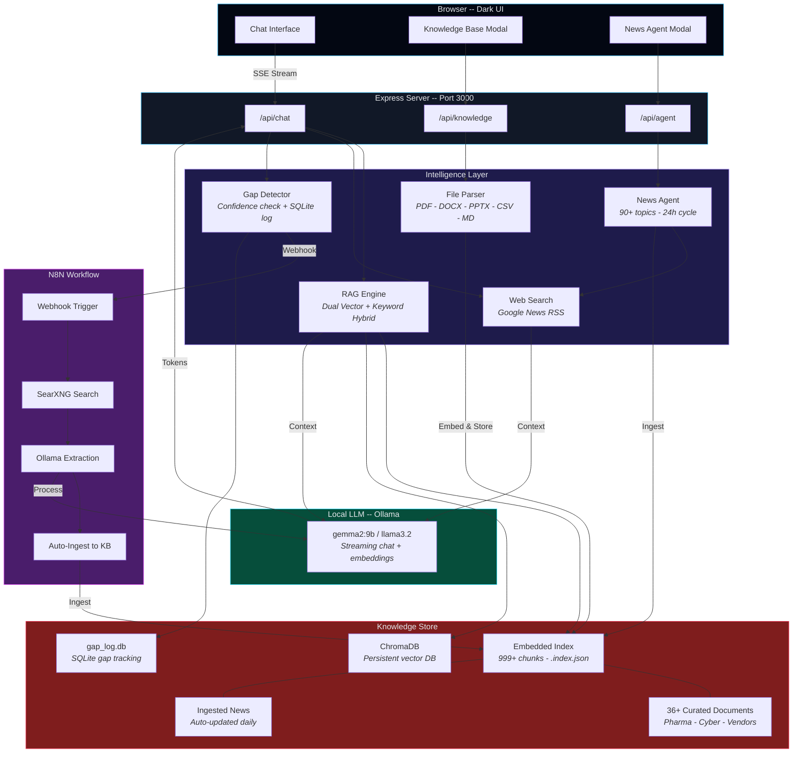
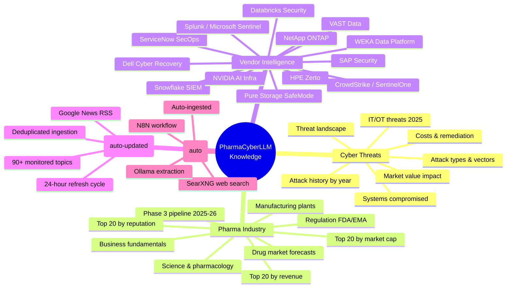

<div align="center">

# PharmaCyberLLM

### AI-Powered Cyber Threat Intelligence for the Pharmaceutical Industry

**Local LLM** | **Dual RAG** | **Auto Gap-Fill** | **N8N Orchestration** | **Zero Cloud**

[](https://typescriptlang.org)
[](https://ollama.com)
[](https://www.trychroma.com)
[](https://n8n.io)
[](https://expressjs.com)
[](https://nodejs.org)

---

*A fully offline, self-healing RAG chatbot that detects its own knowledge gaps, automatically researches the web, and ingests new intelligence — all orchestrated by N8N. Built for cybersecurity professionals who can't send sensitive queries to the cloud.*

</div>

---

## Why This Exists

> The pharmaceutical industry loses **$50M+ per cyber incident**. SOC analysts need instant access to threat intelligence — attack histories, vendor capabilities, regulatory impacts, pipeline exposure — but can't send proprietary questions to ChatGPT.

PharmaCyberLLM runs **entirely on your machine**. No API keys. No cloud. No data leaves your laptop.

It combines:
- A **local LLM** (via Ollama) for conversational intelligence
- A **dual vector store** (embedded index + ChromaDB) with 36+ curated pharma/cyber documents
- An **automated news agent** that scrubs 90+ topics from Google News every 24 hours
- **Real-time web search** augmentation on every query
- A **self-healing knowledge gap detector** that identifies weak answers and auto-fills them via N8N + SearXNG

The result: an always-current, always-private, self-improving pharma cyber threat expert.

---

## How It Works

```
User asks: "What ransomware attacks hit pharma in 2024?"
                    |
                    v
+-------------------------------------------------------------+
|                   PharmaCyberLLM Pipeline                    |
|                                                             |
|   +----------+   +----------+   +----------+               |
|   | Knowledge |   |   Web    |   |  Ollama  |               |
|   |  Search   |   |  Search  |   |   LLM    |               |
|   | (Hybrid)  |   | (Google) |   | (Local)  |               |
|   +-----+----+   +-----+----+   +-----+----+               |
|         |              |              |                      |
|         +------+-------+------+------+                      |
|                |              |                              |
|         Merged context   Gap Detector                       |
|                |              |                              |
|                v              v                              |
|         Streamed         Low confidence?                     |
|         response       +---> N8N Webhook                    |
|      with sources      |     --> SearXNG search             |
|                        |     --> Ollama extraction           |
|                        +---> Auto-ingest to KB              |
+-------------------------------------------------------------+
                    |
                    v
"In 2024, Change Healthcare suffered a $2.87B breach..."
(citing: cyber-pharma-attacks-extended.md, Google News)

Meanwhile: gap-detector already enriched the KB for next time.
```

---

## Self-Healing Knowledge Loop

The killer feature. PharmaCyberLLM **knows when it doesn't know** — and fixes itself.

```
+------------------+     +-------------------+     +------------------+
|   User Question  | --> |  Ollama Response   | --> |  Gap Detector    |
|                  |     |                    |     |  (Confidence?)   |
+------------------+     +-------------------+     +--------+---------+
                                                            |
                                              Confident?    |    Not confident?
                                              (done)        |    (trigger)
                                                            v
                                                   +--------+---------+
                                                   |   N8N Webhook    |
                                                   +--------+---------+
                                                            |
                              +-----------------------------+----------------------------+
                              |                             |                            |
                              v                             v                            v
                    +---------+--------+      +-------------+---------+    +-------------+---------+
                    | Ollama: Generate |      | SearXNG: Search Web   |    | Ollama: Extract       |
                    | 3 search queries |      | (3 queries x 3 results)|    | relevant knowledge    |
                    +---------+--------+      +-------------+---------+    +-------------+---------+
                              |                             |                            |
                              +-----------------------------+----------------------------+
                                                            |
                                                            v
                                                   +--------+---------+
                                                   |  Store in KB     |
                                                   |  (ingest-text)   |
                                                   +--------+---------+
                                                            |
                                                            v
                                                   +--------+---------+
                                                   |  Next time user  |
                                                   |  asks = better   |
                                                   |  answer!         |
                                                   +------------------+
```

The gap detector uses a 2-hour cooldown per topic to avoid flooding, and logs every detection in SQLite for analytics.

---

## Architecture



---

## Knowledge Base

PharmaCyberLLM ships with **36+ curated intelligence documents** and **999+ embedded chunks** covering the pharma cyber threat landscape:



### Curated Documents

| Category | Documents | Coverage |
|----------|-----------|----------|
| **Cyber Attacks** | 8 files | Every major pharma breach 2017-2025, attack vectors, systems compromised, financial impact, costs & remediation |
| **Pharma Business** | 9 files | Drug market forecasts, Phase 3 pipeline, top 20 rankings (revenue, market cap, reputation), manufacturing plants, regulation |
| **Vendor Intel** | 13 files | Dell, Snowflake, Databricks, ServiceNow, Pure Storage, NetApp, HPE, VAST, SAP, NVIDIA, WEKA, CrowdStrike, Splunk |
| **PDF Reports** | 2 files | Everpure AI Pharma Challenge executive briefings |
| **Auto-News** | Daily | 90+ search topics across business, science, cyber, and vendor categories |
| **Gap-Filled** | On-demand | Automatically researched and ingested via N8N when knowledge gaps are detected |

---

## N8N Workflow — Knowledge Gap Auto-Fill

An importable N8N workflow that automatically fills knowledge gaps detected by the chatbot.

```
Webhook POST ──> Ollama (3 queries) ──> SearXNG (web search)
    ──> Fetch pages ──> Ollama (extraction) ──> Filter relevance
    ──> Store in KB ──> Summary log
```

### Workflow Nodes

| # | Node | Type | Description |
|---|------|------|-------------|
| 1 | Knowledge Gap Webhook | Webhook | Receives POST from gap-detector |
| 2 | Generate Search Queries | HTTP Request | Ollama generates 3 search queries |
| 3 | Parse Search Queries | Code | Parses response into 3 items |
| 4 | Search SearXNG | HTTP Request | Web search per query |
| 5 | Deduplicate Results | Code | Deduplicates by URL, max 9 results |
| 6 | Fetch Page Content | HTTP Request | Fetches each page (skip on error) |
| 7 | Truncate & Clean | Code | Strips HTML, limits to 8000 chars |
| 8 | Extract Knowledge | HTTP Request | Ollama extracts relevant facts |
| 9 | Filter Relevant Only | Code | Removes NOT_RELEVANT responses |
| 10 | Store in Knowledge Base | HTTP Request | POSTs to `/api/knowledge/ingest-text` |
| 11 | Summary & Log | Code | Aggregates stats and logs result |

Error handling: Ollama fallback (uses search_topic directly), SearXNG graceful stop, page fetch skip-on-error, configurable timeouts (30s-120s).

Import: **N8N > Workflows > Import from File** > select `n8n/knowledge_gap_workflow.json`

---

## The News Agent

An autonomous agent that keeps the knowledge base current — no manual updates needed.

```
Every 24 hours:
    |
    +-- Scrub 90+ topics across Google News RSS
    |   +-- Pharma business (8 topics)
    |   +-- Pharma science (8 topics)
    |   +-- Cyber threats (8 topics)
    |   +-- Storage & recovery vendors (5 topics)
    |   +-- NVIDIA & AI infra (3 topics)
    |   +-- SIEM & security ops (4 topics)
    |   +-- Security data platforms (2 topics)
    |   +-- IT operations (2 topics)
    |   +-- SAP security (3 topics)
    |   +-- Endpoint & identity (4 topics)
    |   +-- Phase 3 pipeline (6 topics)
    |
    +-- Deduplicate against 2,000 seen titles
    |
    +-- Embed & ingest new articles
    |
    +-- Save updated index
```

---

## Dual RAG Pipeline

The search pipeline uses a **dual-store hybrid approach** — combining an embedded vector index with ChromaDB and keyword matching for maximum recall:

```
Query: "Dell cyber recovery ransomware"
         |
         +-- Embedded Vector Search (70% weight)
         |   +-- Cosine similarity on Ollama embeddings
         |   +-- 999+ pre-indexed chunks
         |
         +-- ChromaDB Vector Search
         |   +-- Persistent vector DB (port 8100)
         |   +-- Gap-filled + URL-ingested content
         |
         +-- Keyword Search (30% weight)
         |   +-- Exact term matching (pharma-specific boost)
         |
         +-- Deduplication
         |   +-- Content-prefix dedup across chunks
         |
         +-- Top 8 chunks --> LLM context window
```

| Parameter | Value |
|-----------|-------|
| Chunk size | 800 characters |
| Embedding model | Ollama (same as chat model) |
| Similarity threshold | 0.2 |
| Top-K retrieval | 8 chunks |
| Hybrid ratio | 70% vector / 30% keyword |
| ChromaDB | Persistent, auto-synced |

---

## File Ingestion

Drop any document into the chat or knowledge base — PharmaCyberLLM parses it instantly:

| Format | Parser | Notes |
|--------|--------|-------|
| `.pdf` | pdf-parse | Full text extraction |
| `.docx` | mammoth | Word document support |
| `.pptx` / `.ppt` | JSZip + XML | Slide-by-slide text extraction |
| `.csv` | Built-in | Header-aware row formatting |
| `.json` | Built-in | Recursive object flattening |
| `.txt` / `.md` | Native | Direct ingestion |

---

## Quick Start

```bash
# 1. Install Ollama (if not already installed)
brew install ollama
ollama pull gemma2:9b

# 2. Clone and install
git clone https://github.com/sebdallais-git/PharmaCyberLLM.git
cd PharmaCyberLLM
npm install

# 3. Start Ollama
ollama serve &

# 4. Launch
npm run dev

# --> http://localhost:3000
```

That's it. No API keys. No `.env` file. No cloud accounts.

### Optional: Enable Self-Healing (N8N + SearXNG)

```bash
# 5. Set the N8N webhook URL
export N8N_WEBHOOK_URL="http://localhost:5678/webhook/knowledge-gap"

# 6. Import the workflow into N8N
#    N8N > Workflows > Import from File > n8n/knowledge_gap_workflow.json

# 7. Ensure SearXNG is running on port 8888
#    and ChromaDB on port 8100

# 8. Restart the server
npm run dev
```

Now when the chatbot gives a weak answer, it automatically researches and learns.

---

## Tech Stack

| Layer | Technology | Purpose |
|-------|-----------|---------|
| **Runtime** | Node.js 22 + TypeScript 5.6 | Type-safe server |
| **Server** | Express 4.21 | REST API + static file serving |
| **LLM** | Ollama (gemma2:9b) | Local inference + embeddings |
| **Vector DB** | ChromaDB | Persistent vector store for gap-filled content |
| **Orchestration** | N8N | Workflow automation for knowledge gap filling |
| **Web Search** | SearXNG + Google News RSS | Privacy-first web search |
| **Gap Detection** | Custom + SQLite | Confidence analysis + cooldown + logging |
| **Search** | Hybrid vector + keyword | Dual-store RAG retrieval |
| **Parsing** | pdf-parse, mammoth, JSZip | Multi-format document ingestion |
| **Frontend** | Vanilla HTML/CSS/JS | Dark theme, SSE streaming |
| **Streaming** | Server-Sent Events | Token-by-token chat output |
| **Python** | Utilities | Search and vector DB helpers |

---

## Project Structure

```
PharmaCyberLLM/
+-- src/
|   +-- server.ts                # Express entry point + news agent scheduler
|   +-- api/
|   |   +-- chat.ts              # SSE streaming chat with RAG context injection
|   |   +-- knowledge.ts         # Knowledge base CRUD + search + ChromaDB + gaps API
|   |   +-- agent.ts             # News agent status + manual trigger
|   +-- services/
|       +-- ollama.ts            # Ollama chat, streaming, embeddings, model list
|       +-- knowledge-store.ts   # Vector store -- chunking, embedding, hybrid search
|       +-- chromadb-store.ts    # ChromaDB persistent vector store client
|       +-- gap-detector.ts      # Confidence check, cooldown, SQLite log, N8N webhook
|       +-- news-agent.ts        # 90-topic Google News scraper + dedup + ingest
|       +-- web-search.ts        # Real-time Google News RSS search
|       +-- file-parser.ts       # PDF, DOCX, PPTX, CSV, JSON, MD parser
+-- public/
|   +-- index.html               # Chat UI
|   +-- styles.css               # Dark theme
|   +-- app.js                   # Frontend logic -- chat, modals, file upload
+-- knowledge/                   # 36+ curated pharma/cyber documents
|   +-- cyber-*.md               # 8 cyber threat intelligence files
|   +-- pharma-*.md              # 9 pharma industry files
|   +-- vendor-*.md              # 13 vendor intelligence files
|   +-- *.pdf                    # Executive briefing PDFs
|   +-- .index.json              # Embedded vector index (auto-generated)
+-- n8n/
|   +-- knowledge_gap_workflow.json  # Importable N8N workflow
|   +-- README.md                    # N8N setup guide
+-- python/
|   +-- utils/                   # Search and vector DB helpers
|   +-- tests/                   # Integration + vector DB tests
+-- data/
|   +-- chromadb/                # ChromaDB persistent storage
|   +-- gap_log.db               # SQLite gap detection log
+-- package.json
+-- tsconfig.json
+-- .gitignore
```

---

## API Reference

| Endpoint | Method | Description |
|----------|--------|-------------|
| `/api/chat` | POST | Send a message, receive SSE-streamed response with RAG context |
| `/api/chat/models` | GET | List available Ollama models |
| `/api/knowledge/stats` | GET | Knowledge base stats (chunks, sources) |
| `/api/knowledge/search` | POST | Search the knowledge base |
| `/api/knowledge/ingest-text` | POST | Ingest raw text into the knowledge base |
| `/api/knowledge/upload` | POST | Upload and ingest a file (multipart) |
| `/api/knowledge/add` | POST | Add content to ChromaDB (URL or text) |
| `/api/knowledge/status` | GET | ChromaDB connection status and stats |
| `/api/knowledge/gaps` | GET | Recent knowledge gap detections |
| `/api/knowledge/gaps/stats` | GET | Gap detection analytics |
| `/api/agent/status` | GET | News agent last run time + topics |
| `/api/agent/run` | POST | Manually trigger the news agent |

---

## Environment Variables

All optional — PharmaCyberLLM works out of the box with zero configuration.

| Variable | Default | Description |
|----------|---------|-------------|
| `PORT` | `3000` | Server port |
| `HOST` | `0.0.0.0` | Bind address |
| `OLLAMA_URL` | `http://localhost:11434` | Ollama API endpoint |
| `CHROMADB_URL` | `http://localhost:8100` | ChromaDB server endpoint |
| `N8N_WEBHOOK_URL` | *(none)* | N8N webhook URL for gap detection auto-fill |

---

## Integration with PharmaCyber

PharmaCyberLLM is designed as a companion to the [PharmaCyber](https://github.com/sebdallais-git/CyberDemo) incident response dashboard. The PharmaCyber dashboard includes a direct link to this chatbot, giving SOC analysts and demo presenters instant access to threat intelligence alongside live scenario execution.

```
+-------------------------------+     +--------------------------+
|    PharmaCyber Dashboard      |     |    PharmaCyberLLM        |
|    (Port 8888)                |---->|    (Port 3000)           |
|                               |     |                          |
| Snowflake - ServiceNow - Dell |     | "What attacks hit        |
| Live incident response demo   |     |  pharma SCADA in 2024?"  |
+-------------------------------+     +----------+---------------+
                                                  |
                                      +-----------v-----------+
                                      |   N8N (Port 5678)     |
                                      |   Auto gap-fill       |
                                      |   SearXNG search      |
                                      +-----------------------+
```

---

<div align="center">

**100% local. Zero cloud. Self-healing. Always current.**

*Ollama LLM* · *Dual RAG* · *ChromaDB* · *N8N Orchestration* · *Gap Detection* · *36+ Curated Intel Documents*

<br/>

Built for pharma cybersecurity professionals who take data sovereignty seriously.

</div>
