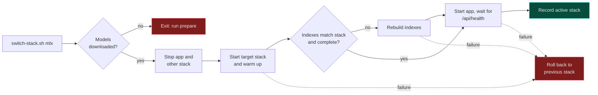
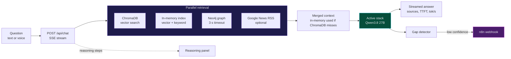

<div align="center">

# PharmaCyberLLM

### Local-first cyber threat intelligence for the pharmaceutical industry

A RAG chatbot that runs a 27B Qwen model on your own Mac, on **Ollama or MLX**, grounds every answer in a hybrid vector + graph knowledge base, and detects and fills its own knowledge gaps.

[](https://nodejs.org)
[](https://www.typescriptlang.org)
[](https://expressjs.com)
<br/>
[](https://ollama.com)
[](https://github.com/ml-explore/mlx-lm)
[](#benchmarks-ollama-vs-mlx)
<br/>
[](https://www.trychroma.com)
[](https://neo4j.com)
[](https://n8n.io)

[](#testing)
[](#choose-your-stack)

[Quick Start](#quick-start) · [Choose Your Stack](#choose-your-stack) · [Benchmarks](#benchmarks-ollama-vs-mlx) · [How It Works](#how-it-works) · [API](#api-reference)

</div>

---

## Why PharmaCyberLLM

Security teams in pharma need fast answers about attack histories, threat actors, vendor capabilities and regulations, but the questions themselves are sensitive: they reveal what a company runs, what it fears and where it is exposed. Pasting them into a cloud chatbot is often not an option.

> PharmaCyberLLM keeps the model, the embeddings and the knowledge base on your machine. No API keys, no cloud LLM, no `.env` file required.

At runtime, network access is limited to live news lookups (Google News RSS for web search and the news agent), URLs you explicitly add to the knowledge base, and, if you enable it, the n8n research loop through your own SearXNG instance. Web search can be switched off in the chat UI.

---

## Highlights

| | Feature | What it does |
|---|---|---|
| 🧠 | **Local 27B LLM** | Qwen3.8 27B (4-bit) for chat and Qwen3-Embedding 0.6B (8-bit), on Ollama or MLX |
| 🔀 | **Two interchangeable stacks** | One script switches Ollama ⇄ MLX, with per-stack indexes and automatic rollback |
| 🔎 | **Hybrid retrieval** | ChromaDB, an in-memory vector + keyword index, Neo4j Graph RAG and live news, in parallel |
| 💭 | **Visible reasoning** | Each retrieval step streams to the UI over SSE, with sources, TTFT and tok/s per answer |
| 🩹 | **Self-healing knowledge** | Low-confidence answers trigger an n8n workflow that researches, ingests and re-checks the gap |
| 🎙️ | **Voice input** | Local speech-to-text with whisper.cpp; HTTPS mode for iPad and mobile microphones |
| 📰 | **News agent** | 188 search topics pulled from Google News every 24 hours into the knowledge base |
| 📊 | **Monitoring dashboard** | Chart.js dashboard for questions, confidence, ratings, gaps, KB health and service status |
| ⭐ | **Feedback loop** | 1–5 ratings tied to the chunks used, RAG vs non-RAG comparison, weekly digest |
| ⏱️ | **Built-in benchmark** | Reproducible Ollama vs MLX comparison with retrieval overlap and a blind A/B review page |

---

## Quick Start

**Prerequisites:** a Mac with Apple Silicon (MLX requires it), [Homebrew](https://brew.sh), Node.js 22, Python 3, about 33 GB of free disk for the models, and `ffmpeg` if you want voice input.

```bash
# 1. Install Ollama and the Node dependencies
brew install ollama && brew services start ollama
git clone https://github.com/sebdallais-git/PharmaCyberLLM.git
cd PharmaCyberLLM
npm install

# 2. One-time setup: download both stacks' models (~33 GB), create the MLX venv,
#    then start ChromaDB, build the active stack's indexes and launch PharmaLLM
scripts/switch-stack.sh prepare
```

When `prepare` finishes, PharmaLLM is running on the Ollama stack (the default):

| | URL |
|---|---|
| 💬 Chat | http://localhost:3000 |
| 📊 Dashboard | http://localhost:3000/dashboard |
| ❤️ Health | http://localhost:3000/api/health |

Later sessions start everything (ChromaDB, the last active stack and a hot-reload dev server) with:

```bash
npm run dev
```

> [!NOTE]
> The first index build re-embeds the whole knowledge base (about 7,000 raw documents) and took 12–16 minutes on an M4 Pro. Ollama 0.17.6 could not pull Qwen3.8; the setup was verified with Ollama 0.34.0.

<details>
<summary><b>Optional: self-healing loop (n8n + SearXNG)</b></summary>

<br/>

1. Run [SearXNG](https://github.com/searxng/searxng) on `http://localhost:8888` and [n8n](https://n8n.io) on `http://localhost:5678`.
2. In n8n, import `n8n/knowledge_gap_workflow_v2.json` and `n8n/knowledge_qa_workflow.json` (**Workflows → Import from File**) and activate them.
3. Point the gap detector at the webhook and restart:

```bash
export N8N_WEBHOOK_URL="http://localhost:5678/webhook/knowledge-gap"
npm run dev
```

</details>

<details>
<summary><b>Optional: Graph RAG (Neo4j)</b></summary>

<br/>

```bash
# Neo4j Community in Docker (the app's default password is pharma2024)
docker run -d --name neo4j-pharma \
  -p 7474:7474 -p 7687:7687 \
  -e NEO4J_AUTH=neo4j/pharma2024 \
  neo4j:community

# Bulk-extract entities from knowledge/*.md (requires the Ollama stack to be running)
pip install -r python/requirements.txt
python python/graph_builder.py
```

`graph_builder.py` calls Ollama's `/api/generate` directly with `OLLAMA_MODEL` (default `mistral-small:24b`), so pull that model or set `OLLAMA_MODEL` to one you have. Browse the graph at http://localhost:7474. New content from the news agent and uploads is added to the graph automatically.

</details>

---

## Choose Your Stack

Every local model call, chat and embeddings alike, runs on **exactly one** stack. Both stacks run the same models at matching quantization levels (4-bit chat, 8-bit embeddings), so they can be compared fairly. There is no silent fallback: if the active stack is down, requests fail with a clear error.

| | 🦙 Ollama stack | 🍎 MLX stack |
|---|---|---|
| **Chat model** | `qwen3.8-pharma` (Qwen3.8 27B Q4_K_M, 16k context) | `mlx-community/Qwen3.8-27B-4bit` via `mlx_lm.server` |
| **Embedding model** | `qwen3-embedding:0.6b-q8_0` | `mlx-community/Qwen3-Embedding-0.6B-8bit` via `python/mlx-embed-server.py` |
| **Ports** | `:11434` | `:8080` chat, `:8081` embeddings |
| **ChromaDB collection** | `knowledge_base_ollama` | `knowledge_base_mlx` |
| **In-memory index** | `knowledge/.index.ollama.json` | `knowledge/.index.mlx.json` |
| **Graph rebuild** | ✅ supported | ❌ switch to Ollama first (`409`) |

```bash
scripts/switch-stack.sh mlx      # stop Ollama, start MLX, restart PharmaLLM (rolls back on failure)
scripts/switch-stack.sh ollama   # and back
scripts/switch-stack.sh status   # active stack, ports and index counts for both stacks
scripts/switch-stack.sh prepare  # one-time model downloads (Ollama pulls + Hugging Face snapshots)
```



**How the switch stays safe**

- **One client:** `src/services/llm-client.ts` talks to both stacks through the OpenAI-compatible `/v1/chat/completions` and `/v1/embeddings` APIs; `src/config/llm-stacks.ts` only swaps base URLs and model names. Thinking mode is disabled on both.
- **Guarded indexes:** each index records its stack, embedding model and dimension (1024), plus a completeness marker written only when a rebuild ran to the end. Search on a mismatched, incomplete or rebuilding index is refused instead of returning meaningless matches.
- **Rebuildable from source:** indexes are rebuilt from `knowledge/` and `data/raw_documents/`, where uploads, ingested text and news articles are saved first. Rebuild with `LLM_PROVIDER=<stack> npx tsx scripts/reindex-stack.ts` (app stopped) or `POST /api/knowledge/reindex` (app running).
- **n8n follows the stack:** workflows call `POST /api/llm/complete`, which runs on whichever stack is active.

---

## Benchmarks: Ollama vs MLX

First head-to-head run on a **Mac mini M4 Pro, 48 GB** (macOS 26.4), 2026-09-16. Full pipeline through `POST /api/chat`: 23 questions from `bench/questions.json`, one cold run each after a warm-up question outside the set, temperature 0, no web search, `max_tokens` 1024 on both stacks, background LLM jobs paused.

| Metric (median) | 🦙 Ollama | 🍎 MLX | MLX vs Ollama |
|---|---:|---:|---:|
| Time to first token | 19.1 s | 18.5 s | **−2.8%** |
| Decode speed | 12.4 tok/s | 13.0 tok/s | **+4.9%** |
| Total time per answer | 99.6 s | 93.8 s | **−5.8%** |
| Query embedding | 30 ms | 18 ms | −40.0% |
| Retrieval | 80 ms | 42 ms | −47.5% |
| Peak system memory used | 39,958 MB | 37,338 MB | **−6.6%** |
| Loaded model memory (chat + embeddings) | ~20.4 GB | 16.0 GB | ≈ −22% |
| Index build (~7k raw documents) | 15.6 min | 11.6 min | −25% |
| Failed runs | 0 / 23 | 0 / 23 | |

**Quality checks:** cross-stack embedding parity has a mean cosine of **0.9986** (min 0.9875 over 20 texts, threshold 0.98), and retrieved chunks overlap at **0.91** (mean Jaccard), so both stacks answered from nearly the same evidence.

**Reading it honestly**

- 🟰 MLX is modestly faster end to end (~6%). Generation dominates: embedding and retrieval gains are milliseconds against ~95 s answers.
- ✂️ Most answers hit the 1024-token cap (15/23 on Ollama, 13/23 on MLX). The cap is identical, so the comparison is fair, but totals reflect truncated answers and the blind review compares truncated text.
- 🧮 The benchmark's own Ollama *process* memory reading (59 MB) was invalid: Ollama 0.34 runs models in `llama-server` child processes the sampler missed. The ~20.4 GB figure was measured directly afterwards (17,576 MB chat + 2,780 MB embeddings), and the sampler has since been fixed. The system-wide peak was unaffected.
- 🔁 This is a single cold run per question on one machine, so treat the percentages as a first signal rather than a verdict.

<details>
<summary><b>Reproduce the benchmark</b></summary>

<br/>

```bash
scripts/switch-stack.sh ollama && npx tsx scripts/benchmark-stack.ts
scripts/switch-stack.sh mlx    && npx tsx scripts/benchmark-stack.ts
npx tsx scripts/compare-benchmarks.ts data/benchmarks/ollama-<time>.json data/benchmarks/mlx-<time>.json
```

`benchmark-stack.ts` accepts `--runs`, `--app` and `--questions`. Benchmark mode (`/api/bench/start`, a 15-minute lease) pauses the news agent and other background LLM jobs; chat requests with `benchmark: true` use temperature 0, skip web search and cap answers at 1024 tokens. The comparison reports TTFT, decode speed, embedding and retrieval time, peak memory, retrieval overlap, and writes a blind A/B review page with stack labels hidden.

Embedding parity check (stacks run one after the other):

```bash
LLM_PROVIDER=ollama npx tsx scripts/embedding-parity.ts save data/benchmarks/parity-ollama.json
LLM_PROVIDER=mlx    npx tsx scripts/embedding-parity.ts save data/benchmarks/parity-mlx.json
npx tsx scripts/embedding-parity.ts compare data/benchmarks/parity-ollama.json data/benchmarks/parity-mlx.json
```

The question set has 23 questions: 11 vendor, 5 threat, 2 regulation, 2 pharma, and 3 deliberately not covered by the knowledge base.

</details>

---

## How It Works

### Request pipeline



The reasoning panel shows each step live ("Searching knowledge graph...", "Searching the web for: ...") and collapses when the first answer token arrives. Each answer carries a `response_id` for feedback. Typing `/names` toggles whether answers name specific companies in incident discussions.

### Self-healing knowledge loop


A second workflow runs every 6 hours as a KB health check: it sends test queries through the full RAG pipeline, has the active stack score each answer and flag hallucinations, and posts the report to `/api/dashboard/kb-health` (168 reports kept, 7 days).

### Knowledge graph

Neo4j stores **14 entity types** (Company, Subsidiary, Drug, TherapeuticArea, ManufacturingSite, Country, RegulatoryBody, Regulation, ThreatActor, Attack, AttackVector, Vendor, Product, Technology) and **20 relationship types** such as `ACQUIRED`, `MANUFACTURES`, `TARGETED`, `ATTRIBUTED_TO`, `USED_VECTOR` and `PROTECTS_AGAINST`. Chat extracts likely entity names from the question and queries the graph alongside vector search; graph writes from the news agent and uploads run asynchronously so they never block a response.

---

## Voice Input and HTTPS

The mic button records audio in the browser (MediaRecorder), uploads it to `POST /api/chat/transcribe` (max 25 MB), converts it to 16 kHz WAV with `ffmpeg`, and transcribes it locally with whisper.cpp (`ggml-base.en`, bundled with `whisper-node`).

Browsers only allow microphone access on secure origins, so an **iPad or phone needs HTTPS**. Put a key and certificate in `certs/`:

```
certs/key.pem
certs/cert.pem
```

When both files exist, the server also listens on **https://&lt;your-mac&gt;:3443** (`HTTPS_PORT`). The device must trust the certificate.

---

## Monitoring and Feedback

**Dashboard** (`/dashboard`, refreshes every 60 s, metrics cached 30 s):

| Panel | Shows |
|---|---|
| Metric cards | Questions today, confidence rate, average rating, knowledge base size |
| Time series | 30-day questions and confidence, user ratings |
| Gap intelligence | Recent gaps with status, top gap topics |
| System health | Knowledge sources, active stack, ChromaDB, SearXNG, Neo4j and SQLite checks with latency |

**Health** (`/api/health`) is `healthy`, `degraded` when only ChromaDB, SearXNG or Neo4j is down, or `unhealthy` when the active stack's chat or embedding endpoint or the search index is unusable. The inactive stack is never probed.

**Feedback:** ratings (1–5) are linked to the chunks used, compared across RAG and non-RAG answers, and answers rated 2 or lower are surfaced as improvement candidates. ChromaDB misses are logged to show coverage gaps.

---

## n8n Workflows

| File | Nodes | Purpose |
|---|---:|---|
| `n8n/knowledge_gap_workflow_v2.json` | 15 | Gap auto-fill with resolution check (recommended) |
| `n8n/knowledge_gap_workflow.json` | 13 | Gap auto-fill, v1 |
| `n8n/knowledge_qa_workflow.json` | 12 | KB health monitor, every 6 hours |

All LLM steps call `POST /api/llm/complete`, so they run on the active stack. The endpoint accepts an Ollama `/api/generate`-shaped body; the `model` field is ignored, and `temperature` or `options.temperature` is honored. It returns `503` while a benchmark runs. See `n8n/README.md` for setup details.

---

## Knowledge Base

`knowledge/` ships **40 curated documents** (36 Markdown, 2 DOCX, 2 PDF), grown by the news agent, uploads and the n8n loop. At the last verified rebuild, each stack's index held about **7,600 chunks**.

| Area | Examples |
|---|---|
| 🛡️ Cyber threats | Major pharma attacks, attacks by year, attack types, systems compromised, costs and remediation, IT/OT threats 2025 |
| 💊 Pharma industry | Business and science basics, regulation, Phase 3 pipeline 2025–26, top 20 by revenue / market cap / reputation, manufacturing plants, Basel biotech hub |
| 🏢 Vendor intelligence | Dell, Pure Storage, NetApp, HPE, VAST Data, WEKA, NVIDIA, SAP, ServiceNow, Snowflake, Databricks, Splunk / Sentinel / CrowdStrike, endpoint and identity security, Bug Bounty Switzerland |

Uploads accept `.txt`, `.md`, `.pdf`, `.csv`, `.json`, `.docx`, `.pptx` and `.ppt`.

---

## Agents and MCP

PharmaLLM can serve AI agents such as [Hermes Agent](https://hermes-agent.nousresearch.com/) in two ways:

| | Endpoint | Purpose |
|---|---|---|
| 🧰 **MCP tools** | `pharmallm-mcp` at `http://<host>:3200/mcp` | 16 tools: search, full RAG answers, add knowledge, graph, gaps, health, news agent, background reindex, feedback |
| 🧠 **Model gateway** | `http://<host>:3000/v1` or `https://<host>:3443/v1` | OpenAI-compatible chat completions on the active stack (tools and streaming supported) |

```bash
scripts/switch-stack.sh token             # create data/run/api-token, then restart the app
npm --prefix mcp install
PHARMALLM_API_TOKEN="$(cat data/run/api-token)" npm --prefix mcp start
```

- **Security:** without a token, the gateway and operations routes only accept requests from the same machine addressed as `localhost`, `127.0.0.1` or `[::1]` (other Host names are refused, which blocks DNS rebinding). With a token, every protected route requires `Authorization: Bearer <token>` on both ports (3000 and HTTPS 3443).
- **Browser routes stay open:** chat, search, upload, ingest-text, news agent run and the dashboard reads (see [API Reference](#api-reference)) are open by design to anyone who can reach the app.
- **Reverse proxies:** a local reverse proxy in front of the app (e.g. `tailscale serve`, caddy) makes every request look like it comes from the same machine; enable the token in that setup.
- **Gateway fields:** only `messages`, `tools`, `tool_choice`, `stream`, `stream_options`, `temperature` and `max_tokens` (capped at 4096) are forwarded; the stack's model is always used and other fields such as `stop`, `top_p` or `response_format` are dropped.
- **Two machines:** run the agent on one Mac and PharmaLLM plus the model on another by pointing the agent at the model Mac's LAN or Tailscale address. Start the MCP service with `MCP_HOST` and `MCP_TOKEN` there (see [`mcp/README.md`](mcp/README.md)).
- **One stack at a time still holds:** gateway requests go to the active stack and are refused (503) during benchmarks.

### Hermes Agent on Telegram

[`hermes/`](hermes/README.md) runs Hermes Agent as a Telegram assistant on the local 27B model, with four scheduled jobs: a morning news digest, knowledge gap resolution, a health watch that stays silent while healthy, and a weekly feedback digest.

```bash
scripts/switch-stack.sh mcp-token      # token Hermes uses for pharmallm-mcp
scripts/hermes-setup.sh all            # after installing Hermes and adding the Telegram bot to ~/.hermes/.env
scripts/switch-stack.sh mcp status     # pharmallm-mcp runs under launchd (com.pharmallm.mcp)
```

- **Context:** the chat model runs with a 64k context on both stacks (Hermes needs at least 64k). The KV cache grows from about 1 GB to about 4 GB; MLX caps its prompt cache at 8 GB (`MLX_PROMPT_CACHE_BYTES`). Keep `OLLAMA_NUM_PARALLEL` at 1 so Ollama allocates one 64k context.
- **Speed:** a session's first reply takes about 1.5–2 minutes (Hermes' prompt is 10–15k tokens), later steps about 5–25 s. On Ollama, a web chat between Hermes steps evicts Hermes' cached prompt.
- **Safety:** Hermes gets 15 of the 16 MCP tools (no `start_reindex`), runs shell commands only in a Docker container without network, answers only your Telegram user ID, and denies risky commands in scheduled runs. Web search uses the local SearXNG with cloud fallbacks disabled.

---

## API Reference

The **Auth** column shows which routes need `Authorization: Bearer <PHARMALLM_API_TOKEN>` once a token is set (without a token, `token` routes accept only same-machine requests addressed as localhost). `open` routes are the browser UI routes in `src/api/auth.ts` and never need the token.

<details>
<summary><b>Model gateway (OpenAI-compatible)</b></summary>

<br/>

| Endpoint | Method | Auth | Description |
|---|---|---|---|
| `/v1/models` | GET | token | The active stack's chat model (`503` when the stack is down) |
| `/v1/chat/completions` | POST | token | Forwarded to the active stack, tools and streaming supported (`503` during a benchmark or when the stack is down) |

</details>

<details>
<summary><b>Chat, stack and benchmark</b></summary>

<br/>

| Endpoint | Method | Auth | Description |
|---|---|---|---|
| `/api/chat` | POST | open | SSE stream with reasoning steps, token stats and `response_id` |
| `/api/chat/transcribe` | POST | open | Multipart `audio` file (max 25 MB) → `{ "text": "..." }` |
| `/api/chat/models` | GET | open | Active stack and its chat and embedding models |
| `/api/llm/complete` | POST | token | `{ prompt }` → `{ response }` on the active stack (used by n8n) |
| `/api/bench/start` | POST | token | Pause background LLM jobs (15-minute lease, refreshed by calling again) |
| `/api/bench/stop` | POST | token | Resume background LLM jobs |
| `/api/bench/status` | GET | token | Benchmark flag and running background jobs |

</details>

<details>
<summary><b>Knowledge and gaps</b></summary>

<br/>

| Endpoint | Method | Auth | Description |
|---|---|---|---|
| `/api/knowledge/stats` | GET | open | Knowledge base stats |
| `/api/knowledge/search` | POST | open | Search the knowledge base |
| `/api/knowledge/ingest-text` | POST | open | Ingest raw text (saved to `data/raw_documents/` first) |
| `/api/knowledge/upload` | POST | open | Upload and ingest a file (saved as a raw document first) |
| `/api/knowledge/add` | POST | token | Add a URL or text to ChromaDB |
| `/api/knowledge/status` | GET | token | ChromaDB status |
| `/api/knowledge/reindex` | POST | token | Start rebuilding the active stack's indexes in the background: `202 { job_id, status: "running" }`, `409` while a reindex or benchmark runs |
| `/api/knowledge/reindex/status` | GET | token | Most recent reindex job: `status` (`idle`, `running`, `succeeded`, `failed`), progress, result or error |
| `/api/knowledge/gaps` | GET | token | Recent gap detections |
| `/api/knowledge/gaps/stats` | GET | token | Gap analytics |
| `/api/knowledge/gaps/check-resolution` | POST | token | Re-ask a gap through the full RAG pipeline |

</details>

<details>
<summary><b>Feedback, dashboard, graph and agent</b></summary>

<br/>

| Endpoint | Method | Auth | Description |
|---|---|---|---|
| `/api/feedback` | POST | token | `{ response_id, rating (1-5), comment? }` |
| `/api/feedback/stats` | GET | token | Rating analytics (7d, 30d, RAG vs non-RAG) |
| `/api/feedback/low-rated` | GET | token | Answers rated 2 or lower, with chunk IDs |
| `/api/feedback/weekly-digest` | GET | token | 7-day summary with improvement priorities |
| `/api/health` | GET | open | Active stack (`llm_chat`, `llm_embed`, `search_index`), ChromaDB, SearXNG, Neo4j, SQLite |
| `/api/dashboard/metrics` | GET | open | All dashboard metrics (30 s cache) |
| `/api/dashboard/chromadb-misses` | GET | open | Recent ChromaDB misses and top missed queries |
| `/api/dashboard/kb-health` | GET / POST | token | KB health history, or receive a report from n8n |
| `/api/graph/health` | GET | token | Neo4j connection check with latency |
| `/api/graph/stats` | GET | open | Node and relationship counts by type |
| `/api/graph/search` | POST | token | Search by entity name, returns neighbors |
| `/api/graph/rebuild` | POST | token | Clear and rebuild the graph (Ollama stack only, `409` on MLX) |
| `/api/agent/status` | GET | open | News agent last run and topics |
| `/api/agent/run` | POST | open | Trigger the news agent now |

</details>

---

## Configuration

Everything works with defaults. `scripts/switch-stack.sh` and `npm run dev` set `LLM_PROVIDER` for you.

<details>
<summary><b>Environment variables</b></summary>

<br/>

| Variable | Default | Description |
|---|---|---|
| `LLM_PROVIDER` | `ollama` | Active stack: `ollama` or `mlx` |
| `PORT` | `3000` | HTTP port |
| `HTTPS_PORT` | `3443` | HTTPS port (used when `certs/key.pem` and `certs/cert.pem` exist) |
| `HOST` | `0.0.0.0` | Bind address |
| `OLLAMA_URL` | `http://localhost:11434` | Ollama stack endpoint |
| `MLX_CHAT_URL` | `http://localhost:8080` | MLX chat server |
| `MLX_EMBED_URL` | `http://localhost:8081` | MLX embedding server |
| `MLX_PYTHON` | `python3` | Python used to create `python/mlx-venv` |
| `CHROMADB_URL` | `http://localhost:8100` | ChromaDB server |
| `N8N_WEBHOOK_URL` | *(none)* | n8n webhook for gap auto-fill |
| `NEO4J_URI` | `bolt://localhost:7687` | Neo4j Bolt URI |
| `NEO4J_USER` | `neo4j` | Neo4j user |
| `NEO4J_PASSWORD` | `pharma2024` | Neo4j password |
| `APP_URL` | `http://localhost:3000` | App URL used by `scripts/reindex-stack.ts` |
| `PHARMALLM_API_TOKEN` | *(none)* | Token for `/v1` and operations routes; without it they accept only same-machine requests addressed as localhost |
| `MLX_PROMPT_CACHE_BYTES` | `8589934592` | Memory cap for `mlx_lm.server`'s prompt cache (set by `switch-stack.sh`) |
| `MCP_HOST` / `MCP_PORT` | `127.0.0.1` / `3200` | Where `pharmallm-mcp` listens (`scripts/run-mcp.sh`); a non-loopback host requires `data/run/mcp-token` |

</details>

---

## Project Structure

<details>
<summary><b>Show the tree</b></summary>

<br/>

```
PharmaCyberLLM/
├── src/
│   ├── server.ts               # Express + HTTPS, index checks, news agent schedule
│   ├── config/llm-stacks.ts    # Ollama and MLX stack definitions
│   ├── api/                    # chat, knowledge, agent, feedback, dashboard, graph, bench, llm routes
│   ├── services/
│   │   ├── llm-client.ts       # One OpenAI-compatible client for both stacks
│   │   ├── index-guard.ts      # Refuses search on mismatched indexes
│   │   ├── reindex.ts          # Rebuilds the active stack's indexes
│   │   ├── raw-documents.ts    # Source documents that indexes are rebuilt from
│   │   ├── bench-mode.ts       # Benchmark lease and background job tracking
│   │   ├── health.ts           # Health probes and aggregation
│   │   ├── knowledge-store.ts  # In-memory hybrid index
│   │   ├── chromadb-store.ts   # ChromaDB client
│   │   ├── graph-store.ts      # Neo4j queries and entity writes
│   │   ├── gap-detector.ts     # Confidence check, cooldown, n8n webhook
│   │   ├── news-agent.ts       # 188-topic Google News agent
│   │   └── ...                 # feedback, request log, response cache, web search, file parser
│   └── utils/
├── scripts/
│   ├── switch-stack.sh         # prepare | ollama | mlx | status (with rollback)
│   ├── start-services.sh       # npm run dev: ChromaDB + active stack + dev server
│   ├── reindex-stack.ts        # Rebuild, --check or --status for the active stack
│   ├── benchmark-stack.ts      # Benchmark the active stack through the app
│   ├── compare-benchmarks.ts   # Comparison report + blind A/B page
│   ├── embedding-parity.ts     # Cross-stack embedding parity
│   └── lib/                    # Shared shell and TypeScript helpers
├── python/
│   ├── mlx-embed-server.py     # OpenAI-compatible embedding server for MLX
│   ├── graph_builder.py        # Bulk entity extraction into Neo4j (calls Ollama)
│   └── utils/, tests/          # Standalone Python RAG utilities (chunking, LLM re-ranking)
├── ollama/qwen3.8-pharma.Modelfile   # Qwen3.8 27B Q4_K_M with 16k context
├── bench/questions.json        # 23 benchmark questions
├── knowledge/                  # Curated documents + per-stack index files
├── n8n/                        # Importable workflows + setup guide
├── public/                     # Chat UI (voice, reasoning panel)
├── dashboard/                  # Monitoring dashboard
├── __tests__/                  # Jest suites (+ fake OpenAI-compatible server)
└── data/                       # Raw documents, benchmarks, logs, SQLite (gitignored)
```

</details>

---

## Testing

```bash
npm run test              # Jest: 16 suites, 101 tests, against a fake OpenAI-compatible server (no real models)
npm run typecheck         # tsc --noEmit (strict mode)
npm run typecheck:tests   # type-check the test suites
```

---

## Troubleshooting

<details>
<summary><b>Common issues</b></summary>

<br/>

| Symptom | Fix |
|---|---|
| `Models for mlx are missing` | Run `scripts/switch-stack.sh prepare` once |
| Search refused / `search_index` error in `/api/health` | The index belongs to another stack, is incomplete or is rebuilding. Wait for the rebuild, or run `POST /api/knowledge/reindex` |
| `Port 8080 is used by another program` | Free the MLX ports (`:8080`, `:8081`); the switch leaves foreign processes alone and rolls back |
| `/api/graph/rebuild` returns `409` | Graph rebuild only works on the Ollama stack: `scripts/switch-stack.sh ollama` |
| Reindex or `/api/llm/complete` rejected during a benchmark | Wait for it to finish, or `POST /api/bench/stop` |
| Health is `degraded` | A supporting service (ChromaDB, SearXNG or Neo4j) is down; chat still works |
| Mic button missing or blocked on iPad | Use HTTPS on port 3443 with certificates in `certs/` that the device trusts |
| `npm run dev` fails on port 3000 | `prepare` and `switch-stack.sh ollama\|mlx` already start PharmaLLM in the background (log in `data/logs/app.log`) |
| Switch or rebuild failed | Check `data/logs/` (`mlx-chat.log`, `mlx-embed.log`, `reindex-<stack>.log`, `app.log`) |

</details>

**Hermes says the context length is below the minimum** — the Ollama model still has the old context. Run `scripts/switch-stack.sh ollama-ctx` (or any `switch-stack.sh ollama`), which recreates `qwen3.8-pharma` from the Modelfile without downloading.

**Hermes tool calls to PharmaLLM fail after 5 minutes** — restart `pharmallm-mcp` so the version with keepalive notifications runs: `scripts/switch-stack.sh mcp stop && scripts/switch-stack.sh mcp start`.

---

<div align="center">

**Local model. Grounded answers. A knowledge base that repairs itself.**

Built by [@sebdallais-git](https://github.com/sebdallais-git) for pharma security teams who take data sovereignty seriously.

</div>
