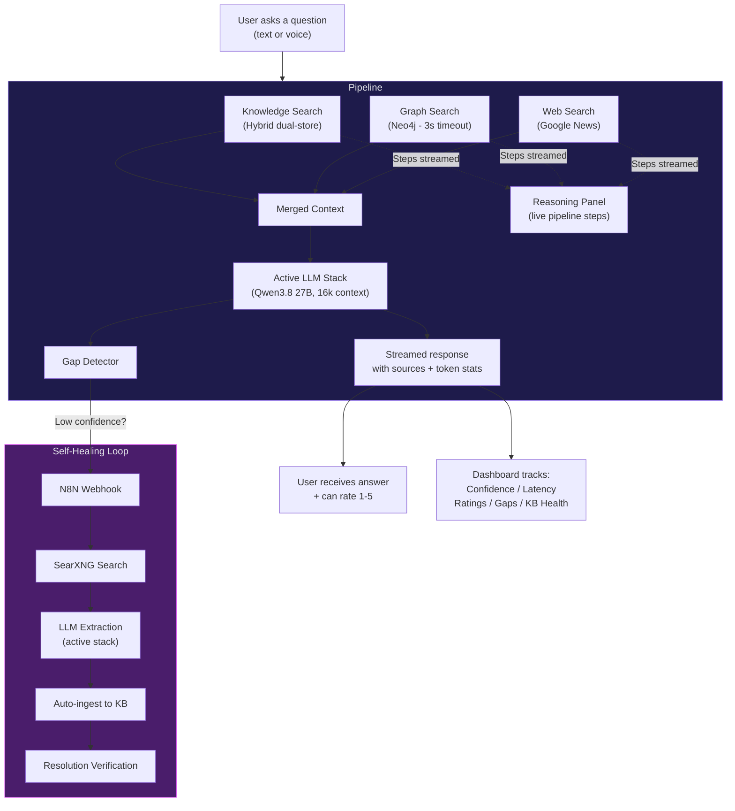
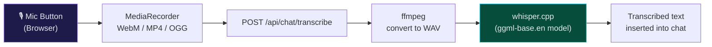
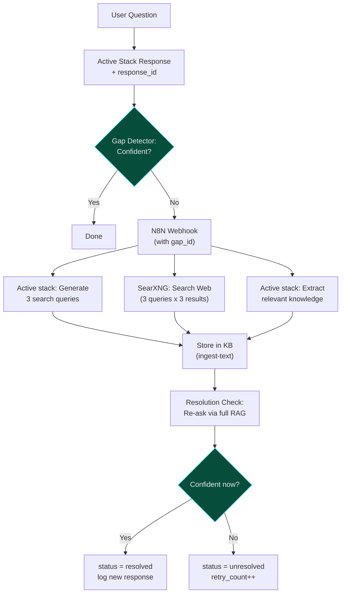
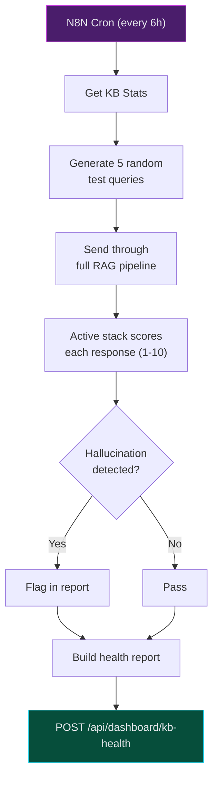
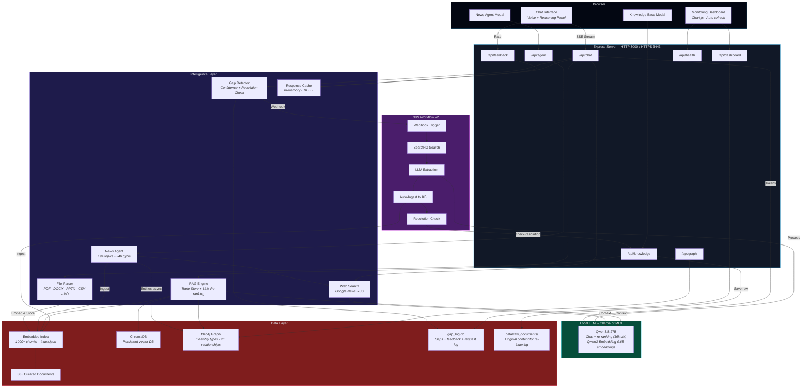
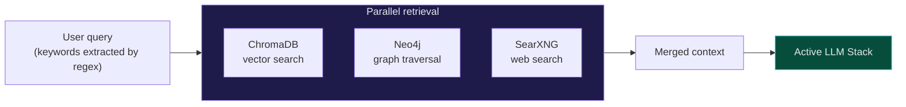
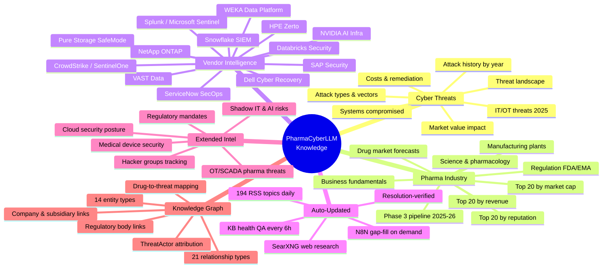
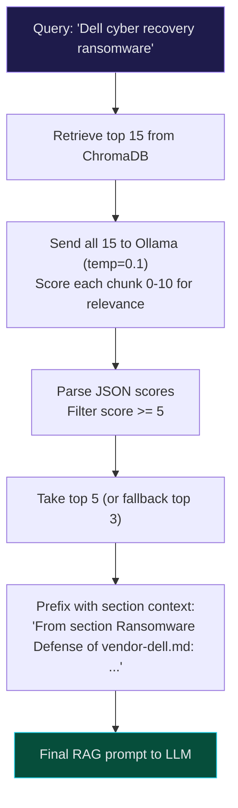
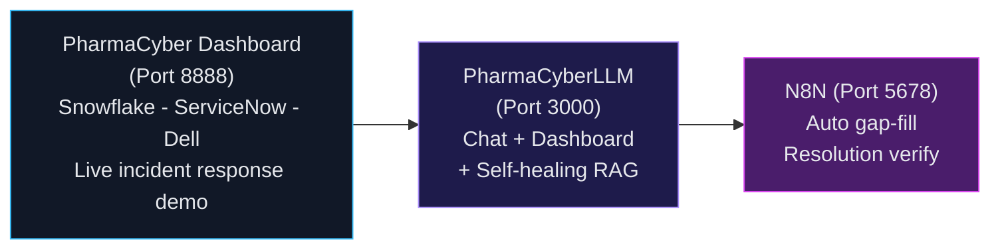

<div align="center">

# PharmaCyberLLM

### AI-Powered Cyber Threat Intelligence for the Pharmaceutical Industry

**Local LLM** | **Voice Input** | **Self-Healing RAG** | **Knowledge Graph** | **Reasoning Transparency** | **KB Health Monitoring** | **Zero Cloud**

[](https://typescriptlang.org)
[](https://ollama.com)
[](https://www.trychroma.com)
[](https://neo4j.com)
[](https://n8n.io)
[](https://www.chartjs.org)
[](https://expressjs.com)
[](https://nodejs.org)
[](https://github.com/openai/whisper)

---

*A fully offline, self-healing RAG chatbot with voice input, real-time reasoning transparency, a Neo4j knowledge graph for Graph RAG, KB health monitoring, and automated knowledge gap resolution — all orchestrated by N8N. Built for cybersecurity professionals who can't send sensitive queries to the cloud.*

</div>

---

## Table of Contents

- [Why This Exists](#why-this-exists)
- [Quick Start](#quick-start)
- [LLM Stacks (Ollama / MLX)](#llm-stacks-ollama--mlx)
- [How It Works](#how-it-works)
- [Voice Input](#voice-input)
- [Real-Time Reasoning](#real-time-reasoning)
- [Self-Healing Knowledge Loop](#self-healing-knowledge-loop)
- [KB Health Monitoring](#kb-health-monitoring)
- [Monitoring Dashboard](#monitoring-dashboard)
- [User Feedback System](#user-feedback-system)
- [Architecture](#architecture)
- [Knowledge Graph (Neo4j)](#knowledge-graph-neo4j)
- [Knowledge Base](#knowledge-base)
- [LLM Re-Ranking](#llm-re-ranking)
- [Smart Chunking](#smart-chunking)
- [N8N Workflows](#n8n-workflows)
- [Tech Stack](#tech-stack)
- [Project Structure](#project-structure)
- [API Reference](#api-reference)
- [Environment Variables](#environment-variables)
- [Integration with PharmaCyber](#integration-with-pharmacyber)

---

## Why This Exists

> The pharmaceutical industry loses **$50M+ per cyber incident**. SOC analysts need instant access to threat intelligence — attack histories, vendor capabilities, regulatory impacts, pipeline exposure — but can't send proprietary questions to ChatGPT.

PharmaCyberLLM runs **entirely on your machine**. No API keys. No cloud. No data leaves your laptop.

It combines:
- A **local LLM** (Qwen3.8 27B, 16k context) on your choice of Ollama or MLX stacks for conversational intelligence
- **Voice input** via Whisper for hands-free querying
- **Real-time reasoning transparency** showing each RAG pipeline step as it happens
- A **triple hybrid store** (embedded index + ChromaDB + Neo4j graph) with 36+ curated pharma/cyber documents
- **LLM-powered re-ranking** for higher precision RAG retrieval
- An **automated news agent** scraping **194 topics** from Google News every 24 hours
- **Real-time web search** augmentation on every query
- A **self-healing knowledge gap detector** with closed-loop resolution verification
- **KB health monitoring** — automated QA every 6 hours with hallucination detection
- **ChromaDB miss tracking** to identify knowledge base coverage gaps
- A **Neo4j knowledge graph** (Graph RAG) with 14 entity types and 21 relationship types for entity-aware retrieval
- A **real-time monitoring dashboard** with Chart.js visualizations
- A **user feedback system** tracking response quality and identifying weak areas
- A **company names toggle** (`/names`) for flexible incident reporting
- **Token statistics** showing throughput, prompt/completion breakdown per response
- **HTTPS support** for secure mobile/tablet access
- Full **N8N workflow orchestration** for gap research, ingestion, and KB quality assurance

---

## Quick Start

```bash
# 1. Install Ollama and Node dependencies
brew install ollama && brew services start ollama
git clone https://github.com/sebdallais-git/PharmaCyberLLM.git
cd PharmaCyberLLM
npm install

# 2. Download both LLM stacks (Ollama + MLX, about 33 GB) and build the Ollama indexes
scripts/switch-stack.sh prepare

# 3. Launch on the active stack (Ollama by default)
npm run dev

# --> Chat:      http://localhost:3000
# --> Dashboard: http://localhost:3000/dashboard
# --> Health:    http://localhost:3000/api/health
```

No API keys. No `.env` file. No cloud accounts.

### Optional: Enable Self-Healing + Full Stack

```bash
# 5. Set the N8N webhook URL
export N8N_WEBHOOK_URL="http://localhost:5678/webhook/knowledge-gap"

# 6. Import the v2 workflow into N8N
#    N8N > Workflows > Import > n8n/knowledge_gap_workflow_v2.json

# 7. Ensure SearXNG (port 8888) and ChromaDB (port 8100) are running

# 8. Restart
npm run dev
```

### Optional: Enable Graph RAG (Neo4j)

```bash
# Start Neo4j Community Edition via Docker
docker run -d \
  --name neo4j-pharma \
  -p 7474:7474 -p 7687:7687 \
  -e NEO4J_AUTH=neo4j/pharma2024 \
  neo4j:community

# Set environment variables
export NEO4J_URI="bolt://localhost:7687"
export NEO4J_USER="neo4j"
export NEO4J_PASSWORD="pharma2024"

# Bulk-populate graph from knowledge/*.md (requires Python 3.8+)
pip install -r python/requirements.txt
python python/graph_builder.py

# --> Neo4j Browser: http://localhost:7474  (explore the entity graph)
```

Graph data is also populated automatically as the news agent ingests new content.

---

## LLM Stacks (Ollama / MLX)

PharmaLLM runs every local model call (chat and embeddings) on exactly one of two stacks. Both use the same models, so the stacks can be compared fairly.

| | Ollama stack | MLX stack |
|---|---|---|
| Chat | `qwen3.8-pharma` (Qwen3.8 27B Q4_K_M, 16k context) | `mlx-community/Qwen3.8-27B-4bit` via `mlx_lm.server` (:8080) |
| Embeddings | `qwen3-embedding:0.6b-q8_0` | `mlx-community/Qwen3-Embedding-0.6B-8bit` via `python/mlx-embed-server.py` (:8081) |
| Search indexes | `knowledge_base_ollama`, `knowledge/.index.ollama.json` | `knowledge_base_mlx`, `knowledge/.index.mlx.json` |
| Index build (7k raw docs) | 15.6 min | 11.6 min |

Only one stack runs at a time, and the app never falls back to the other one.

```bash
scripts/switch-stack.sh mlx      # stop Ollama, start MLX, restart PharmaLLM (rolls back on failure)
scripts/switch-stack.sh ollama   # and back
scripts/switch-stack.sh status   # ports and index counts for both stacks
```

The first switch to a stack builds its indexes from `knowledge/` and `data/raw_documents/`, which takes a while. Rebuild them later with `LLM_PROVIDER=<stack> npx tsx scripts/reindex-stack.ts` (app stopped) or `POST /api/knowledge/reindex` (app running).

### Benchmarking the stacks

```bash
scripts/switch-stack.sh ollama && npx tsx scripts/benchmark-stack.ts
scripts/switch-stack.sh mlx    && npx tsx scripts/benchmark-stack.ts
npx tsx scripts/compare-benchmarks.ts data/benchmarks/ollama-<time>.json data/benchmarks/mlx-<time>.json
```

The benchmark sends the questions from `bench/questions.json` through `/api/chat` in benchmark mode (temperature 0, no web search, answers capped at 1024 tokens on both stacks, background LLM jobs paused), one cold run per question after a warm-up question outside the set, so prompt caching doesn't flatter repeated runs. The comparison reports TTFT, decode speed, embedding and retrieval time, peak memory with change %, retrieval overlap, and a blind A/B review page.

---

## How It Works



---

## Voice Input

PharmaCyberLLM supports **hands-free querying** via a built-in microphone button. Audio is recorded in the browser (MediaRecorder API), sent to the backend, and transcribed locally using **whisper.cpp** — no cloud services involved.



- Pulsing animation indicates active recording
- Supports WebM, MP4, and OGG audio formats (browser-dependent)
- Uses the `ggml-base.en` Whisper model (English, bundled with `whisper-node`)
- Requires `ffmpeg` installed locally for audio conversion
- Requires HTTPS on mobile/tablet (browser security requirement — see [HTTPS support](#environment-variables))

**API usage:**
```
POST /api/chat/transcribe
Content-Type: multipart/form-data
Body: audio file (max 25MB)

Response: { "text": "transcribed text here" }
```

---

## Real-Time Reasoning

Every query shows a **live reasoning panel** revealing each step of the RAG pipeline as it executes:

1. "Searching knowledge base..."
2. "Found X relevant chunks from ChromaDB"
3. "Searching the web for: [query]..."
4. "Generating response with [model]..."

The panel auto-collapses when the first response tokens arrive, and can be expanded again by clicking. Sources are displayed inline with each reasoning step.

**Token statistics** (prompt tokens, completion tokens, tokens/sec) appear on hover at the bottom of each response.

---

## Self-Healing Knowledge Loop

The killer feature. PharmaCyberLLM **knows when it doesn't know** — fixes itself — and **verifies the fix worked**.



The gap detector uses a 2-hour cooldown per topic, logs every detection in SQLite, and the v2 N8N workflow verifies resolution automatically.

---

## KB Health Monitoring

An automated **Knowledge Base QA pipeline** runs every 6 hours via N8N to detect degradation before users notice.



| Metric | Description |
|--------|-------------|
| **Quality Score** | Average LLM score (1-10) across test queries |
| **Hallucination Rate** | % of responses flagged as containing fabricated facts |
| **Gap Rate** | % of test queries with low-confidence answers |
| **24h Average** | Rolling quality trend via `/api/dashboard/kb-health` |

Stores up to 168 reports (7 days of history). The N8N workflow uses 10 baseline test queries covering FDA approvals, ransomware, GLP-1 drugs, ADCs, NIS2, shadow AI, and more.

**ChromaDB miss tracking** also logs every query where the vector store returned no results, identifying coverage gaps for KB expansion.

---

## Monitoring Dashboard

A real-time dark-themed dashboard at `/dashboard` with auto-refresh every 60 seconds.

| Section | Details |
|---------|---------|
| **Metric Cards** | Questions Today, Confidence Rate, Avg User Rating, Knowledge Base Size — with trend arrows |
| **Time Series** | 30-day Questions & Confidence (dual-axis bar + line), User Ratings (with 3.0 baseline) |
| **Gap Intelligence** | Recent gaps table with color-coded status badges, top gap topics bar chart |
| **System Health** | Knowledge sources donut chart, service health checks (active LLM stack, ChromaDB, SearXNG, SQLite) with latency |

All metrics are cached for 30 seconds and backed by indexed SQL queries.

---

## User Feedback System

Every chat response includes a `response_id`. Users can rate responses 1-5 with optional comments.

- Tracks which RAG chunks were used for each response
- Compares ratings for RAG-augmented vs pure LLM responses
- Low-rated responses (<=2) flagged for knowledge base improvement

```
POST /api/feedback
  { "response_id": "uuid", "rating": 4, "comment": "helpful" }

GET /api/feedback/stats         --> avg ratings (7d, 30d, RAG vs non-RAG)
GET /api/feedback/low-rated     --> responses rated <=2 with chunk IDs
GET /api/feedback/weekly-digest --> 7-day summary with improvement priorities
```

---

## Architecture



---

## Knowledge Graph (Neo4j)

The chat pipeline runs ChromaDB vector search and Neo4j graph traversal **in parallel** via `Promise.all`, merging results before passing context to the active stack's chat model. Graph queries have a 3-second timeout so they never block a response.



### Entity Model

| Entity Types (14) | Relationship Types (21, sample) |
|-------------------|--------------------------------|
| Company, Subsidiary, Drug | ACQUIRED, HEADQUARTERED_IN, PARTNERS_WITH |
| TherapeuticArea, ManufacturingSite | MANUFACTURES, SELLS_IN, TARGETS |
| Country, RegulatoryBody, Regulation | GOVERNS, REQUIRES_COMPLIANCE |
| ThreatActor, Attack, AttackVector | ATTRIBUTED_TO, TARGETED, USED_VECTOR |
| Vendor, Product, Technology | PROVIDES, INTEGRATES_WITH |

Live updates: when the news agent or a manual upload ingests new content, entity extraction runs asynchronously via `setImmediate()` and writes to Neo4j without blocking the response.

Explore the graph visually at **http://localhost:7474** (Neo4j Browser) once the Docker container is running.

---

## Knowledge Base

PharmaCyberLLM ships with **36+ curated intelligence documents** and **1000+ embedded chunks**.



### Curated Documents

| Category | Documents | Coverage |
|----------|-----------|----------|
| **Cyber Attacks** | 8 files | Every major pharma breach 2017-2025, attack vectors, systems compromised, financial impact, costs & remediation |
| **Pharma Business** | 9 files | Drug market forecasts, Phase 3 pipeline, top 20 rankings (revenue, market cap, reputation), manufacturing plants, regulation |
| **Vendor Intel** | 13 files | Dell, Snowflake, Databricks, ServiceNow, Pure Storage, NetApp, HPE, VAST, SAP, NVIDIA, WEKA, CrowdStrike, Splunk |
| **PDF Reports** | 2 files | Everpure AI Pharma Challenge executive briefings |
| **Auto-News** | Daily | 194 search topics across business, science, cyber, vendors, threat actors, OT/SCADA, and regulatory categories |
| **Gap-Filled** | On-demand | Automatically researched via N8N, resolution-verified before marking complete |

---

## LLM Re-Ranking

The Python RAG pipeline uses **Ollama as a relevance judge** to re-rank retrieved chunks.



Re-ranking results are logged to `data/logs/reranking.log` for analysis.

---

## Smart Chunking

The Python vectordb uses intelligent document chunking:

| Feature | Detail |
|---------|--------|
| Split strategy | Paragraph boundaries first, then sentences |
| Split threshold | Paragraphs > 600 tokens get sentence-split |
| Merge threshold | Paragraphs < 100 tokens merged with next |
| Target size | 300-500 tokens per chunk |
| Section detection | Markdown headings, ALL CAPS titles, numbered sections |
| Metadata | `section_header`, `chunk_index`, `source_url`, `ingested_at`, `document_title` |
| Re-indexing | `POST /api/knowledge/reindex` rebuilds from `data/raw_documents/` |

---

## N8N Workflows

Two importable N8N workflows automate knowledge management and quality assurance. Their LLM steps call PharmaLLM's `POST /api/llm/complete`, which runs on the active stack (Ollama or MLX); the `model` field in their request bodies is ignored.

### Workflow 1: Closed-Loop Gap Resolution (15 nodes)

Fills knowledge gaps **and verifies the fix worked**.

| # | Node | Description |
|---|------|-------------|
| 1 | Knowledge Gap Webhook | Receives POST with `gap_id` from gap-detector |
| 2 | Generate Search Queries | Active stack generates 3 search queries (`/api/llm/complete`) |
| 3 | Parse Search Queries | Extracts queries into separate items |
| 4 | Search SearXNG | Web search per query |
| 5 | Deduplicate Results | Deduplicates by URL, max 9 results |
| 6 | Fetch Page Content | Fetches pages (skip on error) |
| 7 | Truncate & Clean | Strips HTML, limits to 8000 chars |
| 8 | Extract Knowledge | Active stack extracts relevant facts (`/api/llm/complete`) |
| 9 | Filter Relevant Only | Removes NOT_RELEVANT responses |
| 10 | Store in Knowledge Base | POSTs to `/api/knowledge/ingest-text` |
| 11 | Summary & Log | Aggregates stats |
| 12 | **Check Gap Resolution** | Calls `/api/knowledge/gaps/check-resolution` |
| 13 | **Resolution Result Log** | Logs resolved/unresolved status |
| 14 | SearXNG Error Handler | Graceful error handling |
| 15 | Ollama Query Error Handler | Fallback to search_topic if query generation fails |

Import: **N8N > Workflows > Import** > `n8n/knowledge_gap_workflow_v2.json`

### Workflow 2: Knowledge Base QA (automated every 6h)

Monitors KB quality and detects degradation proactively.

| Step | Description |
|------|-------------|
| Get KB stats | Fetches current knowledge base size and sources |
| Generate test queries | 5 random queries from 10 baseline pharma/cyber topics |
| RAG pipeline test | Sends queries through the full chat pipeline |
| Quality scoring | Active stack scores each response 1-10 (`/api/llm/complete`) |
| Hallucination check | Detects fabricated facts in responses |
| Health report | Aggregates scores and POSTs to `/api/dashboard/kb-health` |

Import: **N8N > Workflows > Import** > `n8n/knowledge_qa_workflow.json`

---

## Tech Stack

| Layer | Technology | Purpose |
|-------|-----------|---------|
| **Runtime** | Node.js 22 + TypeScript 5.6 | Type-safe server |
| **Server** | Express 4.21 | REST API + static file serving |
| **LLM** | Ollama or MLX (Qwen3.8 27B, 16k ctx) — see [LLM Stacks](#llm-stacks-ollama--mlx) | Inference + re-ranking |
| **Embeddings** | Qwen3-Embedding-0.6B (Ollama or MLX) | Vector embeddings |
| **Voice** | Whisper (whisper-node) | Local speech-to-text transcription |
| **Vector DB** | ChromaDB | Persistent vector store |
| **Graph DB** | Neo4j Community (Docker) | Knowledge graph — 14 entity types, 21 relationship types |
| **Dashboard** | Chart.js + vanilla HTML/CSS/JS | Real-time monitoring |
| **Orchestration** | N8N | Workflow automation + resolution check + KB QA |
| **Web Search** | SearXNG + Google News RSS | Privacy-first web search |
| **Gap Detection** | Custom + SQLite | Confidence + cooldown + resolution verification |
| **Feedback** | SQLite + in-memory cache | User ratings + response tracking |
| **Re-ranking** | Ollama (Python) | LLM relevance scoring (0-10) |
| **Search** | Hybrid vector + keyword + graph | Triple-store RAG retrieval (parallel Promise.all) |
| **Graph RAG** | Python (graph_builder.py) + TypeScript (graph-store.ts) | Bulk extraction + runtime queries |
| **Parsing** | pdf-parse, mammoth, JSZip | Multi-format document ingestion |
| **Streaming** | Server-Sent Events | Token-by-token chat output |

---

## Project Structure

```
PharmaCyberLLM/
├── src/
│   ├── server.ts                  # Express + HTTPS + index checks + news agent + DB init
│   ├── config/
│   │   └── llm-stacks.ts          # Ollama and MLX stack definitions (models, URLs, indexes)
│   ├── api/
│   │   ├── chat.ts                # SSE streaming + reasoning steps + /names toggle + models
│   │   ├── knowledge.ts           # KB CRUD + gaps + resolution check + reindex
│   │   ├── agent.ts               # News agent status + manual trigger
│   │   ├── feedback.ts            # User feedback + stats + weekly digest
│   │   ├── dashboard.ts           # Dashboard metrics + health check + KB QA
│   │   ├── graph.ts               # Graph health, stats, search, rebuild endpoints
│   │   ├── bench.ts               # Benchmark mode start/stop/status
│   │   └── llm.ts                 # /api/llm/complete for N8N on the active stack
│   ├── services/
│   │   ├── llm-client.ts          # OpenAI-compatible client for both stacks (chat, streaming, token stats, embeddings)
│   │   ├── index-guard.ts         # Per-stack index metadata checks, refuses mismatched search
│   │   ├── reindex.ts             # Rebuilds the active stack's in-memory index and ChromaDB collection
│   │   ├── raw-documents.ts       # On-disk raw documents that indexes are rebuilt from
│   │   ├── bench-mode.ts          # Benchmark lease + background job tracking
│   │   ├── health.ts              # Health probes and status aggregation
│   │   ├── knowledge-store.ts     # In-memory vector store + hybrid search
│   │   ├── chromadb-store.ts      # ChromaDB client + delete/recreate
│   │   ├── gap-detector.ts        # Confidence check + resolution + N8N webhook
│   │   ├── feedback-store.ts      # Feedback table + stats + weekly digest
│   │   ├── response-cache.ts      # In-memory response metadata (1h TTL)
│   │   ├── request-log.ts         # Request logging + ChromaDB miss tracking + cache
│   │   ├── graph-store.ts         # Neo4j driver + queryGraphForChat() + writeEntities()
│   │   ├── news-agent.ts          # 194-topic Google News scraper (writes to 3 stores)
│   │   ├── web-search.ts          # Real-time Google News RSS search
│   │   └── file-parser.ts         # PDF, DOCX, PPTX, CSV, JSON, MD parser
│   └── utils/
│       └── batches.ts             # Fixed-size batching helper
├── scripts/
│   ├── switch-stack.sh            # Stop one stack, start the other, restart PharmaLLM (with rollback)
│   ├── start-services.sh          # Start ChromaDB, the active stack and the dev server (npm run dev)
│   ├── reindex-stack.ts           # Rebuild or check the active stack's indexes
│   ├── benchmark-stack.ts         # Benchmark the active stack through the running app
│   ├── compare-benchmarks.ts      # Compare two benchmark runs (report + blind A/B page)
│   ├── embedding-parity.ts        # Cross-stack embedding parity check
│   ├── migrate-news-to-raw-documents.ts  # One-off migration of news into raw documents
│   ├── ingest-to-chromadb.ts      # One-time ingest of knowledge/*.md into ChromaDB
│   ├── seed-neo4j-attacks.ts      # Seed the graph with attack data
│   └── lib/                       # Shared helpers (services.sh, benchmark report/types, stats, legacy news)
├── __tests__/                     # Jest tests (+ helpers/fake-openai-server.ts)
├── bench/
│   └── questions.json             # Benchmark question set
├── ollama/
│   └── qwen3.8-pharma.Modelfile   # Ollama chat model (Qwen3.8 27B, 16k context)
├── certs/                         # SSL certificates (HTTPS support)
├── dashboard/
│   └── index.html                 # Monitoring dashboard (Chart.js, dark theme)
├── public/
│   ├── index.html                 # Chat UI (voice input, reasoning panel)
│   ├── styles.css                 # Dark theme + mobile/tablet optimizations
│   └── app.js                     # Frontend logic + history navigation
├── knowledge/                     # 36+ curated pharma/cyber documents + per-stack index files
├── n8n/
│   ├── knowledge_gap_workflow.json      # N8N workflow v1
│   ├── knowledge_gap_workflow_v2.json   # N8N workflow v2 (with resolution check)
│   ├── knowledge_qa_workflow.json       # N8N KB health monitoring (every 6h)
│   └── README.md                        # N8N setup guide
├── python/
│   ├── graph_builder.py           # Bulk entity extraction from knowledge/*.md into Neo4j (calls Ollama)
│   ├── mlx-embed-server.py        # OpenAI-compatible embedding server for the MLX stack
│   ├── requirements.txt           # neo4j>=5.0.0, requests
│   ├── mlx-requirements.txt       # MLX stack dependencies (python/mlx-venv)
│   ├── utils/                     # Smart chunking, re-ranking, vector DB
│   └── tests/                     # Integration + vector DB tests
├── data/
│   ├── chromadb/                  # ChromaDB persistent storage
│   ├── raw_documents/             # Original content for re-indexing
│   ├── benchmarks/                # Benchmark results
│   ├── logs/                      # Re-ranking logs
│   └── gap_log.db                 # SQLite (gaps + feedback + request log)
├── package.json
├── tsconfig.json
└── .gitignore
```

---

## API Reference

### Chat
| Endpoint | Method | Description |
|----------|--------|-------------|
| `/api/chat` | POST | SSE-streamed response with reasoning steps + token stats + `response_id` |

The `/names` command toggles whether responses name specific companies in cyber incident discussions.

### Knowledge
| Endpoint | Method | Description |
|----------|--------|-------------|
| `/api/knowledge/stats` | GET | Knowledge base stats |
| `/api/knowledge/search` | POST | Search the knowledge base |
| `/api/knowledge/ingest-text` | POST | Ingest raw text (saves to raw_documents/) |
| `/api/knowledge/upload` | POST | Upload and ingest a file |
| `/api/knowledge/add` | POST | Add to ChromaDB (URL or text) |
| `/api/knowledge/status` | GET | ChromaDB status |
| `/api/knowledge/reindex` | POST | Rebuild the active stack's indexes from `knowledge/` and raw documents (409 while a reindex or benchmark runs) |
| `/api/knowledge/gaps` | GET | Recent gap detections |
| `/api/knowledge/gaps/stats` | GET | Gap analytics |
| `/api/knowledge/gaps/check-resolution` | POST | Re-check if a gap is resolved |

### Feedback
| Endpoint | Method | Description |
|----------|--------|-------------|
| `/api/feedback` | POST | Submit rating (1-5) with `response_id` |
| `/api/feedback/stats` | GET | Rating analytics (RAG vs non-RAG, trends) |
| `/api/feedback/low-rated` | GET | Responses rated <=2 (improvement candidates) |
| `/api/feedback/weekly-digest` | GET | 7-day summary with improvement priorities |

### Dashboard & Health
| Endpoint | Method | Description |
|----------|--------|-------------|
| `/api/dashboard/metrics` | GET | All dashboard metrics (30s cached) |
| `/api/dashboard/chromadb-misses` | GET | Recent ChromaDB misses + top 20 missed queries |
| `/api/dashboard/kb-health` | GET | KB health trends (24h average, history) |
| `/api/dashboard/kb-health` | POST | Receive health report from N8N QA workflow |
| `/api/health` | GET | Health of the active stack (`llm_chat`, `llm_embed`, `search_index`) plus ChromaDB, SearXNG, Neo4j, SQLite |
| `/dashboard` | GET | Monitoring dashboard UI |

### Graph
| Endpoint | Method | Description |
|----------|--------|-------------|
| `/api/graph/health` | GET | Neo4j connection check with latency |
| `/api/graph/stats` | GET | Node and relationship counts by type |
| `/api/graph/search` | POST | Search by entity name, returns neighbors |
| `/api/graph/rebuild` | POST | Clear graph and run full Python extraction (Ollama stack only: `graph_builder.py` calls Ollama directly; 409 on MLX) |

### Stack & Benchmark
| Endpoint | Method | Description |
|----------|--------|-------------|
| `/api/chat/models` | GET | Active stack and its chat and embedding models (chat always uses the stack's chat model) |
| `/api/llm/complete` | POST | `{ prompt }` → `{ response }` on the active stack (used by N8N) |
| `/api/bench/start` | POST | Pause background LLM jobs for a benchmark (15-minute lease, refreshed by calling again) |
| `/api/bench/stop` | POST | Resume background LLM jobs |
| `/api/bench/status` | GET | Benchmark flag and running background jobs |

### Agent
| Endpoint | Method | Description |
|----------|--------|-------------|
| `/api/agent/status` | GET | News agent last run + topics |
| `/api/agent/run` | POST | Manually trigger news agent |

---

## Environment Variables

All optional — works out of the box with zero configuration.

| Variable | Default | Description |
|----------|---------|-------------|
| `PORT` | `3000` | HTTP server port |
| `HTTPS_PORT` | `3443` | HTTPS server port (requires certs) |
| `HOST` | `0.0.0.0` | Bind address |
| `LLM_PROVIDER` | `ollama` | Active stack (`ollama` or `mlx`); set by `scripts/switch-stack.sh` |
| `OLLAMA_URL` | `http://localhost:11434` | Ollama stack endpoint |
| `MLX_CHAT_URL` | `http://localhost:8080` | MLX chat server endpoint |
| `MLX_EMBED_URL` | `http://localhost:8081` | MLX embedding server endpoint |
| `MLX_PYTHON` | `python3` | Python used to create `python/mlx-venv` |
| `CHROMADB_URL` | `http://localhost:8100` | ChromaDB server endpoint |
| `N8N_WEBHOOK_URL` | *(none)* | N8N webhook for gap auto-fill |
| `NEO4J_URI` | `bolt://localhost:7687` | Neo4j Bolt connection URI |
| `NEO4J_USER` | `neo4j` | Neo4j username |
| `NEO4J_PASSWORD` | *(none)* | Neo4j password (e.g. `pharma2024`) |

### HTTPS Setup (required for mobile voice input)

Place SSL certificates in the `certs/` directory:
```
certs/key.pem    # Private key
certs/cert.pem   # Certificate
```
The HTTPS server starts automatically when both files are present.

---

## Integration with PharmaCyber

PharmaCyberLLM is designed as a companion to the [PharmaCyber](https://github.com/sebdallais-git/CyberDemo) incident response dashboard.



---

<div align="center">

**100% local. Zero cloud. Self-healing. Observable. Voice-enabled. Graph-powered. Always current.**

*Qwen3.8 27B* · *Voice Input* · *Reasoning Transparency* · *Triple-Store RAG + Re-ranking* · *ChromaDB* · *Neo4j Graph* · *KB Health QA* · *194 News Topics* · *N8N Orchestration*

<br/>

Built for pharma cybersecurity professionals who take data sovereignty seriously.

</div>
