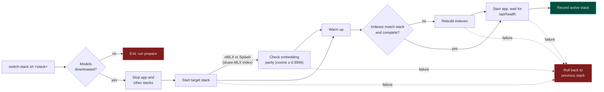
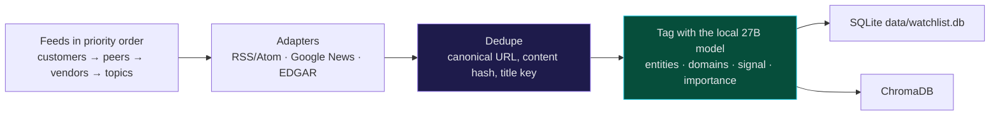
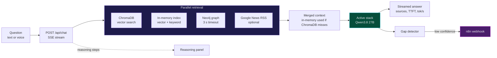
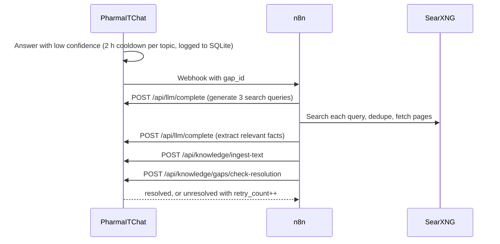
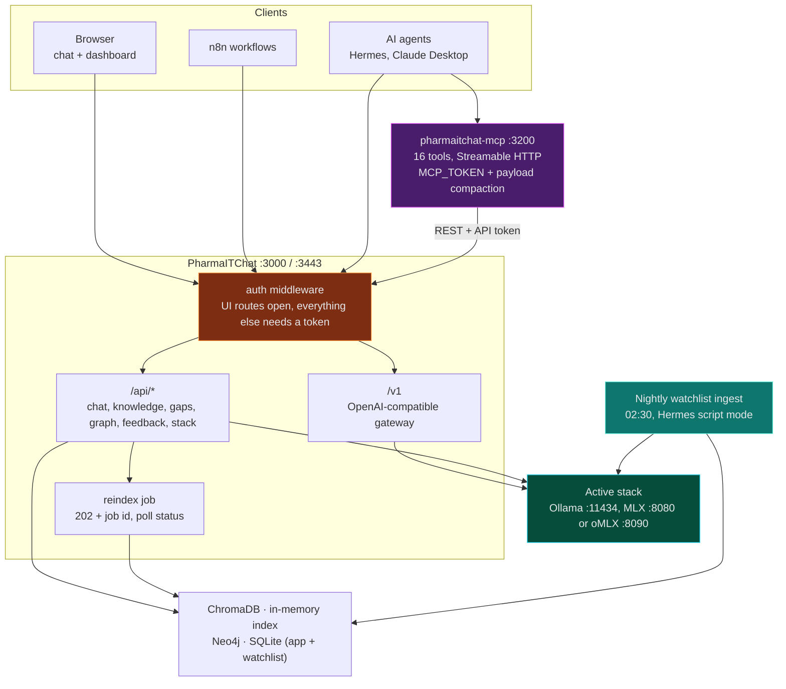

<div align="center">

# PharmaITChat

### The IT landscape around pharma — tracked, tagged and answered with a local LLM, VectorDB and neo4j based GraphRAG

PharmaITChat watches the IT and security scene around three pharma customers, their competitors and the vendors that shape their tech stack — **71 named entities**, collected nightly, deduplicated across sources, tagged by a 27B model and stored in a knowledge base you can then ask questions of, in a browser or on Telegram.

**Every model call happens on this machine.** Chat, embeddings, nightly tagging, retrieval, storage. No cloud LLM, no API key for the model, no per-token bill — and customer intelligence that never leaves your network. The only traffic going out is the news the system fetches and the Telegram message it sends back.

**Last night, unattended:** 1,165 items fetched, 57 collapsed by cross-source dedupe, 250 tagged and stored, 2 failed feeds, 0 anomalies, 42 minutes — and not a word on Telegram, because nothing went wrong.

[](https://nodejs.org)
[](https://www.typescriptlang.org)
[](https://expressjs.com)
<br/>
[](https://ollama.com)
[](https://github.com/ml-explore/mlx-lm)
[](https://github.com/jundot/omlx)
[](#four-interchangeable-stacks)
[](#benchmarks)
<br/>
[](#the-watchlist)
[](https://www.trychroma.com)
[](https://neo4j.com)
<br/>
[](#hermes-agent-on-telegram)
[](#hermes-agent-on-telegram)
[](#the-mcp-server-and-the-model-gateway)

[](#testing)
[](#four-interchangeable-stacks)
[](#switching-from-the-web-ui)
[](#four-interchangeable-stacks)
[](#everything-local-on-one-machine)
[](#the-first-unattended-run)

[Stacks](#four-interchangeable-stacks) · [Benchmarks](#benchmarks) · [Watchlist](#the-watchlist) · [Chat & knowledge base](#chat-retrieval-and-the-knowledge-base) · [Telegram](#hermes-agent-on-telegram) · [Setup](#setup) · [API](#api-reference)

</div>

---

## Everything local, on one machine

The whole system runs on one local box with 48 GB of unified memory — no cloud tenancy, no inference bill, no rate limit. A 27B Qwen model answers the chat, embeds the documents, tags every item the watchlist collects and drives the Telegram assistant. Nothing about what is watched, what is asked or what is stored is handed to a third party.

| What | Where it runs |
|---|---|
| Chat and reasoning | Local 27B model, on Ollama, MLX, oMLX or Splash |
| Embeddings | Local Qwen3-Embedding 0.6B, on the same stack |
| Nightly entity/domain tagging | The same local chat model, one item at a time |
| Vector store, item store, graph | ChromaDB, SQLite and Neo4j on localhost |
| Web search (chat and the self-healing loop) | Your own SearXNG instance on localhost |

Outbound traffic is limited to what the system goes out to *get* and the one channel it answers on: RSS and Atom feeds, Google News RSS, SEC EDGAR, URLs you explicitly add to the knowledge base, and Telegram. Web search can be switched off in the chat UI. There is no `.env` file: tokens live in `data/run/` at mode 600 and reach the process through the environment.

---

## Highlights

| | Feature | What it does |
|---|---|---|
| 🏠 | **Local 27B LLM** | Qwen3.8 27B (4-bit) for chat and tagging, Qwen3-Embedding 0.6B (8-bit), 64K context, zero cloud calls |
| 🔀 | **Four interchangeable stacks** | Ollama ⇄ MLX ⇄ oMLX ⇄ Splash by one script or from the web UI, Telegram-confirmed, with per-stack indexes and automatic rollback |
| 👁️ | **Entity watchlist** | 71 watched entities — 3 customers, 28 peers, 40 IT vendors — across 37 RSS feeds, 46 EDGAR CIKs and 188 entity-less topic queries |
| 🌙 | **Unattended nightly run** | 02:30: fetch, dedupe *before* the model, tag by entity and IT domain, store in SQLite and ChromaDB, alert only on failure |
| 🔎 | **Hybrid retrieval** | ChromaDB, an in-memory vector + keyword index, Neo4j Graph RAG and live news, queried in parallel |
| 🛡️ | **Embedding-parity guard** | A stack that shares another's index must prove its embeddings match (cosine ≥ 0.9999) or the switch is refused |
| 🤖 | **Telegram assistant** | Hermes Agent on the same local model: 16 MCP tools, 5 scheduled jobs, a network-less Docker sandbox |
| 🧰 | **MCP server** | `pharmaitchat-mcp` exposes the knowledge base to any MCP client over Streamable HTTP, with compacted payloads |
| 🔌 | **Model gateway** | OpenAI-compatible `/v1` on whichever stack is active, so any agent can borrow the local model |
| 🩹 | **Self-healing knowledge** | Low-confidence answers trigger an n8n workflow that researches, ingests and re-checks the gap |
| 🎙️ | **Voice input** | Local speech-to-text with whisper.cpp; HTTPS mode for iPad and phone microphones |
| ⏱️ | **Built-in benchmark** | Reproducible Ollama vs MLX vs oMLX vs Splash comparison with retrieval overlap and a blind A/B review page |
| ✅ | **606 tests** | 48 Jest suites across the app and the MCP server, plus 27 Python tests for the Telegram plugin — every one of them against fakes, none touching a real model server, ChromaDB, Docker, launchd or Telegram |

---

## Four interchangeable stacks

Every local model call — chat and embeddings alike — runs on **exactly one** stack. Ollama, MLX and oMLX run the same chat model at matching 4-bit quantization; Splash serves its own build of the same Qwen3.8 27B model. There is no silent fallback: if the active stack is down, requests fail with a clear error.

**Splash serves no embeddings of its own.** It exposes `/v1/chat/completions` but there is no `/v1/embeddings` endpoint at all — the single most surprising fact about this stack, and the reason for everything else about it below: it borrows the MLX embedding server on `:8081` and shares the MLX stack's ChromaDB collection and on-disk index, the same arrangement oMLX uses.

| | 🦙 Ollama stack | 🍎 MLX stack | 🧬 oMLX stack | 💦 Splash stack |
|---|---|---|---|---|
| **Chat model** | `qwen3.8-pharma` (Qwen3.8 27B Q4_K_M, 64K context) | `mlx-community/Qwen3.8-27B-4bit` via `mlx_lm.server` | `mlx-community--Qwen3.8-27B-4bit` (oMLX's discovery ids use double dashes) | `incoai/Qwen3.8-27B-Splash`, 65536-token context |
| **Embedding model** | `qwen3-embedding:0.6b-q8_0` | `mlx-community/Qwen3-Embedding-0.6B-8bit` via `python/mlx-embed-server.py` | `mlx-community--Qwen3-Embedding-0.6B-8bit` | **none** — borrows the MLX embedding server |
| **Ports** | `:11434` | `:8080` chat, `:8081` embeddings | `:8090` — one server for chat and embeddings | `:8000` chat; `:8081` embeddings (the MLX server) |
| **ChromaDB collection** | `knowledge_base_ollama` | `knowledge_base_mlx` | `knowledge_base_mlx` (shared with the MLX stack) | `knowledge_base_mlx` (shared with the MLX stack) |
| **In-memory index** | `knowledge/.index.ollama.json` | `knowledge/.index.mlx.json` | `knowledge/.index.mlx.json` (shared with the MLX stack) | `knowledge/.index.mlx.json` (shared with the MLX stack) |
| **Prompt cache** | one shared cache, evicted by the next caller | several caches, capped by `--prompt-cache-bytes` (8 GB) | one paged SSD cache, capped by `--paged-ssd-cache-max-size` (20 GB default); survives an app restart | managed by the Splash server itself |
| **Thinking** | off by default; off/low/medium/high per chat, via `reasoning_effort` | off by default; on/off per chat, via `chat_template_kwargs.enable_thinking` | off by default; on/off per chat, via `chat_template_kwargs.enable_thinking` | off by default (also server-side with `--default-reasoning-effort none`); off/low/medium/high per chat, via `reasoning_effort` |
| **Graph rebuild** | ✅ supported | ❌ switch to Ollama first (`409`) | ❌ switch to Ollama first (`409`) — `python/graph_builder.py` calls Ollama directly | ❌ switch to Ollama first (`409`) — same reason |

Splash has the steepest hardware bar of the four: **Apple M3 or newer, macOS 26.4 or later, 36 GB unified memory minimum (48 GB recommended)**. Its model, `incoai/Qwen3.8-27B-Splash`, is a 17.4 GB download under Apache-2.0 and **not gated** — unlike some Hugging Face models, no access token is needed to pull it.

```bash
scripts/switch-stack.sh mlx          # stop the other stacks, start MLX, restart the app (rolls back on failure)
scripts/switch-stack.sh omlx         # third stack, port 8090 — one server for chat and embeddings,
                                     # shares the MLX index, restores long prompts from SSD after a restart
scripts/switch-stack.sh splash       # fourth stack, port 8000 — chat only, borrows the MLX embedding
                                     # server on :8081 and shares its index, like omlx does
scripts/switch-stack.sh ollama       # and back
scripts/switch-stack.sh status       # active stack, ports, OLLAMA_NUM_PARALLEL and index counts
scripts/switch-stack.sh ensure-stack ollama   # start a stack and its indexes without starting the app
scripts/switch-stack.sh prepare      # one-time model downloads; also installs the oMLX venv and Splash checkout
scripts/switch-stack.sh telegram     # store the Telegram credentials used to confirm UI-driven switches
scripts/switch-stack.sh ollama-ctx   # recreate qwen3.8-pharma if its context differs from the Modelfile
```

### Switching from the web UI

The chat header has a stack selector next to the model selector. Choosing a different stack does not switch immediately: PharmaITChat sends a Telegram message with **Switch** and **Cancel** buttons, valid for 5 minutes. Tapping Switch starts it, tapping Cancel or ignoring the message reverts the selector. The tap goes through the Hermes gateway (the `pharmaitchat-switch` plugin), which calls the app on localhost — so the phone never has to reach the server at all. The UI then follows the switch (stopping, starting, warming up, checking indexes) and shows the new stack with how long it took: `OMLX stack ready (96 s)`. Telegram gets a completion message with the same line.

The switch route itself needs no token, because approval comes from tapping the Telegram button. Store the credentials once:

```bash
scripts/switch-stack.sh telegram         # prompts for the bot token and your chat id, stores them at mode 600
```

Without them the selector is disabled and says so. The Hermes gateway must also be running on this machine with the `pharmaitchat-switch` plugin installed (`scripts/hermes-setup.sh install-plugin`), or the selector is disabled and says why. A split, two-machine Hermes setup can't confirm switches this way — use `scripts/switch-stack.sh` there instead. A switch is refused while another switch is pending confirmation or already in progress, while a benchmark or a reindex is running, or when the requested stack is already active.

### The embedding-parity guard

The oMLX stack shares the MLX index and ChromaDB collection because their embeddings are identical (cosine 1.000000). Every oMLX start re-checks that against `__tests__/fixtures/embedding-reference.json` and **refuses to serve below a cosine of 0.9999**. Without the check, an oMLX upgrade that quietly changed the embedding would write vectors into `knowledge_base_mlx` that no longer match the ones already there, and searches would return the wrong documents with no error at all. The probe turns a silent corruption into a refused switch.

Every index also records its stack, embedding model and dimension (1024), plus a completeness marker written only when a rebuild ran to the end. Search on a mismatched, incomplete or rebuilding index is refused rather than answered with meaningless matches.

### 64K context

`ollama/qwen3.8-pharma.Modelfile` sets `num_ctx 65536` and MLX is started with `--prompt-cache-bytes`. The model is a hybrid architecture: only 16 of its 64 layers keep a KV cache, so 64K costs about 4 GB instead of the 1 GB a 16K context used. Ollama's OpenAI API cannot set the context per request, so one shared size keeps a single copy of the model loaded. Keep `OLLAMA_NUM_PARALLEL` at 1 — each parallel slot allocates its own 64K context.



**One client, four stacks.** `src/services/llm-client.ts` talks to all four through the OpenAI-compatible `/v1/chat/completions` API (and `/v1/embeddings` on the three that serve it); `src/config/llm-stacks.ts` only swaps base URLs and model names. Thinking is off by default on all four; the chat's thinking switch offers whatever levels the active stack supports (`src/services/thinking.ts`). Indexes are rebuilt from `knowledge/` and `data/raw_documents/`, where uploads, ingested text and collected articles are saved first — so a rebuild never depends on a source still being online. Everything follows the active stack: n8n calls `POST /api/llm/complete`, agents call `/v1/chat/completions`, the nightly ingest tags with whatever `data/run/active-stack` says.

---

## Benchmarks

### RAG answers (the web chat workload)

All three stacks measured on the same day, **2026-09-19**, on the **same workstation-class machine** — one local box, 48 GB unified memory. Full pipeline through `POST /api/chat`: 23 questions from `bench/questions.json`, one cold run each after a warm-up question outside the set, temperature 0, no web search, `max_tokens` 1024, background LLM jobs paused. The stacks were switched between runs on that one machine (macOS 26.4); only the stack changed, and nothing else ran while a run was in flight.

| Metric (median) | 🦙 Ollama | 🍎 MLX | ⚡ oMLX | 💦 Splash |
|---|---:|---:|---:|---:|
| Time to first token | 19.1 s | 18.4 s | **17.5 s** | *not yet measured* |
| Decode speed | 12.4 tok/s | 13.2 tok/s | **15.2 tok/s** | *not yet measured* |
| Total time per answer | 99.6 s | 92.3 s | **82.5 s** | *not yet measured* |
| Query embedding | 31 ms | **19 ms** | 21 ms | *not yet measured* |
| Retrieval | 76 ms | **44 ms** | 68 ms | *not yet measured* |
| Peak system memory used | 42,845 MB | **37,409 MB** | 41,009 MB | *not yet measured* |
| Model process memory | 28,459 MB | **16,184 MB** | 17,119 MB | *not yet measured* |
| Answers hitting the 1024-token cap | 15 / 23 | 11 / 23 | 10 / 23 | *not yet measured* |
| Failed runs | 0 / 23 | 0 / 23 | 0 / 23 | *not yet measured* |
| Version | Ollama 0.34.0 | mlx 0.32.2, mlx-lm 0.31.3 | oMLX 0.7.0.dev3 | *not yet measured* |

**oMLX generates fastest** — 23% quicker decode than Ollama and 15% quicker than MLX, which compounds into a 17% shorter answer than Ollama end to end. **MLX stays leanest**: lowest peak memory and the fastest retrieval, because its embedding server is a separate process rather than sharing one with chat as oMLX does. Ollama's memory figure is honest now that the sampler follows its `llama-server` children — it genuinely holds the most.

The oMLX and MLX rows come from the *same* ChromaDB collection and the same on-disk index: the two stacks share them, so these numbers compare generation, not two different corpora.

**Splash has no numbers here yet.** Nobody has run it on this machine: it needs `scripts/switch-stack.sh prepare` to fetch the model and `scripts/switch-stack.sh splash` to start it before `npx tsx scripts/benchmark-stack.ts` can produce a comparable row. The columns above are placeholders, not zeros.

### Long prompts (the agent workload)

Measured 2026-09-17 on the same machine, through `/v1` with a 16.7K-token prompt, streamed, sent cold and then again with the same prefix.

| Metric | 🦙 Ollama | 🍎 MLX | ⚡ oMLX | 💦 Splash |
|---|---:|---:|---:|---:|
| Cold time to first token | 156.3 s | 141.2 s | 149.6 s | *not yet measured* |
| Warm time to first token, same prefix | 5.8 s | **0.8 s** | 7.1 s | *not yet measured* |
| Same prompt after restarting the model server | ≈156 s | ≈141 s | **12.6 s** | *not yet measured* |
| Decode | 11.3–11.6 tok/s | 11.5–12.4 tok/s | 11.4–12.1 tok/s | *not yet measured* |
| Memory pressure | normal, 41% free | normal, 40% free | normal, 39% free | *not yet measured* |

The oMLX column was measured on 2026-09-18 during its trial, on the same machine and the same 16.7K-token prompt. **Restart recovery is the one axis where it is in a different class**: its SSD prefix cache restored 16,384 tokens and recomputed only 368, turning a 149.6 s cold prefill into 12.6 s (`Prefix cache restore … source=paged cached=16384 suffix=368`). The cache costs about 4.3 GB under `~/.omlx`, capped by `OMLX_CACHE_MAX_GB` (default 20).

The Splash column is pending too — this table is filled by the manual `curl` walkthrough described above, run once against each stack, and nobody has run it against Splash yet.

Prefill is the cost, at roughly 104–118 tok/s. Caching works on all three: appending a tool result to a conversation keeps the cached prefix, and a 14.6K-token prompt that cost 140.6 s cold came back in 10.9 s once about 1K tokens were appended. On Ollama the cache is shared, so a web chat between two agent steps evicts it.

**Reading it honestly**

- 🏁 oMLX wins the part that dominates: decode. Embedding and retrieval differences are milliseconds against 80–100 s answers, so they barely move the total.
- ✂️ Many answers hit the 1024-token cap (15/23 Ollama, 11/23 MLX, 10/23 oMLX). The cap is identical everywhere, so the comparison is fair, but the totals describe truncated answers — and a faster stack hits the cap in less time, which flatters its total slightly.
- 🧮 Ollama really does hold the most memory (28.5 GB of model process). An earlier run reported 59 MB because the sampler missed Ollama 0.34's `llama-server` child processes; that is fixed, and this table is the corrected measurement.
- 🐍 oMLX is alpha software pinned at one commit, roughly seven months old and largely one maintainer's work. It is the fastest of the three here; that is not the same as the safest.
- 🔁 Single cold runs on one machine. Treat the percentages as a signal, not a verdict.

<details>
<summary><b>Reproduce the benchmark</b></summary>

<br/>

```bash
scripts/switch-stack.sh ollama && npx tsx scripts/benchmark-stack.ts
scripts/switch-stack.sh mlx    && npx tsx scripts/benchmark-stack.ts
scripts/switch-stack.sh omlx   && npx tsx scripts/benchmark-stack.ts
npx tsx scripts/compare-benchmarks.ts data/benchmarks/ollama-<time>.json data/benchmarks/mlx-<time>.json
```

`compare-benchmarks.ts` takes two runs at a time, so compare the pairs you care about. Benchmark mode makes `/v1` return `503`, which takes the Telegram agent offline for the duration — check `~/.hermes/cron/jobs.json` for the next scheduled run before starting, or it fails with `HTTP 503: Benchmark in progress`.

`benchmark-stack.ts` accepts `--runs`, `--app` and `--questions`. Benchmark mode (`/api/bench/start`, a 15-minute lease) pauses background LLM jobs; chat requests with `benchmark: true` use temperature 0, skip web search and cap answers at 1024 tokens. `/v1` and `/api/llm/complete` return `503` while it runs. The comparison reports TTFT, decode speed, embedding and retrieval time, peak memory, retrieval overlap, and writes a blind A/B review page with stack labels hidden.

Embedding parity check (stacks run one after the other):

```bash
LLM_PROVIDER=ollama npx tsx scripts/embedding-parity.ts save data/benchmarks/parity-ollama.json
LLM_PROVIDER=mlx    npx tsx scripts/embedding-parity.ts save data/benchmarks/parity-mlx.json
npx tsx scripts/embedding-parity.ts compare data/benchmarks/parity-ollama.json data/benchmarks/parity-mlx.json
```

The question set has 23 questions: 11 vendor, 5 threat, 2 regulation, 2 pharma, and 3 deliberately not covered by the knowledge base.

</details>

---

## The watchlist

Most news tooling watches *topics*. PharmaITChat watches **named entities**: three pharma customers, the peer sets they are measured against, and the IT and security vendors that sell into them. Every item is attributed to the entities it is about and the IT domains it touches, so "what has Novartis done in cloud this month" is a query over structured tags, not a keyword search.

| | Count | Who |
|---|---:|---|
| **Customers** | 3 | Roche, Novartis, Sandoz |
| **Peers** | 28 | The competitive sets each customer is measured against |
| **IT vendors** | 40 | Grouped by the domain they sell into |
| **Total watched entities** | **71** | |
| **Verified RSS/Atom feeds** | 37 | Checked with `verify-feeds` on 2026-09-20 |
| **EDGAR CIKs** | 46 | SEC filings, rate-limited to one shared 10 req/s gate |
| **Entity-less topic queries** | 188 | Google News queries covering the same ground with no named subject |

Ten IT domains carry the tagging vocabulary: `cyber`, `ai`, `cloud`, `infrastructure`, `rnd_it`, `mfg_it`, `sap`, `data`, `storage`, `backup`. The vocabulary is **closed** — an entity id or domain the model invents rather than picks is dropped at the tagger boundary and again at the storage boundary, never stored.

### The nightly run

At **02:30** a Hermes cron job runs one pass in `--no-agent` script mode — no LLM agent step, just the script. Silent on a normal night; a Telegram message only when it fails.



**Dedupe happens before the model.** The same press release legitimately arrives through a company's IR RSS, through Google News and through EDGAR. Collapsing those three into one item costs a few store lookups; tagging them three times would cost three model calls. Every duplicate is recorded as an extra source on the surviving item rather than thrown away.

Three more properties hold the run together:

- **Tagging is sequential.** The local model serves one request at a time, so concurrency here would only queue behind itself.
- **A feed never takes the run down.** An adapter, tagger or store error is caught per feed: the failure is recorded, the feed's watermark is *not* advanced (so the next run re-fetches what this one missed) and the run moves on.
- **The run stops itself before anything else does.** A 250-item cap and a 45-minute wall-clock budget keep it inside Hermes' script timeout. Items past the cap are counted as deferred, not dropped, and the next run picks them up. A feed that has never been seen is backfilled 30 days, not from the beginning of time.

### The first unattended run

Night of **2026-09-21, 02:30–03:12 CEST** (run id 3), start to finish with nobody watching:

| | |
|---|---:|
| Items fetched | 1,165 |
| Collapsed by cross-source dedupe | 57 |
| Tagged and stored | 250 |
| Deferred by the 250-item cap | 858 |
| Stopped by the time budget | 0 |
| Failed feeds | 2 |
| Anomalies | 0 |
| Wall clock | 42 minutes |

Cap-bound and comfortably inside the budget. Disabling the `ir_page` adapter cut failures from 10 to 2 and anomalies from 14 to 0 in the same run, and cross-source dedupe went from 3 to 57 once EDGAR and Google News overlapped the IR feeds properly.

### Working with it

[`config/watchlist.yaml`](config/watchlist.yaml) is the single definition of who is watched and what topics run with no named entity. Editing that file is how an entity, feed or topic is added or retired — nothing else changes. A syntax error in it costs the news agent its topic list for the night and nothing more; it can no longer take the server down at boot.

```bash
npm run watchlist -- verify-feeds                      # fetch every configured feed once, report what parses
npm run watchlist -- ingest [--limit N] [--since ISO] [--only id,id]
npm run watchlist -- status [--days N]                 # last run's stats and per-entity counts, read-only
```

| Command | What it does |
|---|---|
| `verify-feeds` | Fetches every configured RSS/Atom feed once and reports which parse cleanly, writing nothing. EDGAR CIKs and IR pages are skipped with a reason — they are not RSS and would always report a spurious failure |
| `ingest` | One nightly pass. `--only` runs just the named entities' feeds (an unknown id is rejected rather than silently running zero feeds); `--since` overrides every feed's own watermark; `--limit` overrides the per-run cap. Prints which stack it tagged with and the run's counts, and exits non-zero if every attempted feed failed |
| `status` | The last recorded run's stats plus per-entity item counts over a trailing window (default 7 days) |

`ingest` resolves the stack exactly as the rest of the app does: `LLM_PROVIDER` if set, otherwise `data/run/active-stack` (written by `scripts/switch-stack.sh`), falling back to `ollama`.

Installing the schedule copies `hermes/scripts/pharmaitchat-watchlist-ingest.sh` into `~/.hermes/scripts/` with the repo's absolute path baked in, and creates the job with `--script … --no-agent --deliver local --failure-deliver telegram`:

```bash
scripts/hermes-setup.sh install-cron
```

### What is not built yet

Stated plainly, because a README that implies otherwise wastes the reader's time:

- **Digests are next, not now.** `build_digest`, weekly/monthly/quarterly delivery, `search_watchlist` and `compare_entities` are designed in [`docs/superpowers/specs/2026-09-20-it-scene-watchlist-design.md`](docs/superpowers/specs/2026-09-20-it-scene-watchlist-design.md) and **not implemented**. The nightly run fills `data/watchlist.db` and ChromaDB; nothing yet reads them into a report or emails one.
- **IR-page collection is disabled.** The adapter scanned hundreds of links per entity and recognised zero dates on 14 of 29 pages, for 4 stored items in a whole run — noise at a scale that masks real failures. It is switched off at the run level (`DISABLED_FEED_KINDS` in `src/services/watchlist-ingest.ts`), not deleted: every `ir_page` URL and the research behind it stays in the config.
- **14 of the 71 entities therefore have no active feed** — customer `sandoz`, nine peers and four vendors. The fix, already ruled on, is to give *every* entity a Google News feed derived from its name and aliases; the dedupe ladder collapses the overlap with RSS and EDGAR at no model cost. That is the next thing built.

---

## Chat, retrieval and the knowledge base

Ask a question in the browser at `http://localhost:3000` (or by voice, or on Telegram) and four retrieval paths run in parallel before the model sees anything.



The reasoning panel shows each step live ("Searching knowledge graph…", "Searching the web for: …") and collapses when the first answer token arrives. Every answer carries a `response_id` for feedback and names the documents it used. Typing `/names` toggles whether answers name specific companies in incident discussions.

### The knowledge base

`knowledge/` ships **40 curated documents** (36 Markdown, 2 DOCX, 2 PDF), grown by uploads, the n8n research loop and the watchlist's nightly ingest. The embedded corpus is about 439 MB across the per-stack ChromaDB collections; at the last verified rebuild the Ollama index held 7,779 chunks and the MLX index 7,623.

| Area | Examples |
|---|---|
| 🏢 Vendor intelligence | Dell, Pure Storage, NetApp, HPE, VAST Data, WEKA, NVIDIA, SAP, ServiceNow, Snowflake, Databricks, Splunk / Sentinel / CrowdStrike, endpoint and identity security, Bug Bounty Switzerland |
| 💊 Pharma industry | Business and science basics, regulation, Phase 3 pipeline 2025–26, top 20 by revenue / market cap / reputation, manufacturing plants, Basel biotech hub |
| 🛡️ Cyber threats | Major pharma attacks, attacks by year, attack types, systems compromised, costs and remediation, IT/OT threats 2025 |

Uploads accept `.txt`, `.md`, `.pdf`, `.csv`, `.json`, `.docx`, `.pptx` and `.ppt`. Everything ingested is saved to `data/raw_documents/` first, so an index can always be rebuilt from source.

### The knowledge graph

Neo4j stores **14 entity types** (Company, Subsidiary, Drug, TherapeuticArea, ManufacturingSite, Country, RegulatoryBody, Regulation, ThreatActor, Attack, AttackVector, Vendor, Product, Technology) and **20 relationship types** such as `ACQUIRED`, `MANUFACTURES`, `TARGETED`, `ATTRIBUTED_TO`, `USED_VECTOR` and `PROTECTS_AGAINST`. Chat extracts likely entity names from the question and queries the graph alongside vector search; graph writes from uploads run asynchronously so they never block a response.

### The self-healing loop



A second workflow runs every 6 hours as a KB health check: it sends test queries through the full RAG pipeline, has the active stack score each answer and flag hallucinations, and posts the report to `/api/dashboard/kb-health` (168 reports kept, 7 days).

| File | Nodes | Purpose |
|---|---:|---|
| `n8n/knowledge_gap_workflow_v2.json` | 15 | Gap auto-fill with resolution check (recommended) |
| `n8n/knowledge_gap_workflow.json` | 13 | Gap auto-fill, v1 |
| `n8n/knowledge_qa_workflow.json` | 12 | KB health monitor, every 6 hours |

All LLM steps call `POST /api/llm/complete`, so they run on the active stack. See [`n8n/README.md`](n8n/README.md).

> [!NOTE]
> The standalone news agent (`src/services/news-agent.ts`) no longer scrubs anything. Its 188 topic queries now belong solely to the watchlist ingest, which already fetches every one of them with its own dedupe ladder; running both meant the same articles were embedded into the same collection twice a day. The job, its state file and its tool contract (`POST /api/agent/run`, the MCP `run_news_agent` tool) are kept and now report zero.

---

## Hermes Agent on Telegram

[`hermes/`](hermes/README.md) runs [Hermes Agent](https://hermes-agent.nousresearch.com/) as a Telegram assistant **on the same local 27B model** — the phone talks to your own machine, not to a cloud. Everything needed to rebuild it lives in the repo; secrets stay in `~/.hermes/.env` and `data/run/*-token` at mode 600.

```bash
scripts/switch-stack.sh token           # PharmaITChat API token
scripts/switch-stack.sh mcp-token       # token Hermes uses for pharmaitchat-mcp
scripts/hermes-setup.sh all             # config, .env, launchd services, plugin, cron jobs
scripts/hermes-setup.sh check           # read-only status; prints variable names, never values
```

| Job | Schedule | What it does |
|---|---|---|
| `pharmaitchat-watchlist-ingest` | 02:30 daily | The nightly watchlist run. Hermes `--no-agent` script mode — no LLM agent step — running `hermes/scripts/pharmaitchat-watchlist-ingest.sh`. Silent on success, Telegram only on failure |
| `pharmaitchat-news-digest` | 06:00 daily | Calls `run_news_agent` and `knowledge_status`, then reports the knowledge base's state in at most 10 lines |
| `pharmaitchat-gap-resolution` | 07:00 daily | Re-checks at most 3 triggered knowledge gaps, oldest first |
| `pharmaitchat-health-watch` | 09:00 and 19:00 | Reports failing checks; replies `[SILENT]` and delivers nothing while healthy |
| `pharmaitchat-feedback-digest` | Monday 08:00 | Weekly rating trends and the worst-rated answers |

- **Tool scope is the control.** Telegram and CLI runs get 15 of the 16 MCP tools (no `start_reindex`). Scheduled runs connect to a separate, write-limited `pharmaitchat_cron` server with 14 tools: no `start_reindex` and no `add_knowledge`. MCP calls are never approval-gated, so the tool list is what enforces this. Scheduled runs also get no web, memory, terminal or file toolsets.
- **Sandbox:** shell commands run in a Docker container with `--network=none`, 512 MB and 1 CPU, no host project or home directory mounted. Verified live: `/Users` is not visible, `host.docker.internal` does not resolve and the app is unreachable from inside.
- **Web search:** the local SearXNG instance, with the keyless cloud fallbacks turned off. Private and loopback URLs stay blocked for Hermes' web tools, so ChromaDB and Neo4j cannot be reached that way.
- **Speed:** a warm Telegram round trip takes about 1 min 47 s end to end (Hermes' own timer reports 107.7 s). The first step of a cold session pays the full prefill, about 140–156 s.
- **Restarting the MCP service** costs the next Hermes message about 3 minutes, because the model has to prefill the tool list again.
- **After a reboot:** `com.pharmaitchat.mcp` and the Hermes gateway come back on their own; the app and the model stack do not. Run `scripts/start-services.sh` before the first job fires.

The Telegram bot is also what confirms a stack switch requested from the web UI — see [Switching from the web UI](#switching-from-the-web-ui).

<details>
<summary><b>Running Hermes on a second Mac</b></summary>

<br/>

Point the agent at the model Mac's LAN or VPN address. On the PharmaITChat Mac, bake the bind address into the launch agent so it survives a reboot:

```bash
MCP_HOST=0.0.0.0 scripts/hermes-setup.sh install-services
```

An MCP token is then required. On the Hermes Mac, set `PHARMALLM_URL`, `PHARMALLM_MCP_URL` and `SEARXNG_URL` to the model Mac and copy the two token values into `~/.hermes/.env` by hand. Full instructions in [`hermes/README.md`](hermes/README.md).

</details>

---

## The MCP server and the model gateway

PharmaITChat serves AI agents in two ways: as a set of tools, and as a model provider.

| | Endpoint | Purpose |
|---|---|---|
| 🧰 **MCP tools** | `pharmaitchat-mcp` at `http://<host>:3200/mcp` | 16 tools over Streamable HTTP: search, full RAG answers, add knowledge, graph, gaps, health, metrics, news agent, background reindex, feedback |
| 🧠 **Model gateway** | `http://<host>:3000/v1` or `https://<host>:3443/v1` | OpenAI-compatible chat completions on the active stack, tools and streaming supported |

### The MCP server

`mcp/` is a separate package and process with no RAG logic of its own: every tool maps to one or two PharmaITChat REST calls. It speaks stateless Streamable HTTP at `POST /mcp` and answers `GET /healthz` without auth, which makes the knowledge base usable from any MCP client — Claude Desktop, Hermes, your own.

```bash
scripts/switch-stack.sh mcp-token       # create data/run/mcp-token
npm --prefix mcp install
scripts/switch-stack.sh mcp start       # launchd service com.pharmaitchat.mcp, logs in data/logs/mcp.log
scripts/switch-stack.sh mcp status
scripts/switch-stack.sh mcp stop
```

Without `MCP_TOKEN` the service accepts only same-machine requests with a local Host header. With a token it requires `Authorization: Bearer` and accepts any Host. `scripts/run-mcp.sh` refuses to listen on a non-loopback host without a token. See [`mcp/README.md`](mcp/README.md) for the full tool list.

**Tool payloads are compacted** before they reach an agent (`mcp/src/tools/compact.ts`): embeddings are dropped, long lists become `{count, sample, truncated}`, stored answers are cut to 300 characters, and `list_knowledge_gaps` returns 20 rows by default (`limit` up to 50).

| Tool result | Before | After |
|---|---:|---:|
| `search_knowledge` (5 chunks) | ≈48,600 tokens | ≈1,100 tokens |
| `list_knowledge_gaps` | ≈31,000 tokens | ≈2,700 tokens |
| `knowledge_status` | ≈10,000 tokens | ≈530 tokens |
| `news_agent_status` | ≈2,200 tokens | ≈260 tokens |

Each search chunk used to carry a ~30 KB embedding object next to ~440 characters of text, so 98% of the payload was a vector no agent can use. That size, re-read on every step, was the real cost of agent runs — not cache misses.

### The model gateway

`/v1/chat/completions` forwards to the active stack and pipes the response through byte for byte, so streaming and tool calls work unchanged. It forces the stack's own chat model (the `model` field is ignored), forwards only `messages`, `tools`, `tool_choice`, `stream`, `stream_options`, `temperature` and `max_tokens` (capped at 4096), and drops the rest. It returns `503` during a benchmark or when the stack is down, with no fallback.

---

## Setup

**Prerequisites:** [Homebrew](https://brew.sh), Node.js 22, Python 3, about 50 GB of free disk for the models, and `ffmpeg` if you want voice input. The **MLX and oMLX stacks require Apple Silicon**; **Splash additionally requires an M3 or newer and macOS 26.4+** (36 GB unified memory minimum, 48 GB recommended). The Ollama stack only needs Ollama, so a host without Apple Silicon still gets the whole pipeline — on one stack instead of four. The setup scripts themselves drive Homebrew and `launchctl`, so they assume macOS.

```bash
# 1. Install Ollama and the Node dependencies
brew install ollama && brew services start ollama
git clone git@github.com:sebdallais-git/PharmaIT_Chat_and_Digest.git
cd PharmaIT_Chat_and_Digest
npm install

# 2. One-time setup: download the Ollama, MLX and Splash models (~50 GB total),
#    create the MLX and oMLX venvs (oMLX reuses the same Hugging Face snapshots,
#    so it adds no extra download), clone and verify Splash, then start ChromaDB,
#    build the active stack's indexes and launch the app
scripts/switch-stack.sh prepare          # also installs the oMLX venv and Splash checkout
```

When `prepare` finishes, PharmaITChat is running on the Ollama stack (the default):

| | URL |
|---|---|
| 💬 Chat | http://localhost:3000 |
| 📊 Dashboard | http://localhost:3000/dashboard |
| ❤️ Health | http://localhost:3000/api/health |

Later sessions start everything (ChromaDB, the last active stack and a hot-reload dev server) with:

```bash
npm run dev          # runs scripts/start-services.sh
```

> [!NOTE]
> The first index build re-embeds the whole knowledge base and took 12–16 minutes here. Ollama 0.17.6 could not pull Qwen3.8; the setup was verified with Ollama 0.34.0.

> [!IMPORTANT]
> Nothing starts the app or the model stack after a reboot. Run `scripts/start-services.sh` (or `scripts/switch-stack.sh ollama`) before you expect answers. Only the MCP service and the Hermes gateway come back on their own, and until the app is up they report it as unreachable.

<details>
<summary><b>Optional: the watchlist schedule</b></summary>

<br/>

The nightly ingest is a Hermes cron job, so it needs Hermes installed first ([`hermes/README.md`](hermes/README.md)). Then:

```bash
scripts/hermes-setup.sh install-cron     # creates all five jobs from hermes/cron/jobs.json
npm run watchlist -- verify-feeds        # sanity-check the feeds before the first night
npm run watchlist -- status              # after the first run: counts and per-entity totals
```

</details>

<details>
<summary><b>Optional: self-healing loop (n8n + SearXNG)</b></summary>

<br/>

1. Run [SearXNG](https://github.com/searxng/searxng) on `http://localhost:8888` with `bash scripts/setup-searxng.sh`, which builds its settings from `config/searxng/settings.yml`, and [n8n](https://n8n.io) on `http://localhost:5678`. The public search engines SearXNG scrapes tend to answer a self-hosted instance with CAPTCHAs and rate limits, so put a [Brave Search API](https://brave.com/search/api/) key in `data/run/brave-api-key` (mode 600) before running the script; it is rendered into the container's settings, never into the repo or a command line.
2. In n8n, import `n8n/knowledge_gap_workflow_v2.json` and `n8n/knowledge_qa_workflow.json` (**Workflows → Import from File**) and activate them.
3. Nothing else to wire: `start-services.sh` and `switch-stack.sh` point the gap detector at `http://localhost:5678/webhook/knowledge-gap` (override with `N8N_WEBHOOK_URL`), and `scripts/run-n8n.sh` hands n8n the API token from `data/run/api-token`.

The workflows call protected routes with `Authorization: Bearer {{ $env.PHARMALLM_API_TOKEN }}` — the legacy variable name, which `run-n8n.sh` sets. n8n 2.x blocks `$env` in expressions by default, so `run-n8n.sh` also sets `N8N_BLOCK_ENV_ACCESS_IN_NODE=false`; an n8n started some other way needs both. See [`n8n/README.md`](n8n/README.md).

</details>

<details>
<summary><b>Optional: Graph RAG (Neo4j)</b></summary>

<br/>

```bash
# Neo4j Community in Docker (the app's default password is pharma2024)
docker run -d --name neo4j-pharma \
  -p 7474:7474 -p 7687:7687 \
  -e NEO4J_AUTH=neo4j/pharma2024 \
  neo4j:community

# Bulk-extract entities from knowledge/*.md (requires the Ollama stack to be running)
pip install -r python/requirements.txt
python python/graph_builder.py
```

`graph_builder.py` calls Ollama's `/api/generate` directly with `OLLAMA_MODEL` (default `mistral-small:24b`), so pull that model or set `OLLAMA_MODEL` to one you have. Browse the graph at http://localhost:7474. New uploads are added to the graph automatically.

</details>

<details>
<summary><b>Optional: agents (MCP service and Telegram assistant)</b></summary>

<br/>

```bash
scripts/switch-stack.sh token          # create data/run/api-token
scripts/switch-stack.sh mcp-token      # create data/run/mcp-token
npm --prefix mcp install
scripts/switch-stack.sh mcp start      # pharmaitchat-mcp under launchd (com.pharmaitchat.mcp)
scripts/switch-stack.sh mcp status
```

Creating the API token does not enable it: restart the app (`scripts/switch-stack.sh ollama`, `mlx` or `omlx`) so it is exported. The Telegram assistant is a separate install — see [`hermes/README.md`](hermes/README.md).

</details>

### Voice input and HTTPS

The mic button records audio in the browser (MediaRecorder), uploads it to `POST /api/chat/transcribe` (max 25 MB), converts it to 16 kHz WAV with `ffmpeg`, and transcribes it locally with whisper.cpp (`ggml-base.en`, bundled with `whisper-node`).

Browsers only allow microphone access on secure origins, so an **iPad or phone needs HTTPS**. Put `certs/key.pem` and `certs/cert.pem` in place and the server also listens on **https://&lt;your-host&gt;:3443** (`HTTPS_PORT`). The device must trust the certificate. A token, once set, is required on both ports.

---

## Architecture



Static files and the browser routes listed in `src/api/auth.ts` are always open. Everything else (`/v1/*` and the rest of `/api/*`) needs `Authorization: Bearer <token>` once `PHARMAITCHAT_API_TOKEN` is set. Without a token, those routes accept only same-machine requests that also carry a `localhost`, `127.0.0.1` or `[::1]` Host header, which blocks DNS rebinding.

---

## API Reference

The **Auth** column shows which routes need `Authorization: Bearer <PHARMAITCHAT_API_TOKEN>` once a token is set. Without a token, `token` routes accept only same-machine requests addressed as localhost. `open` routes are the browser UI routes listed in `src/api/auth.ts` and never need the token.

<details>
<summary><b>Model gateway (OpenAI-compatible)</b></summary>

<br/>

| Endpoint | Method | Auth | Description |
|---|---|---|---|
| `/v1/models` | GET | token | The active stack's chat model (`503` when the stack is down) |
| `/v1/chat/completions` | POST | token | Forwarded to the active stack, tools and streaming supported (`503` during a benchmark or when the stack is down) |

</details>

<details>
<summary><b>Chat, stack and benchmark</b></summary>

<br/>

| Endpoint | Method | Auth | Description |
|---|---|---|---|
| `/api/chat` | POST | open | SSE stream with reasoning steps, token stats and `response_id` |
| `/api/chat/transcribe` | POST | open | Multipart `audio` file (max 25 MB) → `{ "text": "..." }` |
| `/api/chat/models` | GET | open | Active stack and its chat and embedding models |
| `/api/llm/complete` | POST | token | `{ prompt }` → `{ response }` on the active stack (used by n8n) |
| `/api/bench/start` | POST | token | Pause background LLM jobs (15-minute lease, refreshed by calling again) |
| `/api/bench/stop` | POST | token | Resume background LLM jobs |
| `/api/bench/status` | GET | token | Benchmark flag and running background jobs |
| `/api/stack/switch` | POST | open | `{ stack }` → request a switch to `ollama`, `mlx` or `omlx`; sends a Telegram message with Switch/Cancel buttons (`202` pending confirmation, with `id`; `400` unknown stack; `409` refused — already active, another switch pending, a switch already in progress, a benchmark or a reindex running, Telegram not configured, or `hermes_unavailable` when the Hermes gateway or its plugin cannot receive the tap; `502` if the Telegram send fails) |
| `/api/stack/confirm` | POST | token | `{ token }` from the Telegram button, sent by the Hermes plugin; starts `scripts/switch-stack.sh <target>` (`200 {status, target}`, `410` if the token expired or was already used) |
| `/api/stack/cancel` | POST | token | `{ token }`; drops the pending switch (`200 {status, target}`, `410` as above) |
| `/api/stack/status` | GET | open | Active stack, whether Telegram is configured, `hermes_ready`, `hermes_reason`, any pending switch, `cancelled`, and switch progress |

`/api/stack/switch` and `/api/stack/status` are `open` because requesting a switch or checking its status needs no proof of identity — approval happens on the Telegram tap. `/api/stack/confirm` and `/api/stack/cancel` need the bearer token because the tap reaches the app through the Hermes plugin, not from the phone directly.

</details>

<details>
<summary><b>Knowledge, reindex and gaps</b></summary>

<br/>

| Endpoint | Method | Auth | Description |
|---|---|---|---|
| `/api/knowledge/stats` | GET | open | Knowledge base stats |
| `/api/knowledge/search` | POST | open | Search the knowledge base |
| `/api/knowledge/ingest-text` | POST | open | Ingest raw text (saved to `data/raw_documents/` first) |
| `/api/knowledge/upload` | POST | open | Upload and ingest a file (saved as a raw document first) |
| `/api/knowledge/add` | POST | token | Add a URL or text to ChromaDB |
| `/api/knowledge/status` | GET | token | ChromaDB status |
| `/api/knowledge/reindex` | POST | token | Start rebuilding the active stack's indexes in the background: `202 { job_id, status: "running" }`, `409` while a reindex or benchmark runs |
| `/api/knowledge/reindex/status` | GET | token | Most recent reindex job: `status` (`idle`, `running`, `succeeded`, `failed`), progress, result or error |
| `/api/knowledge/gaps` | GET | token | Recent gap detections |
| `/api/knowledge/gaps/stats` | GET | token | Gap analytics |
| `/api/knowledge/gaps/check-resolution` | POST | token | Re-ask a gap through the full RAG pipeline |

Job state lives in memory, so a server restart forgets it. The index completeness markers remain the source of truth.

</details>

<details>
<summary><b>Feedback, dashboard, graph and agent</b></summary>

<br/>

| Endpoint | Method | Auth | Description |
|---|---|---|---|
| `/api/feedback` | POST | token | `{ response_id, rating (1-5), comment? }` |
| `/api/feedback/stats` | GET | token | Rating analytics (7d, 30d, RAG vs non-RAG) |
| `/api/feedback/low-rated` | GET | token | Answers rated 2 or lower, with chunk IDs |
| `/api/feedback/weekly-digest` | GET | token | 7-day summary with improvement priorities |
| `/api/health` | GET | open | Active stack (`llm_chat`, `llm_embed`, `search_index`), ChromaDB, SearXNG, Neo4j, SQLite |
| `/api/dashboard/metrics` | GET | open | All dashboard metrics (30 s cache) |
| `/api/dashboard/chromadb-misses` | GET | open | Recent ChromaDB misses and top missed queries |
| `/api/dashboard/kb-health` | GET / POST | token | KB health history, or receive a report from n8n |
| `/api/graph/health` | GET | token | Neo4j connection check with latency |
| `/api/graph/stats` | GET | open | Node and relationship counts by type |
| `/api/graph/search` | POST | token | Search by entity name, returns neighbors |
| `/api/graph/rebuild` | POST | token | Clear and rebuild the graph (Ollama stack only, `409` on MLX and oMLX) |
| `/api/agent/status` | GET | open | News agent last run and the watchlist's topic list |
| `/api/agent/run` | POST | open | Trigger the news agent now (reports zero — see the note above) |

</details>

---

## Monitoring and feedback

**Dashboard** (`/dashboard`, refreshes every 60 s, metrics cached 30 s):

| Panel | Shows |
|---|---|
| Metric cards | Questions today, confidence rate, average rating, knowledge base size |
| Time series | 30-day questions and confidence, user ratings |
| Gap intelligence | Recent gaps with status, top gap topics |
| System health | Knowledge sources, active stack, ChromaDB, SearXNG, Neo4j and SQLite checks with latency |

**Health** (`/api/health`) is `healthy`, `degraded` when only ChromaDB, SearXNG or Neo4j is down, or `unhealthy` when the active stack's chat or embedding endpoint or the search index is unusable. The inactive stacks are never probed.

**Feedback:** ratings (1–5) are linked to the chunks used, compared across RAG and non-RAG answers, and answers rated 2 or lower are surfaced as improvement candidates. ChromaDB misses are logged to show coverage gaps.

---

## Configuration

Everything works with defaults. `scripts/switch-stack.sh` and `npm run dev` set `LLM_PROVIDER` and export the API token from `data/run/api-token` when it exists.

<details>
<summary><b>Environment variables</b></summary>

<br/>

| Variable | Default | Description |
|---|---|---|
| `LLM_PROVIDER` | `ollama` | Active stack: `ollama`, `mlx` or `omlx` |
| `PORT` | `3000` | HTTP port |
| `HTTPS_PORT` | `3443` | HTTPS port (used when `certs/key.pem` and `certs/cert.pem` exist) |
| `HOST` | `0.0.0.0` | Bind address |
| `OLLAMA_URL` | `http://localhost:11434` | Ollama stack endpoint |
| `MLX_CHAT_URL` | `http://localhost:8080` | MLX chat server |
| `MLX_EMBED_URL` | `http://localhost:8081` | MLX embedding server |
| `OMLX_URL` | `http://localhost:8090` | oMLX server (chat and embeddings) |
| `MLX_PYTHON` | `python3` | Python used to create `python/mlx-venv` and `python/omlx-venv` |
| `CHROMADB_URL` | `http://localhost:8100` | ChromaDB server |
| `N8N_WEBHOOK_URL` | `http://localhost:5678/webhook/knowledge-gap` | n8n webhook for gap auto-fill (set by `start-services.sh` and `switch-stack.sh`) |
| `NEO4J_URI` | `bolt://localhost:7687` | Neo4j Bolt URI |
| `NEO4J_USER` | `neo4j` | Neo4j user |
| `NEO4J_PASSWORD` | `pharma2024` | Neo4j password |
| `APP_URL` | `http://localhost:3000` | App URL used by `scripts/reindex-stack.ts` |
| `PHARMAITCHAT_API_TOKEN` | *(none)* | Token for `/v1` and operations routes; without it they accept only same-machine requests addressed as localhost |
| `MLX_PROMPT_CACHE_BYTES` | `8589934592` | Memory cap for `mlx_lm.server`'s prompt cache (set by `switch-stack.sh`) |
| `MCP_HOST` / `MCP_PORT` | `127.0.0.1` / `3200` | Where `pharmaitchat-mcp` listens (`scripts/run-mcp.sh`); a non-loopback host requires `data/run/mcp-token` |
| `MCP_TOKEN` | *(none)* | Bearer token agents send to `pharmaitchat-mcp`; read from `data/run/mcp-token` by `run-mcp.sh` |

Tokens live in `data/run/` at mode 600 and are passed through the environment only, never as command arguments. There is no `.env` file.

> [!NOTE]
> The product was renamed from PharmaLLM. Where a variable carries the product name, the app and the MCP service read `PHARMAITCHAT_<NAME>` first and fall back to the legacy `PHARMALLM_<NAME>` — `API_TOKEN` and `URL` in both, `RUN_DIR` in `scripts/hermes-setup.sh` — so an unedited `~/.hermes/.env` keeps working. Hermes' own config template still expands `${PHARMALLM_URL}`, `${PHARMALLM_MCP_URL}` and `${PHARMALLM_MCP_TOKEN}`, because Hermes' variable expansion has no fallback of its own. The app-side fallback is temporary.

</details>

---

## Project structure

<details>
<summary><b>Show the tree</b></summary>

<br/>

```
PharmaITChat/
├── src/
│   ├── server.ts                 # Express + HTTPS, auth middleware, index checks, news agent schedule
│   ├── config/
│   │   ├── llm-stacks.ts         # Ollama, MLX, oMLX and Splash stack definitions
│   │   └── env-names.ts          # PHARMAITCHAT_* with a PHARMALLM_* fallback
│   ├── api/                      # auth, chat, knowledge, agent, feedback, dashboard, graph, bench, llm, v1, stack
│   ├── services/
│   │   ├── llm-client.ts         # One OpenAI-compatible client for all four stacks
│   │   ├── model-gateway.ts      # /v1 body building and forwarding
│   │   ├── index-guard.ts        # Refuses search on mismatched indexes
│   │   ├── reindex.ts            # Rebuilds the active stack's indexes
│   │   ├── reindex-jobs.ts       # Background reindex job state
│   │   ├── raw-documents.ts      # Source documents that indexes are rebuilt from
│   │   ├── bench-mode.ts         # Benchmark lease and background job tracking
│   │   ├── health.ts             # Health probes and aggregation
│   │   ├── knowledge-store.ts    # In-memory hybrid index
│   │   ├── chromadb-store.ts     # ChromaDB client
│   │   ├── graph-store.ts        # Neo4j queries and entity writes
│   │   ├── gap-detector.ts       # Confidence check, cooldown, n8n webhook
│   │   ├── news-agent.ts         # Legacy job; its topic scrub now belongs to the watchlist ingest
│   │   ├── watchlist-config.ts   # Loads/validates config/watchlist.yaml (entities, feeds, topics)
│   │   ├── watchlist-store.ts    # SQLite store for items, feed watermarks and runs
│   │   ├── watchlist-sources.ts  # RSS/Atom + Google News adapters, canonicalization, dedupe keys
│   │   ├── watchlist-edgar.ts    # EDGAR filings adapter, IR page adapter (disabled at run level)
│   │   ├── watchlist-tagger.ts   # Local-model tagging against the closed vocabulary
│   │   ├── watchlist-ingest.ts   # Nightly orchestrator: fetch, dedupe, tag, store, embed
│   │   ├── stack-switch.ts       # Pending-switch state machine (confirm tokens, refusal reasons)
│   │   ├── telegram-notify.ts    # Sends the switch buttons and the completion message
│   │   ├── hermes-readiness.ts   # Can Hermes receive the switch buttons? (gateway socket + plugin ready file)
│   │   ├── switch-labels.ts      # Switch-status text ("OMLX stack ready (96 s)"), synced with public/app.js
│   │   └── ...                   # feedback, request log, response cache, web search, file parser
│   └── utils/batches.ts
├── config/watchlist.yaml         # 71 entities (customers, peers, vendors) + 188 entity-less topic queries
├── mcp/                          # pharmaitchat-mcp: 16 MCP tools over Streamable HTTP
│   ├── src/pharmaitchat-client.ts  # REST client for the app
│   ├── src/tools/                # knowledge, graph, gaps, operations, feedback, compact.ts
│   ├── src/http.ts               # auth middleware, /mcp, /healthz
│   └── __tests__/                # against a fake PharmaITChat server
├── hermes/                       # Telegram assistant
│   ├── config.template.yaml      # Model provider, two MCP server scopes, sandbox, toolsets
│   ├── SOUL.md                   # Assistant role and tool policy
│   ├── cron/jobs.json            # The five scheduled jobs
│   ├── scripts/pharmaitchat-watchlist-ingest.sh   # 02:30 --no-agent script-mode job body
│   ├── plugins/pharmaitchat-switch/               # Handles the Telegram Switch / Cancel buttons
│   ├── tests/                    # Python unit tests for the plugin
│   └── com.pharmaitchat.mcp.plist.template        # launchd service for pharmaitchat-mcp
├── scripts/
│   ├── switch-stack.sh           # prepare | ollama | mlx | omlx | ensure-stack | status | token | telegram | mcp-token | mcp | ollama-ctx
│   ├── start-services.sh         # npm run dev: ChromaDB + active stack + dev server
│   ├── run-mcp.sh                # launchd entry point for pharmaitchat-mcp
│   ├── hermes-setup.sh           # check | install-config | install-services | install-plugin | install-cron | all
│   ├── watchlist.ts              # verify-feeds | ingest | status
│   ├── reindex-stack.ts          # Rebuild, --check or --status for the active stack
│   ├── benchmark-stack.ts        # Benchmark the active stack through the app
│   ├── compare-benchmarks.ts     # Comparison report + blind A/B page
│   ├── embedding-parity.ts       # Cross-stack embedding parity
│   └── lib/                      # Shared shell and TypeScript helpers
├── python/
│   ├── mlx-embed-server.py       # OpenAI-compatible embedding server for MLX
│   ├── graph_builder.py          # Bulk entity extraction into Neo4j (calls Ollama)
│   └── utils/, tests/            # Standalone Python RAG utilities (chunking, LLM re-ranking)
├── ollama/qwen3.8-pharma.Modelfile   # Qwen3.8 27B Q4_K_M with a 64K context
├── bench/questions.json          # 23 benchmark questions
├── knowledge/                    # 40 curated documents + per-stack index files
├── n8n/                          # Importable workflows + setup guide
├── docs/superpowers/             # Specs, plans and verification records
├── public/                       # Chat UI (voice, reasoning panel, stack selector)
├── dashboard/                    # Monitoring dashboard
├── __tests__/                    # Jest suites (+ fake OpenAI-compatible server)
└── data/                         # Raw documents, benchmarks, logs, tokens, SQLite (gitignored)
```

</details>

---

## Testing

**606 Jest tests across 48 suites** — 541 for the app, 65 for the MCP server — plus 27 Python tests for the Telegram switch plugin. All of them run against fakes: not one reaches a real model server, ChromaDB, the live app, Docker, launchd or Telegram, so a fresh checkout runs the whole Jest suite in under 20 seconds with nothing but `npm install`.

```bash
npm run test                 # Jest: 41 suites, 541 tests
npm --prefix mcp test        # Jest: 7 suites, 65 tests
npm run test:hermes-plugin   # Python unittest: 27 tests for the Telegram switch plugin
npm run typecheck            # tsc --noEmit (strict mode)
npm run typecheck:tests      # type-check the test suites
npm --prefix mcp run typecheck
```

---

## Troubleshooting

<details>
<summary><b>App, stacks and indexes</b></summary>

<br/>

| Symptom | Fix |
|---|---|
| Nothing answers after a reboot | The app and the model stack have no launch agent. Run `scripts/start-services.sh` or `scripts/switch-stack.sh ollama` |
| `Models for mlx are missing` | Run `scripts/switch-stack.sh prepare` once |
| `Models for splash are missing` | Run `scripts/switch-stack.sh prepare` once — clones Splash and downloads the 17.4 GB model |
| Splash won't start, or fails with an unsupported-hardware error | Splash needs an Apple M3 or newer and **macOS 26.4 or later**, with 36 GB unified memory minimum (48 GB recommended); check `sw_vers` and the Mac model before filing it as a bug |
| Search refused / `search_index` error in `/api/health` | The index belongs to another stack, is incomplete or is rebuilding. Wait for the rebuild, or `POST /api/knowledge/reindex` and poll `/api/knowledge/reindex/status` |
| `Port 8080 is used by another program` | Free the MLX ports (`:8080`, `:8081`); the switch leaves foreign processes alone and rolls back |
| `Port 8000 is used by another program` | Free the Splash port before switching; look for a stray `splash-server` (or `splash serve`) process holding it and stop it, since the switch leaves foreign processes alone and rolls back |
| `/api/graph/rebuild` returns `409` | Graph rebuild only works on the Ollama stack: `scripts/switch-stack.sh ollama` |
| Reindex, `/v1` or `/api/llm/complete` rejected during a benchmark | Wait for it to finish, or `POST /api/bench/stop` |
| Health is `degraded` | A supporting service (ChromaDB, SearXNG or Neo4j) is down; chat still works |
| `401 Unauthorized` on `/api/*` or `/v1/*` | Send `Authorization: Bearer <token>`, or reach the app as `localhost` from the same machine |
| Mic button missing or blocked on iPad | Use HTTPS on port 3443 with certificates in `certs/` that the device trusts |
| `npm run dev` fails on port 3000 | `prepare` and `switch-stack.sh ollama\|mlx\|omlx\|splash` already start the app in the background (log in `data/logs/app.log`) |
| Switch or rebuild failed | Check `data/logs/` (`mlx-chat.log`, `mlx-embed.log`, `omlx.log`, `splash.log`, `reindex-<stack>.log`, `app.log`) |

</details>

<details>
<summary><b>Watchlist</b></summary>

<br/>

| Symptom | Fix |
|---|---|
| The server refuses to boot after editing the watchlist | It no longer can — a bad `config/watchlist.yaml` costs the news agent its topic list and logs the YAML error. Fix the file and check it with `npm run watchlist -- verify-feeds` |
| A nightly Telegram failure message | The run only speaks up when it fails. `npm run watchlist -- status` shows the last recorded run, and the full per-feed output of every night — success or not — is in `data/logs/watchlist-ingest-<date>.log` |
| An entity produces nothing | It may be one of the 14 with no active feed while `ir_page` is disabled. Check its `feeds:` block in `config/watchlist.yaml` |
| `verify-feeds` prints `skip … verified separately` | Expected for `edgar` (a CIK, not a URL) and `ir_page` (an HTML page, not a feed) |
| The run tags far fewer items than were fetched | The 250-item cap. The remainder is counted as deferred and picked up by the next run; raise it with `--limit` for a one-off catch-up |

</details>

<details>
<summary><b>Agents and the sandbox</b></summary>

<br/>

| Symptom | Fix |
|---|---|
| Hermes says the context length is below the minimum | The Ollama model still has the old context. Run `scripts/switch-stack.sh ollama-ctx`, which recreates `qwen3.8-pharma` from the Modelfile without downloading |
| MCP tool calls fail after 5 minutes | Restart `pharmaitchat-mcp` so the version with keepalive notifications runs: `scripts/switch-stack.sh mcp stop && scripts/switch-stack.sh mcp start`. Expect the next Hermes message to take about 3 minutes longer |
| `docker pull` hangs with no output | `~/.docker/config.json` sets `credsStore: desktop` while Docker Desktop is not running, so the pull blocks in the credential helper before it reaches the daemon. Start Docker Desktop, remove `credsStore`, or pull with an empty `DOCKER_CONFIG` against the colima socket. See [`hermes/README.md`](hermes/README.md) |
| Hermes shell tool fails to start | The sandbox image is missing. Pull `nikolaik/python-nodejs:python3.11-nodejs20` once before first use |
| `hermes-setup.sh check` reports the gateway as not loaded | It probes the `gui` launchd domain; the gateway loads in `user`. Confirm with `hermes gateway status` |
| The stack selector in the UI is disabled | Telegram credentials are missing (`scripts/switch-stack.sh telegram`) or the `pharmaitchat-switch` plugin is not loaded by the running gateway (`scripts/hermes-setup.sh install-plugin`) |

</details>

---

<div align="center">

**One machine. 71 entities watched every night. Zero cloud model calls.**

Built by [@sebdallais-git](https://github.com/sebdallais-git).

</div>
