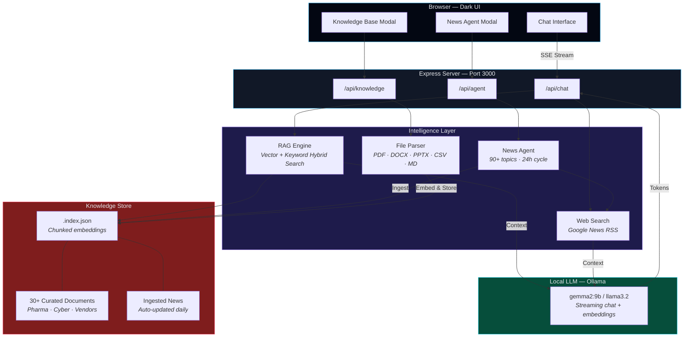
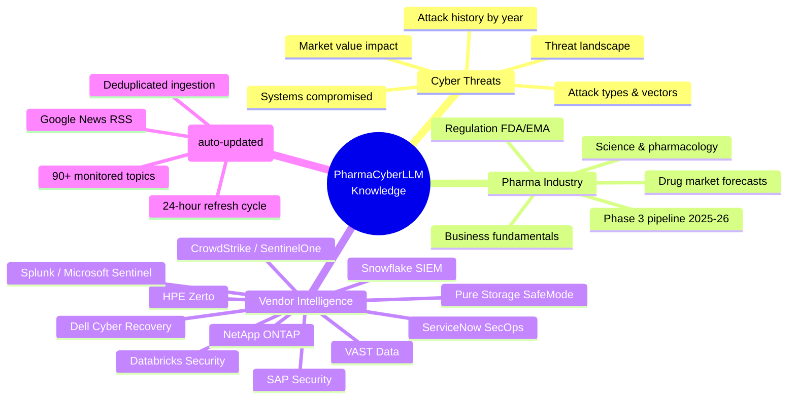

<div align="center">

<br/>

```
 ____  _                                ____      _               _     _     __  __
|  _ \| |__   __ _ _ __ _ __ ___   __ _/ ___|   _| |__   ___ _ _| |   | |   |  \/  |
| |_) | '_ \ / _` | '__| '_ ` _ \ / _` | |  | | | | '_ \ / _ \ '_| |__ | |   | |\/| |
|  __/| | | | (_| | |  | | | | | | (_| | |__| |_| | |_) |  __/ | | |___|| |___| |  | |
|_|   |_| |_|\__,_|_|  |_| |_| |_|\__,_|\____\__, |_.__/ \___|_| |_____|_____|_|  |_|
                                               |___/
```

### AI-Powered Cyber Threat Intelligence for the Pharmaceutical Industry

**Local LLM** | **RAG Knowledge Base** | **Automated News Agent** | **Zero Cloud Dependency**

[](https://typescriptlang.org)
[](https://ollama.com)
[](https://expressjs.com)
[](https://nodejs.org)

---

*A fully offline, RAG-powered chatbot that combines local LLMs with a curated pharma knowledge base and automated news ingestion — built for cybersecurity professionals who can't send sensitive queries to the cloud.*

</div>

---

## Why This Exists

> The pharmaceutical industry loses **$50M+ per cyber incident**. SOC analysts need instant access to threat intelligence — attack histories, vendor capabilities, regulatory impacts, pipeline exposure — but can't send proprietary questions to ChatGPT.

PharmaCyberLLM runs **entirely on your machine**. No API keys. No cloud. No data leaves your laptop.

It combines:
- A **local LLM** (via Ollama) for conversational intelligence
- A **vector knowledge base** with 30+ curated pharma/cyber documents
- An **automated news agent** that scrubs 90+ topics from Google News every 24 hours
- **Real-time web search** augmentation on every query

The result: an always-current, always-private pharma cyber threat expert you can query during incident response, demo preparation, or executive briefings.

---

## How It Works

```
User asks: "What ransomware attacks hit pharma in 2024?"
                    │
                    ▼
┌─────────────────────────────────────────────────────────────┐
│                   PharmaCyberLLM Pipeline                    │
│                                                             │
│   ┌──────────┐   ┌──────────┐   ┌──────────┐              │
│   │ Knowledge │   │   Web    │   │  Ollama  │              │
│   │  Search   │   │  Search  │   │   LLM    │              │
│   │ (Vector)  │   │ (Google) │   │ (Local)  │              │
│   └────┬─────┘   └────┬─────┘   └────┬─────┘              │
│        │              │              │                      │
│        └──────────────┼──────────────┘                      │
│                       │                                     │
│              Merged context + query                         │
│                       │                                     │
│                       ▼                                     │
│              Streamed response                              │
│         with sources cited                                  │
└─────────────────────────────────────────────────────────────┘
                    │
                    ▼
"In 2024, Change Healthcare suffered a $2.87B breach..."
(citing: cyber-pharma-attacks-extended.md, Google News)
```

---

## Architecture



---

## Knowledge Base

PharmaCyberLLM ships with **30+ curated intelligence documents** covering the pharma cyber threat landscape:



### Curated Documents

| Category | Documents | Coverage |
|----------|-----------|----------|
| **Cyber Attacks** | 5 files | Every major pharma breach 2017-2025, attack vectors, systems compromised, financial impact |
| **Pharma Business** | 5 files | Drug market forecasts, Phase 3 pipeline, M&A, pricing, regulation |
| **Vendor Intel** | 12 files | Dell, Snowflake, Databricks, ServiceNow, Pure, NetApp, HPE, VAST, SAP, CrowdStrike, Splunk, Sentinel |
| **PDF Reports** | 2 files | Everpure AI Pharma Challenge executive briefings |
| **Auto-News** | Daily | 90+ search topics across business, science, cyber, and vendor categories |

---

## The News Agent

An autonomous agent that keeps the knowledge base current — no manual updates needed.

```
Every 24 hours:
    │
    ├── Scrub 90+ topics across Google News RSS
    │   ├── Pharma business (8 topics)
    │   ├── Pharma science (8 topics)
    │   ├── Cyber threats (8 topics)
    │   ├── Storage & recovery vendors (5 topics)
    │   ├── NVIDIA & AI infra (3 topics)
    │   ├── SIEM & security ops (4 topics)
    │   ├── Security data platforms (2 topics)
    │   ├── IT operations (2 topics)
    │   ├── SAP security (3 topics)
    │   ├── Endpoint & identity (4 topics)
    │   └── Phase 3 pipeline (6 topics)
    │
    ├── Deduplicate against 2,000 seen titles
    │
    ├── Embed & ingest new articles
    │
    └── Save updated index
```

---

## RAG Pipeline

The search pipeline uses a **hybrid approach** — combining vector similarity with keyword matching for maximum recall:

```
Query: "Dell cyber recovery ransomware"
         │
         ├── Vector Search (70% weight)
         │   └── Cosine similarity on Ollama embeddings
         │
         ├── Keyword Search (30% weight)
         │   └── Exact term matching (pharma-specific boost)
         │
         ├── Deduplication
         │   └── Content-prefix dedup across chunks
         │
         └── Top 8 chunks → LLM context window
```

| Parameter | Value |
|-----------|-------|
| Chunk size | 800 characters |
| Embedding model | Ollama (same as chat model) |
| Similarity threshold | 0.2 |
| Top-K retrieval | 8 chunks |
| Hybrid ratio | 70% vector / 30% keyword |

---

## File Ingestion

Drop any document into the chat or knowledge base — PharmaCyberLLM parses it instantly:

| Format | Parser | Notes |
|--------|--------|-------|
| `.pdf` | pdf-parse | Full text extraction |
| `.docx` | mammoth | Word document support |
| `.pptx` / `.ppt` | JSZip + XML | Slide-by-slide text extraction |
| `.csv` | Built-in | Header-aware row formatting |
| `.json` | Built-in | Recursive object flattening |
| `.txt` / `.md` | Native | Direct ingestion |

---

## Quick Start

```bash
# 1. Install Ollama (if not already installed)
brew install ollama
ollama pull gemma2:9b

# 2. Clone and install
git clone https://github.com/sebdallais-git/PharmaCyberLLM.git
cd PharmaCyberLLM
npm install

# 3. Start Ollama
ollama serve &

# 4. Launch
npm run dev

# → http://localhost:3000
```

That's it. No API keys. No `.env` file. No cloud accounts.

---

## Tech Stack

| Layer | Technology | Purpose |
|-------|-----------|---------|
| **Runtime** | Node.js 22 + TypeScript 5.6 | Type-safe server |
| **Server** | Express 4.21 | REST API + static file serving |
| **LLM** | Ollama (gemma2:9b) | Local inference + embeddings |
| **Search** | Hybrid vector + keyword | RAG retrieval |
| **News** | Google News RSS | Zero-API-key news scraping |
| **Parsing** | pdf-parse, mammoth, JSZip | Multi-format document ingestion |
| **Frontend** | Vanilla HTML/CSS/JS | Dark theme, SSE streaming |
| **Streaming** | Server-Sent Events | Token-by-token chat output |

---

## Project Structure

```
PharmaCyberLLM/
├── src/
│   ├── server.ts                # Express entry point + news agent scheduler
│   ├── api/
│   │   ├── chat.ts              # SSE streaming chat with RAG context injection
│   │   ├── knowledge.ts         # Knowledge base CRUD + search API
│   │   └── agent.ts             # News agent status + manual trigger
│   └── services/
│       ├── ollama.ts            # Ollama chat, streaming, embeddings, model list
│       ├── knowledge-store.ts   # Vector store — chunking, embedding, hybrid search
│       ├── news-agent.ts        # 90-topic Google News scraper + dedup + ingest
│       ├── web-search.ts        # Real-time Google News RSS search
│       └── file-parser.ts       # PDF, DOCX, PPTX, CSV, JSON, MD parser
├── public/
│   ├── index.html               # Chat UI
│   ├── styles.css               # Dark theme (matches PharmaCyber dashboard)
│   └── app.js                   # Frontend logic — chat, modals, file upload
├── knowledge/                   # 30+ curated pharma/cyber documents
│   ├── cyber-pharma-attacks-*.md
│   ├── pharma-business.md
│   ├── pharma-science.md
│   ├── vendor-*.md              # 12 vendor intelligence files
│   ├── *.pdf                    # Executive briefing PDFs
│   └── .index.json              # Embedded vector index (auto-generated)
├── package.json
├── tsconfig.json
└── .gitignore
```

---

## API Reference

| Endpoint | Method | Description |
|----------|--------|-------------|
| `/api/chat` | POST | Send a message, receive SSE-streamed response with RAG context |
| `/api/chat/models` | GET | List available Ollama models |
| `/api/knowledge/stats` | GET | Knowledge base stats (chunks, sources) |
| `/api/knowledge/search` | POST | Search the knowledge base |
| `/api/knowledge/ingest` | POST | Ingest text into the knowledge base |
| `/api/knowledge/upload` | POST | Upload and ingest a file (multipart) |
| `/api/agent/status` | GET | News agent last run time + topics |
| `/api/agent/run` | POST | Manually trigger the news agent |

---

## Environment Variables

All optional — PharmaCyberLLM works out of the box with zero configuration.

| Variable | Default | Description |
|----------|---------|-------------|
| `PORT` | `3000` | Server port |
| `HOST` | `0.0.0.0` | Bind address |
| `OLLAMA_URL` | `http://localhost:11434` | Ollama API endpoint |

---

## Integration with PharmaCyber

PharmaCyberLLM is designed as a companion to the [PharmaCyber](https://github.com/sebdallais-git/CyberDemo) incident response dashboard. The PharmaCyber dashboard includes a direct link to this chatbot, giving SOC analysts and demo presenters instant access to threat intelligence alongside live scenario execution.

```
┌─────────────────────────────────┐     ┌──────────────────────────┐
│     PharmaCyber Dashboard       │     │    PharmaCyberLLM        │
│     (Port 8888)                 │────▶│    (Port 3000)           │
│                                 │     │                          │
│  Snowflake · ServiceNow · Dell  │     │  "What attacks hit       │
│  Live incident response demo    │     │   pharma SCADA in 2024?" │
└─────────────────────────────────┘     └──────────────────────────┘
```

---

<div align="center">

**100% local. Zero cloud. Always current.**

*Ollama LLM* · *RAG Vector Search* · *Automated News Agent* · *30+ Curated Intel Documents*

<br/>

Built for pharma cybersecurity professionals who take data sovereignty seriously.

</div>
